```python
# Dependencies
import matplotlib.pyplot as plt
import pandas as pd
import json
import tweepy
import numpy as np
import seaborn as sns
from scipy import stats
import plotly.graph_objs as go 
import plotly as py
```


```python
py.tools.set_credentials_file(username='KDC323', api_key='yz33uA12K8h73ybtBOY7')
```


```python
hospitalspending_2015 = "Medicare_Hospital_Spending_by_Claim.csv"
hospitalspending_2015_df = pd.read_csv(hospitalspending_2015)
hospitalspending_2015_df
```


<div>
<style>
    .dataframe thead tr:only-child th {
        text-align: right;
    }

    .dataframe thead th {
        text-align: left;
    }

    .dataframe tbody tr th {
        vertical-align: top;
    }
</style>
<table border="1" class="dataframe">
  <thead>
    <tr style="text-align: right;">
      <th></th>
      <th>Hospital_Name</th>
      <th>Provider_ID</th>
      <th>State</th>
      <th>Period</th>
      <th>Claim_Type</th>
      <th>Avg_Spending_Per_Episode_Hospital</th>
      <th>Avg_Spending_Per_Episode_State</th>
      <th>Avg_Spending_Per_Episode_Nation</th>
      <th>Percent_of_Spending_Hospital</th>
      <th>Percent_of_Spending_State</th>
      <th>Percent_of_Spending_Nation</th>
      <th>Start_Date</th>
      <th>End_Date</th>
    </tr>
  </thead>
  <tbody>
    <tr>
      <th>0</th>
      <td>HELEN KELLER HOSPITAL</td>
      <td>10019</td>
      <td>AL</td>
      <td>During Index Hospital Admission</td>
      <td>Skilled Nursing Facility</td>
      <td>$0</td>
      <td>$0</td>
      <td>$0</td>
      <td>0%</td>
      <td>0%</td>
      <td>0%</td>
      <td>1012015</td>
      <td>12312015</td>
    </tr>
    <tr>
      <th>1</th>
      <td>HELEN KELLER HOSPITAL</td>
      <td>10019</td>
      <td>AL</td>
      <td>During Index Hospital Admission</td>
      <td>Durable Medical Equipment</td>
      <td>$18</td>
      <td>$31</td>
      <td>$24</td>
      <td>0.10%</td>
      <td>0.16%</td>
      <td>0.12%</td>
      <td>1012015</td>
      <td>12312015</td>
    </tr>
    <tr>
      <th>2</th>
      <td>HELEN KELLER HOSPITAL</td>
      <td>10019</td>
      <td>AL</td>
      <td>During Index Hospital Admission</td>
      <td>Carrier</td>
      <td>$1,062</td>
      <td>$1,480</td>
      <td>$1,540</td>
      <td>6.01%</td>
      <td>7.71%</td>
      <td>7.52%</td>
      <td>1012015</td>
      <td>12312015</td>
    </tr>
    <tr>
      <th>3</th>
      <td>HELEN KELLER HOSPITAL</td>
      <td>10019</td>
      <td>AL</td>
      <td>1 through 30 days After Discharge from Index H...</td>
      <td>Home Health Agency</td>
      <td>$917</td>
      <td>$948</td>
      <td>$816</td>
      <td>5.19%</td>
      <td>4.94%</td>
      <td>3.98%</td>
      <td>1012015</td>
      <td>12312015</td>
    </tr>
    <tr>
      <th>4</th>
      <td>HELEN KELLER HOSPITAL</td>
      <td>10019</td>
      <td>AL</td>
      <td>1 through 30 days After Discharge from Index H...</td>
      <td>Hospice</td>
      <td>$172</td>
      <td>$154</td>
      <td>$122</td>
      <td>0.97%</td>
      <td>0.80%</td>
      <td>0.60%</td>
      <td>1012015</td>
      <td>12312015</td>
    </tr>
    <tr>
      <th>5</th>
      <td>HELEN KELLER HOSPITAL</td>
      <td>10019</td>
      <td>AL</td>
      <td>1 through 30 days After Discharge from Index H...</td>
      <td>Inpatient</td>
      <td>$2,518</td>
      <td>$2,634</td>
      <td>$2,702</td>
      <td>14.25%</td>
      <td>13.72%</td>
      <td>13.18%</td>
      <td>1012015</td>
      <td>12312015</td>
    </tr>
    <tr>
      <th>6</th>
      <td>HELEN KELLER HOSPITAL</td>
      <td>10019</td>
      <td>AL</td>
      <td>1 through 30 days After Discharge from Index H...</td>
      <td>Outpatient</td>
      <td>$473</td>
      <td>$596</td>
      <td>$730</td>
      <td>2.68%</td>
      <td>3.10%</td>
      <td>3.56%</td>
      <td>1012015</td>
      <td>12312015</td>
    </tr>
    <tr>
      <th>7</th>
      <td>HELEN KELLER HOSPITAL</td>
      <td>10019</td>
      <td>AL</td>
      <td>1 through 30 days After Discharge from Index H...</td>
      <td>Skilled Nursing Facility</td>
      <td>$3,544</td>
      <td>$2,626</td>
      <td>$3,319</td>
      <td>20.06%</td>
      <td>13.67%</td>
      <td>16.19%</td>
      <td>1012015</td>
      <td>12312015</td>
    </tr>
    <tr>
      <th>8</th>
      <td>HELEN KELLER HOSPITAL</td>
      <td>10019</td>
      <td>AL</td>
      <td>1 through 30 days After Discharge from Index H...</td>
      <td>Durable Medical Equipment</td>
      <td>$79</td>
      <td>$126</td>
      <td>$103</td>
      <td>0.45%</td>
      <td>0.66%</td>
      <td>0.50%</td>
      <td>1012015</td>
      <td>12312015</td>
    </tr>
    <tr>
      <th>9</th>
      <td>HELEN KELLER HOSPITAL</td>
      <td>10019</td>
      <td>AL</td>
      <td>1 through 30 days After Discharge from Index H...</td>
      <td>Carrier</td>
      <td>$970</td>
      <td>$1,046</td>
      <td>$1,110</td>
      <td>5.49%</td>
      <td>5.45%</td>
      <td>5.42%</td>
      <td>1012015</td>
      <td>12312015</td>
    </tr>
    <tr>
      <th>10</th>
      <td>HELEN KELLER HOSPITAL</td>
      <td>10019</td>
      <td>AL</td>
      <td>Complete Episode</td>
      <td>Total</td>
      <td>$17,668</td>
      <td>$19,201</td>
      <td>$20,497</td>
      <td>100%</td>
      <td>100%</td>
      <td>100%</td>
      <td>1012015</td>
      <td>12312015</td>
    </tr>
    <tr>
      <th>11</th>
      <td>DALE MEDICAL CENTER</td>
      <td>10021</td>
      <td>AL</td>
      <td>1 to 3 days Prior to Index Hospital Admission</td>
      <td>Home Health Agency</td>
      <td>$23</td>
      <td>$16</td>
      <td>$14</td>
      <td>0.13%</td>
      <td>0.08%</td>
      <td>0.07%</td>
      <td>1012015</td>
      <td>12312015</td>
    </tr>
    <tr>
      <th>12</th>
      <td>DALE MEDICAL CENTER</td>
      <td>10021</td>
      <td>AL</td>
      <td>1 to 3 days Prior to Index Hospital Admission</td>
      <td>Hospice</td>
      <td>$0</td>
      <td>$1</td>
      <td>$1</td>
      <td>0%</td>
      <td>0.01%</td>
      <td>0%</td>
      <td>1012015</td>
      <td>12312015</td>
    </tr>
    <tr>
      <th>13</th>
      <td>DALE MEDICAL CENTER</td>
      <td>10021</td>
      <td>AL</td>
      <td>1 to 3 days Prior to Index Hospital Admission</td>
      <td>Inpatient</td>
      <td>$12</td>
      <td>$6</td>
      <td>$5</td>
      <td>0.07%</td>
      <td>0.03%</td>
      <td>0.03%</td>
      <td>1012015</td>
      <td>12312015</td>
    </tr>
    <tr>
      <th>14</th>
      <td>DALE MEDICAL CENTER</td>
      <td>10021</td>
      <td>AL</td>
      <td>1 to 3 days Prior to Index Hospital Admission</td>
      <td>Outpatient</td>
      <td>$22</td>
      <td>$84</td>
      <td>$124</td>
      <td>0.12%</td>
      <td>0.44%</td>
      <td>0.61%</td>
      <td>1012015</td>
      <td>12312015</td>
    </tr>
    <tr>
      <th>15</th>
      <td>DALE MEDICAL CENTER</td>
      <td>10021</td>
      <td>AL</td>
      <td>1 to 3 days Prior to Index Hospital Admission</td>
      <td>Skilled Nursing Facility</td>
      <td>$0</td>
      <td>$2</td>
      <td>$2</td>
      <td>0%</td>
      <td>0.01%</td>
      <td>0.01%</td>
      <td>1012015</td>
      <td>12312015</td>
    </tr>
    <tr>
      <th>16</th>
      <td>DALE MEDICAL CENTER</td>
      <td>10021</td>
      <td>AL</td>
      <td>1 to 3 days Prior to Index Hospital Admission</td>
      <td>Durable Medical Equipment</td>
      <td>$10</td>
      <td>$10</td>
      <td>$9</td>
      <td>0.06%</td>
      <td>0.05%</td>
      <td>0.04%</td>
      <td>1012015</td>
      <td>12312015</td>
    </tr>
    <tr>
      <th>17</th>
      <td>DALE MEDICAL CENTER</td>
      <td>10021</td>
      <td>AL</td>
      <td>1 to 3 days Prior to Index Hospital Admission</td>
      <td>Carrier</td>
      <td>$398</td>
      <td>$508</td>
      <td>$552</td>
      <td>2.25%</td>
      <td>2.65%</td>
      <td>2.69%</td>
      <td>1012015</td>
      <td>12312015</td>
    </tr>
    <tr>
      <th>18</th>
      <td>DALE MEDICAL CENTER</td>
      <td>10021</td>
      <td>AL</td>
      <td>During Index Hospital Admission</td>
      <td>Home Health Agency</td>
      <td>$0</td>
      <td>$0</td>
      <td>$0</td>
      <td>0%</td>
      <td>0%</td>
      <td>0%</td>
      <td>1012015</td>
      <td>12312015</td>
    </tr>
    <tr>
      <th>19</th>
      <td>DALE MEDICAL CENTER</td>
      <td>10021</td>
      <td>AL</td>
      <td>During Index Hospital Admission</td>
      <td>Hospice</td>
      <td>$0</td>
      <td>$0</td>
      <td>$0</td>
      <td>0%</td>
      <td>0%</td>
      <td>0%</td>
      <td>1012015</td>
      <td>12312015</td>
    </tr>
    <tr>
      <th>20</th>
      <td>DALE MEDICAL CENTER</td>
      <td>10021</td>
      <td>AL</td>
      <td>During Index Hospital Admission</td>
      <td>Inpatient</td>
      <td>$7,529</td>
      <td>$8,934</td>
      <td>$9,324</td>
      <td>42.64%</td>
      <td>46.53%</td>
      <td>45.49%</td>
      <td>1012015</td>
      <td>12312015</td>
    </tr>
    <tr>
      <th>21</th>
      <td>DALE MEDICAL CENTER</td>
      <td>10021</td>
      <td>AL</td>
      <td>During Index Hospital Admission</td>
      <td>Outpatient</td>
      <td>$0</td>
      <td>$0</td>
      <td>$0</td>
      <td>0%</td>
      <td>0%</td>
      <td>0%</td>
      <td>1012015</td>
      <td>12312015</td>
    </tr>
    <tr>
      <th>22</th>
      <td>DALE MEDICAL CENTER</td>
      <td>10021</td>
      <td>AL</td>
      <td>During Index Hospital Admission</td>
      <td>Skilled Nursing Facility</td>
      <td>$0</td>
      <td>$0</td>
      <td>$0</td>
      <td>0%</td>
      <td>0%</td>
      <td>0%</td>
      <td>1012015</td>
      <td>12312015</td>
    </tr>
    <tr>
      <th>23</th>
      <td>DALE MEDICAL CENTER</td>
      <td>10021</td>
      <td>AL</td>
      <td>During Index Hospital Admission</td>
      <td>Durable Medical Equipment</td>
      <td>$8</td>
      <td>$31</td>
      <td>$24</td>
      <td>0.04%</td>
      <td>0.16%</td>
      <td>0.12%</td>
      <td>1012015</td>
      <td>12312015</td>
    </tr>
    <tr>
      <th>24</th>
      <td>DALE MEDICAL CENTER</td>
      <td>10021</td>
      <td>AL</td>
      <td>During Index Hospital Admission</td>
      <td>Carrier</td>
      <td>$846</td>
      <td>$1,480</td>
      <td>$1,540</td>
      <td>4.79%</td>
      <td>7.71%</td>
      <td>7.52%</td>
      <td>1012015</td>
      <td>12312015</td>
    </tr>
    <tr>
      <th>25</th>
      <td>DALE MEDICAL CENTER</td>
      <td>10021</td>
      <td>AL</td>
      <td>1 through 30 days After Discharge from Index H...</td>
      <td>Home Health Agency</td>
      <td>$886</td>
      <td>$948</td>
      <td>$816</td>
      <td>5.02%</td>
      <td>4.94%</td>
      <td>3.98%</td>
      <td>1012015</td>
      <td>12312015</td>
    </tr>
    <tr>
      <th>26</th>
      <td>DALE MEDICAL CENTER</td>
      <td>10021</td>
      <td>AL</td>
      <td>1 through 30 days After Discharge from Index H...</td>
      <td>Hospice</td>
      <td>$204</td>
      <td>$154</td>
      <td>$122</td>
      <td>1.16%</td>
      <td>0.80%</td>
      <td>0.60%</td>
      <td>1012015</td>
      <td>12312015</td>
    </tr>
    <tr>
      <th>27</th>
      <td>DALE MEDICAL CENTER</td>
      <td>10021</td>
      <td>AL</td>
      <td>1 through 30 days After Discharge from Index H...</td>
      <td>Inpatient</td>
      <td>$2,719</td>
      <td>$2,634</td>
      <td>$2,702</td>
      <td>15.40%</td>
      <td>13.72%</td>
      <td>13.18%</td>
      <td>1012015</td>
      <td>12312015</td>
    </tr>
    <tr>
      <th>28</th>
      <td>DALE MEDICAL CENTER</td>
      <td>10021</td>
      <td>AL</td>
      <td>1 through 30 days After Discharge from Index H...</td>
      <td>Outpatient</td>
      <td>$374</td>
      <td>$596</td>
      <td>$730</td>
      <td>2.12%</td>
      <td>3.10%</td>
      <td>3.56%</td>
      <td>1012015</td>
      <td>12312015</td>
    </tr>
    <tr>
      <th>29</th>
      <td>DALE MEDICAL CENTER</td>
      <td>10021</td>
      <td>AL</td>
      <td>1 through 30 days After Discharge from Index H...</td>
      <td>Skilled Nursing Facility</td>
      <td>$3,676</td>
      <td>$2,626</td>
      <td>$3,319</td>
      <td>20.82%</td>
      <td>13.67%</td>
      <td>16.19%</td>
      <td>1012015</td>
      <td>12312015</td>
    </tr>
    <tr>
      <th>...</th>
      <td>...</td>
      <td>...</td>
      <td>...</td>
      <td>...</td>
      <td>...</td>
      <td>...</td>
      <td>...</td>
      <td>...</td>
      <td>...</td>
      <td>...</td>
      <td>...</td>
      <td>...</td>
      <td>...</td>
    </tr>
    <tr>
      <th>69600</th>
      <td>OVERLAKE HOSPITAL MEDICAL CENTER</td>
      <td>500051</td>
      <td>WA</td>
      <td>Complete Episode</td>
      <td>Total</td>
      <td>$18,702</td>
      <td>$19,907</td>
      <td>$20,497</td>
      <td>100%</td>
      <td>100%</td>
      <td>100%</td>
      <td>1012015</td>
      <td>12312015</td>
    </tr>
    <tr>
      <th>69601</th>
      <td>TRIOS HEALTH</td>
      <td>500053</td>
      <td>WA</td>
      <td>1 to 3 days Prior to Index Hospital Admission</td>
      <td>Home Health Agency</td>
      <td>$5</td>
      <td>$7</td>
      <td>$14</td>
      <td>0.03%</td>
      <td>0.04%</td>
      <td>0.07%</td>
      <td>1012015</td>
      <td>12312015</td>
    </tr>
    <tr>
      <th>69602</th>
      <td>TRIOS HEALTH</td>
      <td>500053</td>
      <td>WA</td>
      <td>1 to 3 days Prior to Index Hospital Admission</td>
      <td>Hospice</td>
      <td>$0</td>
      <td>$0</td>
      <td>$1</td>
      <td>0%</td>
      <td>0%</td>
      <td>0%</td>
      <td>1012015</td>
      <td>12312015</td>
    </tr>
    <tr>
      <th>69603</th>
      <td>TRIOS HEALTH</td>
      <td>500053</td>
      <td>WA</td>
      <td>1 to 3 days Prior to Index Hospital Admission</td>
      <td>Inpatient</td>
      <td>$4</td>
      <td>$4</td>
      <td>$5</td>
      <td>0.02%</td>
      <td>0.02%</td>
      <td>0.03%</td>
      <td>1012015</td>
      <td>12312015</td>
    </tr>
    <tr>
      <th>69604</th>
      <td>OHIO VALLEY MEDICAL CENTER</td>
      <td>510039</td>
      <td>WV</td>
      <td>1 to 3 days Prior to Index Hospital Admission</td>
      <td>Durable Medical Equipment</td>
      <td>$13</td>
      <td>$11</td>
      <td>$9</td>
      <td>0.06%</td>
      <td>0.06%</td>
      <td>0.04%</td>
      <td>1012015</td>
      <td>12312015</td>
    </tr>
    <tr>
      <th>69605</th>
      <td>OHIO VALLEY MEDICAL CENTER</td>
      <td>510039</td>
      <td>WV</td>
      <td>1 to 3 days Prior to Index Hospital Admission</td>
      <td>Carrier</td>
      <td>$517</td>
      <td>$644</td>
      <td>$552</td>
      <td>2.61%</td>
      <td>3.39%</td>
      <td>2.69%</td>
      <td>1012015</td>
      <td>12312015</td>
    </tr>
    <tr>
      <th>69606</th>
      <td>OHIO VALLEY MEDICAL CENTER</td>
      <td>510039</td>
      <td>WV</td>
      <td>During Index Hospital Admission</td>
      <td>Home Health Agency</td>
      <td>$0</td>
      <td>$0</td>
      <td>$0</td>
      <td>0%</td>
      <td>0%</td>
      <td>0%</td>
      <td>1012015</td>
      <td>12312015</td>
    </tr>
    <tr>
      <th>69607</th>
      <td>OHIO VALLEY MEDICAL CENTER</td>
      <td>510039</td>
      <td>WV</td>
      <td>During Index Hospital Admission</td>
      <td>Hospice</td>
      <td>$0</td>
      <td>$0</td>
      <td>$0</td>
      <td>0%</td>
      <td>0%</td>
      <td>0%</td>
      <td>1012015</td>
      <td>12312015</td>
    </tr>
    <tr>
      <th>69608</th>
      <td>OHIO VALLEY MEDICAL CENTER</td>
      <td>510039</td>
      <td>WV</td>
      <td>During Index Hospital Admission</td>
      <td>Inpatient</td>
      <td>$8,301</td>
      <td>$8,845</td>
      <td>$9,324</td>
      <td>41.91%</td>
      <td>46.58%</td>
      <td>45.49%</td>
      <td>1012015</td>
      <td>12312015</td>
    </tr>
    <tr>
      <th>69609</th>
      <td>OHIO VALLEY MEDICAL CENTER</td>
      <td>510039</td>
      <td>WV</td>
      <td>During Index Hospital Admission</td>
      <td>Outpatient</td>
      <td>$0</td>
      <td>$0</td>
      <td>$0</td>
      <td>0%</td>
      <td>0%</td>
      <td>0%</td>
      <td>1012015</td>
      <td>12312015</td>
    </tr>
    <tr>
      <th>69610</th>
      <td>OHIO VALLEY MEDICAL CENTER</td>
      <td>510039</td>
      <td>WV</td>
      <td>During Index Hospital Admission</td>
      <td>Skilled Nursing Facility</td>
      <td>$0</td>
      <td>$0</td>
      <td>$0</td>
      <td>0%</td>
      <td>0%</td>
      <td>0%</td>
      <td>1012015</td>
      <td>12312015</td>
    </tr>
    <tr>
      <th>69611</th>
      <td>OHIO VALLEY MEDICAL CENTER</td>
      <td>510039</td>
      <td>WV</td>
      <td>During Index Hospital Admission</td>
      <td>Durable Medical Equipment</td>
      <td>$21</td>
      <td>$37</td>
      <td>$24</td>
      <td>0.11%</td>
      <td>0.19%</td>
      <td>0.12%</td>
      <td>1012015</td>
      <td>12312015</td>
    </tr>
    <tr>
      <th>69612</th>
      <td>OHIO VALLEY MEDICAL CENTER</td>
      <td>510039</td>
      <td>WV</td>
      <td>During Index Hospital Admission</td>
      <td>Carrier</td>
      <td>$1,225</td>
      <td>$1,360</td>
      <td>$1,540</td>
      <td>6.18%</td>
      <td>7.16%</td>
      <td>7.52%</td>
      <td>1012015</td>
      <td>12312015</td>
    </tr>
    <tr>
      <th>69613</th>
      <td>OHIO VALLEY MEDICAL CENTER</td>
      <td>510039</td>
      <td>WV</td>
      <td>1 through 30 days After Discharge from Index H...</td>
      <td>Home Health Agency</td>
      <td>$942</td>
      <td>$714</td>
      <td>$816</td>
      <td>4.76%</td>
      <td>3.76%</td>
      <td>3.98%</td>
      <td>1012015</td>
      <td>12312015</td>
    </tr>
    <tr>
      <th>69614</th>
      <td>OHIO VALLEY MEDICAL CENTER</td>
      <td>510039</td>
      <td>WV</td>
      <td>1 through 30 days After Discharge from Index H...</td>
      <td>Hospice</td>
      <td>$57</td>
      <td>$107</td>
      <td>$122</td>
      <td>0.29%</td>
      <td>0.56%</td>
      <td>0.60%</td>
      <td>1012015</td>
      <td>12312015</td>
    </tr>
    <tr>
      <th>69615</th>
      <td>OHIO VALLEY MEDICAL CENTER</td>
      <td>510039</td>
      <td>WV</td>
      <td>1 through 30 days After Discharge from Index H...</td>
      <td>Inpatient</td>
      <td>$3,245</td>
      <td>$2,862</td>
      <td>$2,702</td>
      <td>16.38%</td>
      <td>15.07%</td>
      <td>13.18%</td>
      <td>1012015</td>
      <td>12312015</td>
    </tr>
    <tr>
      <th>69616</th>
      <td>OHIO VALLEY MEDICAL CENTER</td>
      <td>510039</td>
      <td>WV</td>
      <td>1 through 30 days After Discharge from Index H...</td>
      <td>Outpatient</td>
      <td>$810</td>
      <td>$791</td>
      <td>$730</td>
      <td>4.09%</td>
      <td>4.17%</td>
      <td>3.56%</td>
      <td>1012015</td>
      <td>12312015</td>
    </tr>
    <tr>
      <th>69617</th>
      <td>OHIO VALLEY MEDICAL CENTER</td>
      <td>510039</td>
      <td>WV</td>
      <td>1 through 30 days After Discharge from Index H...</td>
      <td>Skilled Nursing Facility</td>
      <td>$3,399</td>
      <td>$2,290</td>
      <td>$3,319</td>
      <td>17.16%</td>
      <td>12.06%</td>
      <td>16.19%</td>
      <td>1012015</td>
      <td>12312015</td>
    </tr>
    <tr>
      <th>69618</th>
      <td>OHIO VALLEY MEDICAL CENTER</td>
      <td>510039</td>
      <td>WV</td>
      <td>1 through 30 days After Discharge from Index H...</td>
      <td>Durable Medical Equipment</td>
      <td>$100</td>
      <td>$122</td>
      <td>$103</td>
      <td>0.50%</td>
      <td>0.64%</td>
      <td>0.50%</td>
      <td>1012015</td>
      <td>12312015</td>
    </tr>
    <tr>
      <th>69619</th>
      <td>OHIO VALLEY MEDICAL CENTER</td>
      <td>510039</td>
      <td>WV</td>
      <td>1 through 30 days After Discharge from Index H...</td>
      <td>Carrier</td>
      <td>$977</td>
      <td>$1,035</td>
      <td>$1,110</td>
      <td>4.93%</td>
      <td>5.45%</td>
      <td>5.42%</td>
      <td>1012015</td>
      <td>12312015</td>
    </tr>
    <tr>
      <th>69620</th>
      <td>OHIO VALLEY MEDICAL CENTER</td>
      <td>510039</td>
      <td>WV</td>
      <td>Complete Episode</td>
      <td>Total</td>
      <td>$19,805</td>
      <td>$18,991</td>
      <td>$20,497</td>
      <td>100%</td>
      <td>100%</td>
      <td>100%</td>
      <td>1012015</td>
      <td>12312015</td>
    </tr>
    <tr>
      <th>69621</th>
      <td>PRINCETON COMMUNITY HOSPITAL</td>
      <td>510046</td>
      <td>WV</td>
      <td>1 to 3 days Prior to Index Hospital Admission</td>
      <td>Home Health Agency</td>
      <td>$9</td>
      <td>$10</td>
      <td>$14</td>
      <td>0.05%</td>
      <td>0.06%</td>
      <td>0.07%</td>
      <td>1012015</td>
      <td>12312015</td>
    </tr>
    <tr>
      <th>69622</th>
      <td>PRINCETON COMMUNITY HOSPITAL</td>
      <td>510046</td>
      <td>WV</td>
      <td>1 to 3 days Prior to Index Hospital Admission</td>
      <td>Hospice</td>
      <td>$0</td>
      <td>$1</td>
      <td>$1</td>
      <td>0%</td>
      <td>0%</td>
      <td>0%</td>
      <td>1012015</td>
      <td>12312015</td>
    </tr>
    <tr>
      <th>69623</th>
      <td>PRINCETON COMMUNITY HOSPITAL</td>
      <td>510046</td>
      <td>WV</td>
      <td>1 to 3 days Prior to Index Hospital Admission</td>
      <td>Inpatient</td>
      <td>$3</td>
      <td>$7</td>
      <td>$5</td>
      <td>0.02%</td>
      <td>0.04%</td>
      <td>0.03%</td>
      <td>1012015</td>
      <td>12312015</td>
    </tr>
    <tr>
      <th>69624</th>
      <td>PRINCETON COMMUNITY HOSPITAL</td>
      <td>510046</td>
      <td>WV</td>
      <td>1 to 3 days Prior to Index Hospital Admission</td>
      <td>Outpatient</td>
      <td>$35</td>
      <td>$154</td>
      <td>$124</td>
      <td>0.20%</td>
      <td>0.81%</td>
      <td>0.61%</td>
      <td>1012015</td>
      <td>12312015</td>
    </tr>
    <tr>
      <th>69625</th>
      <td>PRINCETON COMMUNITY HOSPITAL</td>
      <td>510046</td>
      <td>WV</td>
      <td>1 to 3 days Prior to Index Hospital Admission</td>
      <td>Skilled Nursing Facility</td>
      <td>$1</td>
      <td>$2</td>
      <td>$2</td>
      <td>0%</td>
      <td>0.01%</td>
      <td>0.01%</td>
      <td>1012015</td>
      <td>12312015</td>
    </tr>
    <tr>
      <th>69626</th>
      <td>PRINCETON COMMUNITY HOSPITAL</td>
      <td>510046</td>
      <td>WV</td>
      <td>1 to 3 days Prior to Index Hospital Admission</td>
      <td>Durable Medical Equipment</td>
      <td>$6</td>
      <td>$11</td>
      <td>$9</td>
      <td>0.04%</td>
      <td>0.06%</td>
      <td>0.04%</td>
      <td>1012015</td>
      <td>12312015</td>
    </tr>
    <tr>
      <th>69627</th>
      <td>PRINCETON COMMUNITY HOSPITAL</td>
      <td>510046</td>
      <td>WV</td>
      <td>1 to 3 days Prior to Index Hospital Admission</td>
      <td>Carrier</td>
      <td>$485</td>
      <td>$644</td>
      <td>$552</td>
      <td>2.81%</td>
      <td>3.39%</td>
      <td>2.69%</td>
      <td>1012015</td>
      <td>12312015</td>
    </tr>
    <tr>
      <th>69628</th>
      <td>PRINCETON COMMUNITY HOSPITAL</td>
      <td>510046</td>
      <td>WV</td>
      <td>During Index Hospital Admission</td>
      <td>Home Health Agency</td>
      <td>$0</td>
      <td>$0</td>
      <td>$0</td>
      <td>0%</td>
      <td>0%</td>
      <td>0%</td>
      <td>1012015</td>
      <td>12312015</td>
    </tr>
    <tr>
      <th>69629</th>
      <td>PRINCETON COMMUNITY HOSPITAL</td>
      <td>510046</td>
      <td>WV</td>
      <td>During Index Hospital Admission</td>
      <td>Hospice</td>
      <td>$0</td>
      <td>$0</td>
      <td>$0</td>
      <td>0%</td>
      <td>0%</td>
      <td>0%</td>
      <td>1012015</td>
      <td>12312015</td>
    </tr>
  </tbody>
</table>
<p>69630 rows × 13 columns</p>
</div>


```python
hospitalspending_state_df = hospitalspending_2015_df[["State","Claim_Type", "Avg_Spending_Per_Episode_State", "Percent_of_Spending_State"]]
hospitalspending_state_df .head()
```


<div>
<style>
    .dataframe thead tr:only-child th {
        text-align: right;
    }

    .dataframe thead th {
        text-align: left;
    }

    .dataframe tbody tr th {
        vertical-align: top;
    }
</style>
<table border="1" class="dataframe">
  <thead>
    <tr style="text-align: right;">
      <th></th>
      <th>State</th>
      <th>Claim_Type</th>
      <th>Avg_Spending_Per_Episode_State</th>
      <th>Percent_of_Spending_State</th>
    </tr>
  </thead>
  <tbody>
    <tr>
      <th>0</th>
      <td>AL</td>
      <td>Skilled Nursing Facility</td>
      <td>$0</td>
      <td>0%</td>
    </tr>
    <tr>
      <th>1</th>
      <td>AL</td>
      <td>Durable Medical Equipment</td>
      <td>$31</td>
      <td>0.16%</td>
    </tr>
    <tr>
      <th>2</th>
      <td>AL</td>
      <td>Carrier</td>
      <td>$1,480</td>
      <td>7.71%</td>
    </tr>
    <tr>
      <th>3</th>
      <td>AL</td>
      <td>Home Health Agency</td>
      <td>$948</td>
      <td>4.94%</td>
    </tr>
    <tr>
      <th>4</th>
      <td>AL</td>
      <td>Hospice</td>
      <td>$154</td>
      <td>0.80%</td>
    </tr>
  </tbody>
</table>
</div>


```python
hs_state_totalperhospital= hospitalspending_state_df.loc[hospitalspending_state_df ["Claim_Type"] =="Total", ["State","Claim_Type", "Avg_Spending_Per_Episode_State"]]
hs_state_totalperhospital.head()
```


<div>
<style>
    .dataframe thead tr:only-child th {
        text-align: right;
    }

    .dataframe thead th {
        text-align: left;
    }

    .dataframe tbody tr th {
        vertical-align: top;
    }
</style>
<table border="1" class="dataframe">
  <thead>
    <tr style="text-align: right;">
      <th></th>
      <th>State</th>
      <th>Claim_Type</th>
      <th>Avg_Spending_Per_Episode_State</th>
    </tr>
  </thead>
  <tbody>
    <tr>
      <th>10</th>
      <td>AL</td>
      <td>Total</td>
      <td>$19,201</td>
    </tr>
    <tr>
      <th>32</th>
      <td>AL</td>
      <td>Total</td>
      <td>$19,201</td>
    </tr>
    <tr>
      <th>54</th>
      <td>AL</td>
      <td>Total</td>
      <td>$19,201</td>
    </tr>
    <tr>
      <th>79</th>
      <td>AL</td>
      <td>Total</td>
      <td>$19,201</td>
    </tr>
    <tr>
      <th>101</th>
      <td>AL</td>
      <td>Total</td>
      <td>$19,201</td>
    </tr>
  </tbody>
</table>
</div>


```python
hs_state_totalperhospital.index = range(len(hs_state_totalperhospital))
hs_state_totalperhospital.head()
```


<div>
<style>
    .dataframe thead tr:only-child th {
        text-align: right;
    }

    .dataframe thead th {
        text-align: left;
    }

    .dataframe tbody tr th {
        vertical-align: top;
    }
</style>
<table border="1" class="dataframe">
  <thead>
    <tr style="text-align: right;">
      <th></th>
      <th>State</th>
      <th>Claim_Type</th>
      <th>Avg_Spending_Per_Episode_State</th>
    </tr>
  </thead>
  <tbody>
    <tr>
      <th>0</th>
      <td>AL</td>
      <td>Total</td>
      <td>$19,201</td>
    </tr>
    <tr>
      <th>1</th>
      <td>AL</td>
      <td>Total</td>
      <td>$19,201</td>
    </tr>
    <tr>
      <th>2</th>
      <td>AL</td>
      <td>Total</td>
      <td>$19,201</td>
    </tr>
    <tr>
      <th>3</th>
      <td>AL</td>
      <td>Total</td>
      <td>$19,201</td>
    </tr>
    <tr>
      <th>4</th>
      <td>AL</td>
      <td>Total</td>
      <td>$19,201</td>
    </tr>
  </tbody>
</table>
</div>


```python
hs_state_totalperhospital["Avg_Spending_Per_Episode_State"] = hs_state_totalperhospital["Avg_Spending_Per_Episode_State"].replace('[\$,]', '', regex=True).astype(float)
hs_state_totalperhospital.head()
```


<div>
<style>
    .dataframe thead tr:only-child th {
        text-align: right;
    }

    .dataframe thead th {
        text-align: left;
    }

    .dataframe tbody tr th {
        vertical-align: top;
    }
</style>
<table border="1" class="dataframe">
  <thead>
    <tr style="text-align: right;">
      <th></th>
      <th>State</th>
      <th>Claim_Type</th>
      <th>Avg_Spending_Per_Episode_State</th>
    </tr>
  </thead>
  <tbody>
    <tr>
      <th>0</th>
      <td>AL</td>
      <td>Total</td>
      <td>19201.0</td>
    </tr>
    <tr>
      <th>1</th>
      <td>AL</td>
      <td>Total</td>
      <td>19201.0</td>
    </tr>
    <tr>
      <th>2</th>
      <td>AL</td>
      <td>Total</td>
      <td>19201.0</td>
    </tr>
    <tr>
      <th>3</th>
      <td>AL</td>
      <td>Total</td>
      <td>19201.0</td>
    </tr>
    <tr>
      <th>4</th>
      <td>AL</td>
      <td>Total</td>
      <td>19201.0</td>
    </tr>
  </tbody>
</table>
</div>


```python
grouped_hs_state = hs_state_totalperhospital.groupby(['State'])
#print(hs_state_totalperhospital)
grouped_hs_state.count().head()
```


<div>
<style>
    .dataframe thead tr:only-child th {
        text-align: right;
    }

    .dataframe thead th {
        text-align: left;
    }

    .dataframe tbody tr th {
        vertical-align: top;
    }
</style>
<table border="1" class="dataframe">
  <thead>
    <tr style="text-align: right;">
      <th></th>
      <th>Claim_Type</th>
      <th>Avg_Spending_Per_Episode_State</th>
    </tr>
    <tr>
      <th>State</th>
      <th></th>
      <th></th>
    </tr>
  </thead>
  <tbody>
    <tr>
      <th>AK</th>
      <td>8</td>
      <td>8</td>
    </tr>
    <tr>
      <th>AL</th>
      <td>82</td>
      <td>82</td>
    </tr>
    <tr>
      <th>AR</th>
      <td>43</td>
      <td>43</td>
    </tr>
    <tr>
      <th>AZ</th>
      <td>62</td>
      <td>62</td>
    </tr>
    <tr>
      <th>CA</th>
      <td>288</td>
      <td>288</td>
    </tr>
  </tbody>
</table>
</div>


```python
hs_state_mean=grouped_hs_state["Avg_Spending_Per_Episode_State"].mean()
hs_state_mean.head()

```


    State
    AK    19907.0
    AL    19201.0
    AR    19705.0
    AZ    20542.0
    CA    21141.0
    Name: Avg_Spending_Per_Episode_State, dtype: float64


```python
hs_state_mean=hs_state_mean.to_frame()
hs_state_mean.head()
hs_state_mean=hs_state_mean.reset_index()
hs_state_mean.head()
```


<div>
<style>
    .dataframe thead tr:only-child th {
        text-align: right;
    }

    .dataframe thead th {
        text-align: left;
    }

    .dataframe tbody tr th {
        vertical-align: top;
    }
</style>
<table border="1" class="dataframe">
  <thead>
    <tr style="text-align: right;">
      <th></th>
      <th>State</th>
      <th>Avg_Spending_Per_Episode_State</th>
    </tr>
  </thead>
  <tbody>
    <tr>
      <th>0</th>
      <td>AK</td>
      <td>19907.0</td>
    </tr>
    <tr>
      <th>1</th>
      <td>AL</td>
      <td>19201.0</td>
    </tr>
    <tr>
      <th>2</th>
      <td>AR</td>
      <td>19705.0</td>
    </tr>
    <tr>
      <th>3</th>
      <td>AZ</td>
      <td>20542.0</td>
    </tr>
    <tr>
      <th>4</th>
      <td>CA</td>
      <td>21141.0</td>
    </tr>
  </tbody>
</table>
</div>


```python
hs_state_mean.count()
```


    State                             50
    Avg_Spending_Per_Episode_State    50
    dtype: int64


```python

hs_state_mean.columns = ['State Abbreviation', 'Avg_Spending_Per_Episode_State']
hs_state_mean.head()
```


<div>
<style>
    .dataframe thead tr:only-child th {
        text-align: right;
    }

    .dataframe thead th {
        text-align: left;
    }

    .dataframe tbody tr th {
        vertical-align: top;
    }
</style>
<table border="1" class="dataframe">
  <thead>
    <tr style="text-align: right;">
      <th></th>
      <th>State Abbreviation</th>
      <th>Avg_Spending_Per_Episode_State</th>
    </tr>
  </thead>
  <tbody>
    <tr>
      <th>0</th>
      <td>AK</td>
      <td>19907.0</td>
    </tr>
    <tr>
      <th>1</th>
      <td>AL</td>
      <td>19201.0</td>
    </tr>
    <tr>
      <th>2</th>
      <td>AR</td>
      <td>19705.0</td>
    </tr>
    <tr>
      <th>3</th>
      <td>AZ</td>
      <td>20542.0</td>
    </tr>
    <tr>
      <th>4</th>
      <td>CA</td>
      <td>21141.0</td>
    </tr>
  </tbody>
</table>
</div>


```python
affordable_care = "states.csv"

affordable_care_df = pd.read_csv(affordable_care)
affordable_care_df.drop(affordable_care_df.tail(1).index,inplace=True)
affordable_care_df.head()
```


<div>
<style>
    .dataframe thead tr:only-child th {
        text-align: right;
    }

    .dataframe thead th {
        text-align: left;
    }

    .dataframe tbody tr th {
        vertical-align: top;
    }
</style>
<table border="1" class="dataframe">
  <thead>
    <tr style="text-align: right;">
      <th></th>
      <th>State</th>
      <th>Uninsured Rate (2010)</th>
      <th>Uninsured Rate (2015)</th>
      <th>Uninsured Rate Change (2010-2015)</th>
      <th>Health Insurance Coverage Change (2010-2015)</th>
      <th>Employer Health Insurance Coverage (2015)</th>
      <th>Marketplace Health Insurance Coverage (2016)</th>
      <th>Marketplace Tax Credits (2016)</th>
      <th>Average Monthly Tax Credit (2016)</th>
      <th>State Medicaid Expansion (2016)</th>
      <th>Medicaid Enrollment (2013)</th>
      <th>Medicaid Enrollment (2016)</th>
      <th>Medicaid Enrollment Change (2013-2016)</th>
      <th>Medicare Enrollment (2016)</th>
    </tr>
  </thead>
  <tbody>
    <tr>
      <th>0</th>
      <td>Alabama</td>
      <td>14.6%</td>
      <td>10.1%</td>
      <td>-4.5%</td>
      <td>215000</td>
      <td>2545000</td>
      <td>165534</td>
      <td>152206</td>
      <td>$310</td>
      <td>False</td>
      <td>799176.0</td>
      <td>910775</td>
      <td>111599.0</td>
      <td>989855</td>
    </tr>
    <tr>
      <th>1</th>
      <td>Alaska</td>
      <td>19.9%</td>
      <td>14.9%</td>
      <td>-5%</td>
      <td>36000</td>
      <td>390000</td>
      <td>17995</td>
      <td>16205</td>
      <td>$750</td>
      <td>True</td>
      <td>122334.0</td>
      <td>166625</td>
      <td>44291.0</td>
      <td>88966</td>
    </tr>
    <tr>
      <th>2</th>
      <td>Arizona</td>
      <td>16.9%</td>
      <td>10.8%</td>
      <td>-6.1%</td>
      <td>410000</td>
      <td>3288000</td>
      <td>179445</td>
      <td>124346</td>
      <td>$230</td>
      <td>True</td>
      <td>1201770.0</td>
      <td>1716198</td>
      <td>514428.0</td>
      <td>1175624</td>
    </tr>
    <tr>
      <th>3</th>
      <td>Arkansas</td>
      <td>17.5%</td>
      <td>9.5%</td>
      <td>-8%</td>
      <td>234000</td>
      <td>1365000</td>
      <td>63357</td>
      <td>56843</td>
      <td>$306</td>
      <td>True</td>
      <td>556851.0</td>
      <td>920194</td>
      <td>363343.0</td>
      <td>606146</td>
    </tr>
    <tr>
      <th>4</th>
      <td>California</td>
      <td>18.5%</td>
      <td>8.6%</td>
      <td>-9.9%</td>
      <td>3826000</td>
      <td>19552000</td>
      <td>1415428</td>
      <td>1239893</td>
      <td>$309</td>
      <td>True</td>
      <td>7755381.0</td>
      <td>11843081</td>
      <td>4087700.0</td>
      <td>5829777</td>
    </tr>
  </tbody>
</table>
</div>


```python

affordable_care_df.count()
```


    State                                           51
    Uninsured Rate (2010)                           51
    Uninsured Rate (2015)                           51
    Uninsured Rate Change (2010-2015)               51
    Health Insurance Coverage Change (2010-2015)    51
    Employer Health Insurance Coverage (2015)       51
    Marketplace Health Insurance Coverage (2016)    51
    Marketplace Tax Credits (2016)                  51
    Average Monthly Tax Credit (2016)               51
    State Medicaid Expansion (2016)                 51
    Medicaid Enrollment (2013)                      49
    Medicaid Enrollment (2016)                      51
    Medicaid Enrollment Change (2013-2016)          49
    Medicare Enrollment (2016)                      51
    dtype: int64


```python
state_abbreviations = "state_abbreviations (2).csv"

state_abbreviations_df = pd.read_csv(state_abbreviations)
state_abbreviations_df.head()
```


<div>
<style>
    .dataframe thead tr:only-child th {
        text-align: right;
    }

    .dataframe thead th {
        text-align: left;
    }

    .dataframe tbody tr th {
        vertical-align: top;
    }
</style>
<table border="1" class="dataframe">
  <thead>
    <tr style="text-align: right;">
      <th></th>
      <th>State</th>
      <th>Abbreviation</th>
    </tr>
  </thead>
  <tbody>
    <tr>
      <th>0</th>
      <td>Alabama</td>
      <td>AL</td>
    </tr>
    <tr>
      <th>1</th>
      <td>Alaska</td>
      <td>AK</td>
    </tr>
    <tr>
      <th>2</th>
      <td>Arizona</td>
      <td>AZ</td>
    </tr>
    <tr>
      <th>3</th>
      <td>Arkansas</td>
      <td>AR</td>
    </tr>
    <tr>
      <th>4</th>
      <td>California</td>
      <td>CA</td>
    </tr>
  </tbody>
</table>
</div>


```python
state_abbreviations_df.count()
```


    State           51
    Abbreviation    51
    dtype: int64


```python
affordable_care_df['State'] = affordable_care_df['State'].str.strip(' ')
```


```python
state_abbreviations_df['State'][8]
```


    'District of Columbia'


```python
affordable_care_df['State'][8]
```


    'District of Columbia'


```python
state_abbreviations_df['State'] == affordable_care_df['State']
```


    0     True
    1     True
    2     True
    3     True
    4     True
    5     True
    6     True
    7     True
    8     True
    9     True
    10    True
    11    True
    12    True
    13    True
    14    True
    15    True
    16    True
    17    True
    18    True
    19    True
    20    True
    21    True
    22    True
    23    True
    24    True
    25    True
    26    True
    27    True
    28    True
    29    True
    30    True
    31    True
    32    True
    33    True
    34    True
    35    True
    36    True
    37    True
    38    True
    39    True
    40    True
    41    True
    42    True
    43    True
    44    True
    45    True
    46    True
    47    True
    48    True
    49    True
    50    True
    Name: State, dtype: bool


```python
affordable_care_statename=pd.merge(affordable_care_df, state_abbreviations_df, left_on='State', right_on='State')
affordable_care_statename.head(9)

```


<div>
<style>
    .dataframe thead tr:only-child th {
        text-align: right;
    }

    .dataframe thead th {
        text-align: left;
    }

    .dataframe tbody tr th {
        vertical-align: top;
    }
</style>
<table border="1" class="dataframe">
  <thead>
    <tr style="text-align: right;">
      <th></th>
      <th>State</th>
      <th>Uninsured Rate (2010)</th>
      <th>Uninsured Rate (2015)</th>
      <th>Uninsured Rate Change (2010-2015)</th>
      <th>Health Insurance Coverage Change (2010-2015)</th>
      <th>Employer Health Insurance Coverage (2015)</th>
      <th>Marketplace Health Insurance Coverage (2016)</th>
      <th>Marketplace Tax Credits (2016)</th>
      <th>Average Monthly Tax Credit (2016)</th>
      <th>State Medicaid Expansion (2016)</th>
      <th>Medicaid Enrollment (2013)</th>
      <th>Medicaid Enrollment (2016)</th>
      <th>Medicaid Enrollment Change (2013-2016)</th>
      <th>Medicare Enrollment (2016)</th>
      <th>Abbreviation</th>
    </tr>
  </thead>
  <tbody>
    <tr>
      <th>0</th>
      <td>Alabama</td>
      <td>14.6%</td>
      <td>10.1%</td>
      <td>-4.5%</td>
      <td>215000</td>
      <td>2545000</td>
      <td>165534</td>
      <td>152206</td>
      <td>$310</td>
      <td>False</td>
      <td>799176.0</td>
      <td>910775</td>
      <td>111599.0</td>
      <td>989855</td>
      <td>AL</td>
    </tr>
    <tr>
      <th>1</th>
      <td>Alaska</td>
      <td>19.9%</td>
      <td>14.9%</td>
      <td>-5%</td>
      <td>36000</td>
      <td>390000</td>
      <td>17995</td>
      <td>16205</td>
      <td>$750</td>
      <td>True</td>
      <td>122334.0</td>
      <td>166625</td>
      <td>44291.0</td>
      <td>88966</td>
      <td>AK</td>
    </tr>
    <tr>
      <th>2</th>
      <td>Arizona</td>
      <td>16.9%</td>
      <td>10.8%</td>
      <td>-6.1%</td>
      <td>410000</td>
      <td>3288000</td>
      <td>179445</td>
      <td>124346</td>
      <td>$230</td>
      <td>True</td>
      <td>1201770.0</td>
      <td>1716198</td>
      <td>514428.0</td>
      <td>1175624</td>
      <td>AZ</td>
    </tr>
    <tr>
      <th>3</th>
      <td>Arkansas</td>
      <td>17.5%</td>
      <td>9.5%</td>
      <td>-8%</td>
      <td>234000</td>
      <td>1365000</td>
      <td>63357</td>
      <td>56843</td>
      <td>$306</td>
      <td>True</td>
      <td>556851.0</td>
      <td>920194</td>
      <td>363343.0</td>
      <td>606146</td>
      <td>AR</td>
    </tr>
    <tr>
      <th>4</th>
      <td>California</td>
      <td>18.5%</td>
      <td>8.6%</td>
      <td>-9.9%</td>
      <td>3826000</td>
      <td>19552000</td>
      <td>1415428</td>
      <td>1239893</td>
      <td>$309</td>
      <td>True</td>
      <td>7755381.0</td>
      <td>11843081</td>
      <td>4087700.0</td>
      <td>5829777</td>
      <td>CA</td>
    </tr>
    <tr>
      <th>5</th>
      <td>Colorado</td>
      <td>15.9%</td>
      <td>8.1%</td>
      <td>-7.8%</td>
      <td>419000</td>
      <td>2949000</td>
      <td>108311</td>
      <td>67062</td>
      <td>$318</td>
      <td>True</td>
      <td>783420.0</td>
      <td>1375264</td>
      <td>591844.0</td>
      <td>820234</td>
      <td>CO</td>
    </tr>
    <tr>
      <th>6</th>
      <td>Connecticut</td>
      <td>9.1%</td>
      <td>6%</td>
      <td>-3.1%</td>
      <td>110000</td>
      <td>2148000</td>
      <td>102917</td>
      <td>80759</td>
      <td>$357</td>
      <td>True</td>
      <td>NaN</td>
      <td>761137</td>
      <td>NaN</td>
      <td>644136</td>
      <td>CT</td>
    </tr>
    <tr>
      <th>7</th>
      <td>Delaware</td>
      <td>9.7%</td>
      <td>5.9%</td>
      <td>-3.8%</td>
      <td>35000</td>
      <td>564000</td>
      <td>25379</td>
      <td>21467</td>
      <td>$330</td>
      <td>True</td>
      <td>223324.0</td>
      <td>236702</td>
      <td>13378.0</td>
      <td>186835</td>
      <td>DE</td>
    </tr>
    <tr>
      <th>8</th>
      <td>District of Columbia</td>
      <td>7.6%</td>
      <td>3.8%</td>
      <td>-3.8%</td>
      <td>25000</td>
      <td>388000</td>
      <td>17666</td>
      <td>1224</td>
      <td>$183</td>
      <td>True</td>
      <td>235786.0</td>
      <td>255491</td>
      <td>19705.0</td>
      <td>90492</td>
      <td>DC</td>
    </tr>
  </tbody>
</table>
</div>


```python
affordable_care_statename["Average Monthly Tax Credit (2016)"] = affordable_care_statename["Average Monthly Tax Credit (2016)"].replace('[\$,]', '', regex=True).astype(float)
affordable_care_statename["Uninsured Rate (2010)"] = affordable_care_statename["Uninsured Rate (2010)"].replace('[%\,]', '', regex=True).astype(float)
affordable_care_statename["Uninsured Rate (2015)"] = affordable_care_statename["Uninsured Rate (2015)"].replace('[%\,]', '', regex=True).astype(float)
affordable_care_statename["Uninsured Rate Change (2010-2015)"] = affordable_care_statename["Uninsured Rate Change (2010-2015)"].replace('[%\,]', '', regex=True).astype(float)
affordable_care_statename.head()
```


<div>
<style>
    .dataframe thead tr:only-child th {
        text-align: right;
    }

    .dataframe thead th {
        text-align: left;
    }

    .dataframe tbody tr th {
        vertical-align: top;
    }
</style>
<table border="1" class="dataframe">
  <thead>
    <tr style="text-align: right;">
      <th></th>
      <th>State</th>
      <th>Uninsured Rate (2010)</th>
      <th>Uninsured Rate (2015)</th>
      <th>Uninsured Rate Change (2010-2015)</th>
      <th>Health Insurance Coverage Change (2010-2015)</th>
      <th>Employer Health Insurance Coverage (2015)</th>
      <th>Marketplace Health Insurance Coverage (2016)</th>
      <th>Marketplace Tax Credits (2016)</th>
      <th>Average Monthly Tax Credit (2016)</th>
      <th>State Medicaid Expansion (2016)</th>
      <th>Medicaid Enrollment (2013)</th>
      <th>Medicaid Enrollment (2016)</th>
      <th>Medicaid Enrollment Change (2013-2016)</th>
      <th>Medicare Enrollment (2016)</th>
      <th>Abbreviation</th>
    </tr>
  </thead>
  <tbody>
    <tr>
      <th>0</th>
      <td>Alabama</td>
      <td>14.6</td>
      <td>10.1</td>
      <td>-4.5</td>
      <td>215000</td>
      <td>2545000</td>
      <td>165534</td>
      <td>152206</td>
      <td>310.0</td>
      <td>False</td>
      <td>799176.0</td>
      <td>910775</td>
      <td>111599.0</td>
      <td>989855</td>
      <td>AL</td>
    </tr>
    <tr>
      <th>1</th>
      <td>Alaska</td>
      <td>19.9</td>
      <td>14.9</td>
      <td>-5.0</td>
      <td>36000</td>
      <td>390000</td>
      <td>17995</td>
      <td>16205</td>
      <td>750.0</td>
      <td>True</td>
      <td>122334.0</td>
      <td>166625</td>
      <td>44291.0</td>
      <td>88966</td>
      <td>AK</td>
    </tr>
    <tr>
      <th>2</th>
      <td>Arizona</td>
      <td>16.9</td>
      <td>10.8</td>
      <td>-6.1</td>
      <td>410000</td>
      <td>3288000</td>
      <td>179445</td>
      <td>124346</td>
      <td>230.0</td>
      <td>True</td>
      <td>1201770.0</td>
      <td>1716198</td>
      <td>514428.0</td>
      <td>1175624</td>
      <td>AZ</td>
    </tr>
    <tr>
      <th>3</th>
      <td>Arkansas</td>
      <td>17.5</td>
      <td>9.5</td>
      <td>-8.0</td>
      <td>234000</td>
      <td>1365000</td>
      <td>63357</td>
      <td>56843</td>
      <td>306.0</td>
      <td>True</td>
      <td>556851.0</td>
      <td>920194</td>
      <td>363343.0</td>
      <td>606146</td>
      <td>AR</td>
    </tr>
    <tr>
      <th>4</th>
      <td>California</td>
      <td>18.5</td>
      <td>8.6</td>
      <td>-9.9</td>
      <td>3826000</td>
      <td>19552000</td>
      <td>1415428</td>
      <td>1239893</td>
      <td>309.0</td>
      <td>True</td>
      <td>7755381.0</td>
      <td>11843081</td>
      <td>4087700.0</td>
      <td>5829777</td>
      <td>CA</td>
    </tr>
  </tbody>
</table>
</div>


```python
comparestate_affordable_care= affordable_care_statename[['State', 'Abbreviation','Uninsured Rate (2010)','Uninsured Rate (2015)','Uninsured Rate Change (2010-2015)', 'Medicare Enrollment (2016)', "Employer Health Insurance Coverage (2015)","Marketplace Health Insurance Coverage (2016)","Average Monthly Tax Credit (2016)", "Medicaid Enrollment (2016)", "State Medicaid Expansion (2016)"]]


comparestate_affordable_care=comparestate_affordable_care.rename(columns = {'Abbreviation':'State Abbreviation'})
comparestate_affordable_care.head()
```


<div>
<style>
    .dataframe thead tr:only-child th {
        text-align: right;
    }

    .dataframe thead th {
        text-align: left;
    }

    .dataframe tbody tr th {
        vertical-align: top;
    }
</style>
<table border="1" class="dataframe">
  <thead>
    <tr style="text-align: right;">
      <th></th>
      <th>State</th>
      <th>State Abbreviation</th>
      <th>Uninsured Rate (2010)</th>
      <th>Uninsured Rate (2015)</th>
      <th>Uninsured Rate Change (2010-2015)</th>
      <th>Medicare Enrollment (2016)</th>
      <th>Employer Health Insurance Coverage (2015)</th>
      <th>Marketplace Health Insurance Coverage (2016)</th>
      <th>Average Monthly Tax Credit (2016)</th>
      <th>Medicaid Enrollment (2016)</th>
      <th>State Medicaid Expansion (2016)</th>
    </tr>
  </thead>
  <tbody>
    <tr>
      <th>0</th>
      <td>Alabama</td>
      <td>AL</td>
      <td>14.6</td>
      <td>10.1</td>
      <td>-4.5</td>
      <td>989855</td>
      <td>2545000</td>
      <td>165534</td>
      <td>310.0</td>
      <td>910775</td>
      <td>False</td>
    </tr>
    <tr>
      <th>1</th>
      <td>Alaska</td>
      <td>AK</td>
      <td>19.9</td>
      <td>14.9</td>
      <td>-5.0</td>
      <td>88966</td>
      <td>390000</td>
      <td>17995</td>
      <td>750.0</td>
      <td>166625</td>
      <td>True</td>
    </tr>
    <tr>
      <th>2</th>
      <td>Arizona</td>
      <td>AZ</td>
      <td>16.9</td>
      <td>10.8</td>
      <td>-6.1</td>
      <td>1175624</td>
      <td>3288000</td>
      <td>179445</td>
      <td>230.0</td>
      <td>1716198</td>
      <td>True</td>
    </tr>
    <tr>
      <th>3</th>
      <td>Arkansas</td>
      <td>AR</td>
      <td>17.5</td>
      <td>9.5</td>
      <td>-8.0</td>
      <td>606146</td>
      <td>1365000</td>
      <td>63357</td>
      <td>306.0</td>
      <td>920194</td>
      <td>True</td>
    </tr>
    <tr>
      <th>4</th>
      <td>California</td>
      <td>CA</td>
      <td>18.5</td>
      <td>8.6</td>
      <td>-9.9</td>
      <td>5829777</td>
      <td>19552000</td>
      <td>1415428</td>
      <td>309.0</td>
      <td>11843081</td>
      <td>True</td>
    </tr>
  </tbody>
</table>
</div>


```python
comparestate_affordable_care = comparestate_affordable_care.drop(comparestate_affordable_care.index[8])
comparestate_affordable_care.head()
```


<div>
<style>
    .dataframe thead tr:only-child th {
        text-align: right;
    }

    .dataframe thead th {
        text-align: left;
    }

    .dataframe tbody tr th {
        vertical-align: top;
    }
</style>
<table border="1" class="dataframe">
  <thead>
    <tr style="text-align: right;">
      <th></th>
      <th>State</th>
      <th>State Abbreviation</th>
      <th>Uninsured Rate (2010)</th>
      <th>Uninsured Rate (2015)</th>
      <th>Uninsured Rate Change (2010-2015)</th>
      <th>Medicare Enrollment (2016)</th>
      <th>Employer Health Insurance Coverage (2015)</th>
      <th>Marketplace Health Insurance Coverage (2016)</th>
      <th>Average Monthly Tax Credit (2016)</th>
      <th>Medicaid Enrollment (2016)</th>
      <th>State Medicaid Expansion (2016)</th>
    </tr>
  </thead>
  <tbody>
    <tr>
      <th>0</th>
      <td>Alabama</td>
      <td>AL</td>
      <td>14.6</td>
      <td>10.1</td>
      <td>-4.5</td>
      <td>989855</td>
      <td>2545000</td>
      <td>165534</td>
      <td>310.0</td>
      <td>910775</td>
      <td>False</td>
    </tr>
    <tr>
      <th>1</th>
      <td>Alaska</td>
      <td>AK</td>
      <td>19.9</td>
      <td>14.9</td>
      <td>-5.0</td>
      <td>88966</td>
      <td>390000</td>
      <td>17995</td>
      <td>750.0</td>
      <td>166625</td>
      <td>True</td>
    </tr>
    <tr>
      <th>2</th>
      <td>Arizona</td>
      <td>AZ</td>
      <td>16.9</td>
      <td>10.8</td>
      <td>-6.1</td>
      <td>1175624</td>
      <td>3288000</td>
      <td>179445</td>
      <td>230.0</td>
      <td>1716198</td>
      <td>True</td>
    </tr>
    <tr>
      <th>3</th>
      <td>Arkansas</td>
      <td>AR</td>
      <td>17.5</td>
      <td>9.5</td>
      <td>-8.0</td>
      <td>606146</td>
      <td>1365000</td>
      <td>63357</td>
      <td>306.0</td>
      <td>920194</td>
      <td>True</td>
    </tr>
    <tr>
      <th>4</th>
      <td>California</td>
      <td>CA</td>
      <td>18.5</td>
      <td>8.6</td>
      <td>-9.9</td>
      <td>5829777</td>
      <td>19552000</td>
      <td>1415428</td>
      <td>309.0</td>
      <td>11843081</td>
      <td>True</td>
    </tr>
  </tbody>
</table>
</div>


```python
affordable_care_sort=comparestate_affordable_care.sort_values(['Uninsured Rate Change (2010-2015)'], ascending = True)
affordable_care_sort.head()
```


<div>
<style>
    .dataframe thead tr:only-child th {
        text-align: right;
    }

    .dataframe thead th {
        text-align: left;
    }

    .dataframe tbody tr th {
        vertical-align: top;
    }
</style>
<table border="1" class="dataframe">
  <thead>
    <tr style="text-align: right;">
      <th></th>
      <th>State</th>
      <th>State Abbreviation</th>
      <th>Uninsured Rate (2010)</th>
      <th>Uninsured Rate (2015)</th>
      <th>Uninsured Rate Change (2010-2015)</th>
      <th>Medicare Enrollment (2016)</th>
      <th>Employer Health Insurance Coverage (2015)</th>
      <th>Marketplace Health Insurance Coverage (2016)</th>
      <th>Average Monthly Tax Credit (2016)</th>
      <th>Medicaid Enrollment (2016)</th>
      <th>State Medicaid Expansion (2016)</th>
    </tr>
  </thead>
  <tbody>
    <tr>
      <th>28</th>
      <td>Nevada</td>
      <td>NV</td>
      <td>22.6</td>
      <td>12.3</td>
      <td>-10.3</td>
      <td>471747</td>
      <td>1505000</td>
      <td>79876</td>
      <td>268.0</td>
      <td>614298</td>
      <td>True</td>
    </tr>
    <tr>
      <th>37</th>
      <td>Oregon</td>
      <td>OR</td>
      <td>17.1</td>
      <td>7.0</td>
      <td>-10.1</td>
      <td>784032</td>
      <td>2070000</td>
      <td>131167</td>
      <td>253.0</td>
      <td>1021862</td>
      <td>True</td>
    </tr>
    <tr>
      <th>4</th>
      <td>California</td>
      <td>CA</td>
      <td>18.5</td>
      <td>8.6</td>
      <td>-9.9</td>
      <td>5829777</td>
      <td>19552000</td>
      <td>1415428</td>
      <td>309.0</td>
      <td>11843081</td>
      <td>True</td>
    </tr>
    <tr>
      <th>17</th>
      <td>Kentucky</td>
      <td>KY</td>
      <td>15.3</td>
      <td>6.0</td>
      <td>-9.3</td>
      <td>881938</td>
      <td>2316000</td>
      <td>74640</td>
      <td>258.0</td>
      <td>1220788</td>
      <td>True</td>
    </tr>
    <tr>
      <th>31</th>
      <td>New Mexico</td>
      <td>NM</td>
      <td>19.6</td>
      <td>10.9</td>
      <td>-8.7</td>
      <td>385918</td>
      <td>884000</td>
      <td>47497</td>
      <td>212.0</td>
      <td>766732</td>
      <td>True</td>
    </tr>
  </tbody>
</table>
</div>


```python
np.random.seed(0)
n, p = 40, 8
d = np.random.normal(0, 2, (n, p))
d += np.log(np.arange(1, p + 1)) * -5 + 10
# plot
sns.set_style("darkgrid", {"axes.facecolor": ".9"})
fig, ax = plt.subplots()
fig.set_size_inches(15, 10)

g = sns.barplot(x="State Abbreviation", y="Uninsured Rate Change (2010-2015)", hue="State Medicaid Expansion (2016)", orient= 'v',
                 data=affordable_care_sort, dodge=False, ax=ax)
for i, v in enumerate(affordable_care_sort['Uninsured Rate Change (2010-2015)']):
    plt.text(i+.1, v+.1, str(v), color='black', fontweight='bold')

plt.axhline(y=-6.1, color = 'black') #adds a horizontal line for national average
plt.text(23,-6.3,'National Average (-6.1%)',fontweight='bold')    
sns.despine(ax=ax, bottom=True, left=True)
plt.title("Descending Uninsured Rates Change per State (2015:2010)", fontweight='bold',fontsize=16)
plt.xlabel("State", fontweight='bold',fontsize=16)
plt.ylabel("Uninsured Rates Change (2015:2010)(%)",fontweight='bold',fontsize=16)

plt.tight_layout()
plt.savefig("Uninsured Rates Change per State (2010-2015) Descending.png")
plt.show()
```


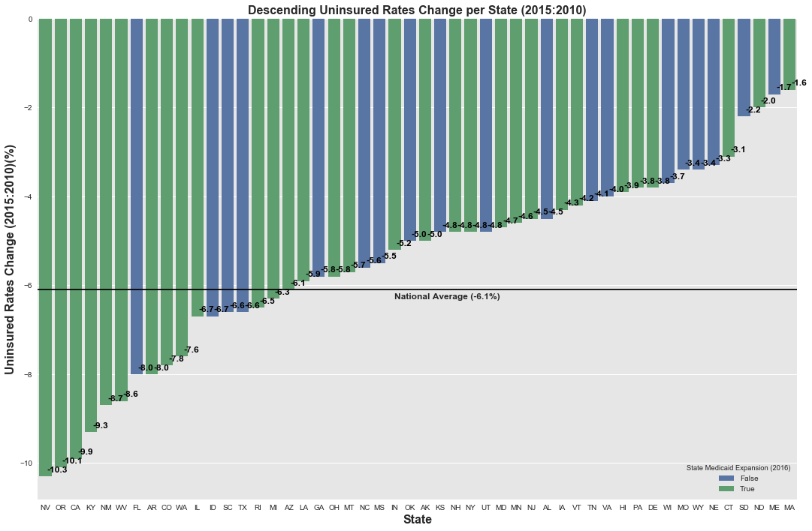


```python
Medicaid_Expansion = affordable_care_sort[affordable_care_sort['State Medicaid Expansion (2016)']==True]
Medicaid_Expansion.head()
```


<div>
<style>
    .dataframe thead tr:only-child th {
        text-align: right;
    }

    .dataframe thead th {
        text-align: left;
    }

    .dataframe tbody tr th {
        vertical-align: top;
    }
</style>
<table border="1" class="dataframe">
  <thead>
    <tr style="text-align: right;">
      <th></th>
      <th>State</th>
      <th>State Abbreviation</th>
      <th>Uninsured Rate (2010)</th>
      <th>Uninsured Rate (2015)</th>
      <th>Uninsured Rate Change (2010-2015)</th>
      <th>Medicare Enrollment (2016)</th>
      <th>Employer Health Insurance Coverage (2015)</th>
      <th>Marketplace Health Insurance Coverage (2016)</th>
      <th>Average Monthly Tax Credit (2016)</th>
      <th>Medicaid Enrollment (2016)</th>
      <th>State Medicaid Expansion (2016)</th>
    </tr>
  </thead>
  <tbody>
    <tr>
      <th>28</th>
      <td>Nevada</td>
      <td>NV</td>
      <td>22.6</td>
      <td>12.3</td>
      <td>-10.3</td>
      <td>471747</td>
      <td>1505000</td>
      <td>79876</td>
      <td>268.0</td>
      <td>614298</td>
      <td>True</td>
    </tr>
    <tr>
      <th>37</th>
      <td>Oregon</td>
      <td>OR</td>
      <td>17.1</td>
      <td>7.0</td>
      <td>-10.1</td>
      <td>784032</td>
      <td>2070000</td>
      <td>131167</td>
      <td>253.0</td>
      <td>1021862</td>
      <td>True</td>
    </tr>
    <tr>
      <th>4</th>
      <td>California</td>
      <td>CA</td>
      <td>18.5</td>
      <td>8.6</td>
      <td>-9.9</td>
      <td>5829777</td>
      <td>19552000</td>
      <td>1415428</td>
      <td>309.0</td>
      <td>11843081</td>
      <td>True</td>
    </tr>
    <tr>
      <th>17</th>
      <td>Kentucky</td>
      <td>KY</td>
      <td>15.3</td>
      <td>6.0</td>
      <td>-9.3</td>
      <td>881938</td>
      <td>2316000</td>
      <td>74640</td>
      <td>258.0</td>
      <td>1220788</td>
      <td>True</td>
    </tr>
    <tr>
      <th>31</th>
      <td>New Mexico</td>
      <td>NM</td>
      <td>19.6</td>
      <td>10.9</td>
      <td>-8.7</td>
      <td>385918</td>
      <td>884000</td>
      <td>47497</td>
      <td>212.0</td>
      <td>766732</td>
      <td>True</td>
    </tr>
  </tbody>
</table>
</div>


```python
merge_affordable_care_medicare = pd.merge(comparestate_affordable_care, hs_state_mean, how='left', on=['State Abbreviation'])
merge_affordable_care_medicare.head()
```


<div>
<style>
    .dataframe thead tr:only-child th {
        text-align: right;
    }

    .dataframe thead th {
        text-align: left;
    }

    .dataframe tbody tr th {
        vertical-align: top;
    }
</style>
<table border="1" class="dataframe">
  <thead>
    <tr style="text-align: right;">
      <th></th>
      <th>State</th>
      <th>State Abbreviation</th>
      <th>Uninsured Rate (2010)</th>
      <th>Uninsured Rate (2015)</th>
      <th>Uninsured Rate Change (2010-2015)</th>
      <th>Medicare Enrollment (2016)</th>
      <th>Employer Health Insurance Coverage (2015)</th>
      <th>Marketplace Health Insurance Coverage (2016)</th>
      <th>Average Monthly Tax Credit (2016)</th>
      <th>Medicaid Enrollment (2016)</th>
      <th>State Medicaid Expansion (2016)</th>
      <th>Avg_Spending_Per_Episode_State</th>
    </tr>
  </thead>
  <tbody>
    <tr>
      <th>0</th>
      <td>Alabama</td>
      <td>AL</td>
      <td>14.6</td>
      <td>10.1</td>
      <td>-4.5</td>
      <td>989855</td>
      <td>2545000</td>
      <td>165534</td>
      <td>310.0</td>
      <td>910775</td>
      <td>False</td>
      <td>19201.0</td>
    </tr>
    <tr>
      <th>1</th>
      <td>Alaska</td>
      <td>AK</td>
      <td>19.9</td>
      <td>14.9</td>
      <td>-5.0</td>
      <td>88966</td>
      <td>390000</td>
      <td>17995</td>
      <td>750.0</td>
      <td>166625</td>
      <td>True</td>
      <td>19907.0</td>
    </tr>
    <tr>
      <th>2</th>
      <td>Arizona</td>
      <td>AZ</td>
      <td>16.9</td>
      <td>10.8</td>
      <td>-6.1</td>
      <td>1175624</td>
      <td>3288000</td>
      <td>179445</td>
      <td>230.0</td>
      <td>1716198</td>
      <td>True</td>
      <td>20542.0</td>
    </tr>
    <tr>
      <th>3</th>
      <td>Arkansas</td>
      <td>AR</td>
      <td>17.5</td>
      <td>9.5</td>
      <td>-8.0</td>
      <td>606146</td>
      <td>1365000</td>
      <td>63357</td>
      <td>306.0</td>
      <td>920194</td>
      <td>True</td>
      <td>19705.0</td>
    </tr>
    <tr>
      <th>4</th>
      <td>California</td>
      <td>CA</td>
      <td>18.5</td>
      <td>8.6</td>
      <td>-9.9</td>
      <td>5829777</td>
      <td>19552000</td>
      <td>1415428</td>
      <td>309.0</td>
      <td>11843081</td>
      <td>True</td>
      <td>21141.0</td>
    </tr>
  </tbody>
</table>
</div>


```python
NoMedicaid_Expansion = affordable_care_sort[affordable_care_sort['State Medicaid Expansion (2016)']==False]
NoMedicaid_Expansion.head()
```


<div>
<style>
    .dataframe thead tr:only-child th {
        text-align: right;
    }

    .dataframe thead th {
        text-align: left;
    }

    .dataframe tbody tr th {
        vertical-align: top;
    }
</style>
<table border="1" class="dataframe">
  <thead>
    <tr style="text-align: right;">
      <th></th>
      <th>State</th>
      <th>State Abbreviation</th>
      <th>Uninsured Rate (2010)</th>
      <th>Uninsured Rate (2015)</th>
      <th>Uninsured Rate Change (2010-2015)</th>
      <th>Medicare Enrollment (2016)</th>
      <th>Employer Health Insurance Coverage (2015)</th>
      <th>Marketplace Health Insurance Coverage (2016)</th>
      <th>Average Monthly Tax Credit (2016)</th>
      <th>Medicaid Enrollment (2016)</th>
      <th>State Medicaid Expansion (2016)</th>
    </tr>
  </thead>
  <tbody>
    <tr>
      <th>9</th>
      <td>Florida</td>
      <td>FL</td>
      <td>21.3</td>
      <td>13.3</td>
      <td>-8.0</td>
      <td>4149593</td>
      <td>8847000</td>
      <td>1531714</td>
      <td>305.0</td>
      <td>3644673</td>
      <td>False</td>
    </tr>
    <tr>
      <th>12</th>
      <td>Idaho</td>
      <td>ID</td>
      <td>17.7</td>
      <td>11.0</td>
      <td>-6.7</td>
      <td>294284</td>
      <td>836000</td>
      <td>94270</td>
      <td>265.0</td>
      <td>293905</td>
      <td>False</td>
    </tr>
    <tr>
      <th>40</th>
      <td>South Carolina</td>
      <td>SC</td>
      <td>17.5</td>
      <td>10.9</td>
      <td>-6.6</td>
      <td>974114</td>
      <td>2487000</td>
      <td>204846</td>
      <td>312.0</td>
      <td>994804</td>
      <td>False</td>
    </tr>
    <tr>
      <th>43</th>
      <td>Texas</td>
      <td>TX</td>
      <td>23.7</td>
      <td>17.1</td>
      <td>-6.6</td>
      <td>3765946</td>
      <td>13709000</td>
      <td>1092650</td>
      <td>271.0</td>
      <td>4770229</td>
      <td>False</td>
    </tr>
    <tr>
      <th>10</th>
      <td>Georgia</td>
      <td>GA</td>
      <td>19.7</td>
      <td>13.9</td>
      <td>-5.8</td>
      <td>1574058</td>
      <td>5240000</td>
      <td>478016</td>
      <td>291.0</td>
      <td>1782301</td>
      <td>False</td>
    </tr>
  </tbody>
</table>
</div>


```python
#Combined
sns.set()
x_axis1 = np.arange(len(Medicaid_Expansion))
x_axis = np.arange(len(NoMedicaid_Expansion))
#Plot 1
plt.figure(figsize=(24,10))
plt.subplot(2,2,1)
tick_locations = [value+0.4 for value in x_axis1]
plt.bar(x_axis1, (Medicaid_Expansion['Uninsured Rate Change (2010-2015)']), color='Y', alpha=0.5, align="edge", edgecolor = 'black')
plt.xticks(tick_locations, Medicaid_Expansion["State"], rotation="vertical",fontweight='bold')
plt.xlim(-0.25, len(x_axis1))
plt.ylim(-12, max(Medicaid_Expansion['Uninsured Rate Change (2010-2015)']+1))
plt.axhline(y=-6.1, color = 'black') #adds a horizontal line for national average
plt.text(20,-6.6,'National Average (6.1%)',fontweight='bold')
plt.title("Uninsured Rates Change per State with Medicaid Expansion (2010-2015)", fontweight='bold')
plt.xlabel("State", fontweight='bold')
plt.ylabel("Rate Change(%) over 5 Years",fontweight='bold')
#Plot 2 
plt.subplot(222)
plt.bar(x_axis, (NoMedicaid_Expansion['Uninsured Rate Change (2010-2015)']), color='r', alpha=0.5, align="edge", edgecolor = 'black')
plt.xticks(tick_locations, NoMedicaid_Expansion["State"], rotation="vertical",fontweight='bold')
plt.xlim(-0.25, len(x_axis))
plt.ylim(-12, max(NoMedicaid_Expansion['Uninsured Rate Change (2010-2015)']+1))
plt.axhline(y=-6.1, color = 'black') #adds a horizontal line for national average
plt.text(12,-6.6,'National Average (6.1%)',fontweight='bold')
plt.title("Uninsured Rates Change per State without Medicaid Expansion (2010-2015)", fontweight='bold')
plt.xlabel("State", fontweight='bold')
plt.ylabel("Rate Change(%) over 5 Years",fontweight='bold')
plt.show()
```


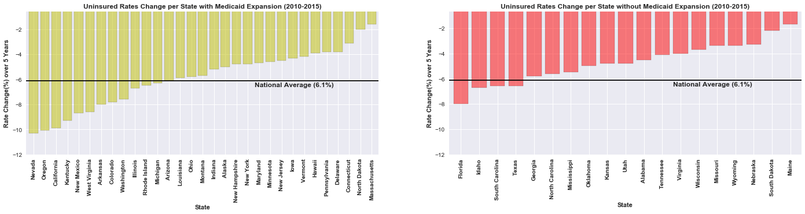


```python
import plotly.plotly as py
from plotly.graph_objs import *
```


```python
trace1 = Choropleth(
    z=['1', '1', '1', '1', '1', '1', '1','1', '1', '1', '1', '1', '1', '1', '1', '1', '1', '1', '1', '1', '1','1', '1', '1', '1', '1', '1', '1','1','1','1'],
    autocolorscale=False,
    colorscale=[[1, 'rgb(186,58,51)']],
    hoverinfo='text',
    locationmode='USA-states',
    locations=['AK','AZ','AR','CA','CO','CT','DE','HI','IL','IN','IA','KY','LA','MD','MA','MI','MN','MT','NV','NH', 'NJ', 'NM', 'NY', 'ND', 'OH', 'OR', 'PA', 'RI', 'VT', 'WA', 'WV'],
    name='With Medicaid Expansion',
    showscale=False,
    text=['Alaska','Arizona','Arkansas','California','Colorado','Connecticut','Delaware', 'Hawaii', 'Illinois','Indiana','Iowa','Kentucky','Louisiana','Maryland', 'Massachusetts', 'Michigan','Minnesota','Montana', 'Nevada','New Hampshire','New Jersey', 'New Mexico', 'New York', 'North Dakota', 'Ohio', 'Oregon', 'Pennsylvania', 'Rhode Island', 'Vermont', 'Washington', 'West Virginia'],
    zauto=False,
    zmax=1,
    zmin=0,
)
trace2 = Choropleth(
    z=[],
    autocolorscale=False,
    colorscale= ['rgb(68,94,150)'],
    hoverinfo='text',
    locationmode='USA-states',
    locations=['AL', 'FL', 'GA', 'ID', 'KS', 'ME', 'MS', 'MO', 'NE', 'NC', 'OK','SC', 'SD', 'TN', 'TX','UT','VA','WI','WY'],
    name='Without Medicaid Expansion',
    showscale=False,
    text=['Alabama', 'Florida', 'Georgia', 'Idaho','Kansas','Maine', 'Mississippi','Missouri', 'Nebraska', 'North Carolina', 'Oklahoma', 'South Carolina', 'South Dakota', 'Tennesee', 'Texas', 'Utah', 'Virgina', 'Wisconsin', 'Wyoming'],             
    zauto=False,
    zmax=1,
    zmin=0,
)

data = Data([trace1, trace2])
layout = Layout(
    autosize=False,
    geo=dict(
        countrycolor='rgb(102, 102,102)',
        countrywidth=0.1,
        lakecolor='rgb(68,94,150)',
        landcolor='rgba(237, 247, 138, 0.28)',
        lonaxis=dict(
            gridwidth=1.5999999999999999,
            range=[-180, -50],
            showgrid=False
        ),
        projection=dict(
            type='albers usa'
        ),
        scope='usa',
        showland=True,
        showrivers=False,
        showsubunits=True,
        subunitcolor='rgb(102, 102,102)',
        subunitwidth=0.5
    ),
    hovermode='closest',
    title='<b>States that Expanded Medicaid in 2016<br>(Red)',
    width= 800,
    margin = dict(
        l=0,
        r=50,
        b=100,
        t=100,
        pad=4)
)
fig = Figure(data=data, layout=layout)
py.iplot(fig, filename='Medicaid Expansion in 2016')

```


<iframe id="igraph" scrolling="no" style="border:none;" seamless="seamless" src="https://plot.ly/~KDC323/8.embed" height="525px" width="800px"></iframe>


```python
merge_affordable_care_medicare.head()
```


<div>
<style>
    .dataframe thead tr:only-child th {
        text-align: right;
    }

    .dataframe thead th {
        text-align: left;
    }

    .dataframe tbody tr th {
        vertical-align: top;
    }
</style>
<table border="1" class="dataframe">
  <thead>
    <tr style="text-align: right;">
      <th></th>
      <th>State</th>
      <th>State Abbreviation</th>
      <th>Uninsured Rate (2010)</th>
      <th>Uninsured Rate (2015)</th>
      <th>Uninsured Rate Change (2010-2015)</th>
      <th>Medicare Enrollment (2016)</th>
      <th>Employer Health Insurance Coverage (2015)</th>
      <th>Marketplace Health Insurance Coverage (2016)</th>
      <th>Average Monthly Tax Credit (2016)</th>
      <th>Medicaid Enrollment (2016)</th>
      <th>State Medicaid Expansion (2016)</th>
      <th>Avg_Spending_Per_Episode_State</th>
    </tr>
  </thead>
  <tbody>
    <tr>
      <th>0</th>
      <td>Alabama</td>
      <td>AL</td>
      <td>14.6</td>
      <td>10.1</td>
      <td>-4.5</td>
      <td>989855</td>
      <td>2545000</td>
      <td>165534</td>
      <td>310.0</td>
      <td>910775</td>
      <td>False</td>
      <td>19201.0</td>
    </tr>
    <tr>
      <th>1</th>
      <td>Alaska</td>
      <td>AK</td>
      <td>19.9</td>
      <td>14.9</td>
      <td>-5.0</td>
      <td>88966</td>
      <td>390000</td>
      <td>17995</td>
      <td>750.0</td>
      <td>166625</td>
      <td>True</td>
      <td>19907.0</td>
    </tr>
    <tr>
      <th>2</th>
      <td>Arizona</td>
      <td>AZ</td>
      <td>16.9</td>
      <td>10.8</td>
      <td>-6.1</td>
      <td>1175624</td>
      <td>3288000</td>
      <td>179445</td>
      <td>230.0</td>
      <td>1716198</td>
      <td>True</td>
      <td>20542.0</td>
    </tr>
    <tr>
      <th>3</th>
      <td>Arkansas</td>
      <td>AR</td>
      <td>17.5</td>
      <td>9.5</td>
      <td>-8.0</td>
      <td>606146</td>
      <td>1365000</td>
      <td>63357</td>
      <td>306.0</td>
      <td>920194</td>
      <td>True</td>
      <td>19705.0</td>
    </tr>
    <tr>
      <th>4</th>
      <td>California</td>
      <td>CA</td>
      <td>18.5</td>
      <td>8.6</td>
      <td>-9.9</td>
      <td>5829777</td>
      <td>19552000</td>
      <td>1415428</td>
      <td>309.0</td>
      <td>11843081</td>
      <td>True</td>
      <td>21141.0</td>
    </tr>
  </tbody>
</table>
</div>


```python
merge_affordable_care_medicare = merge_affordable_care_medicare.dropna()
merge_affordable_care_medicare.head()
```


<div>
<style>
    .dataframe thead tr:only-child th {
        text-align: right;
    }

    .dataframe thead th {
        text-align: left;
    }

    .dataframe tbody tr th {
        vertical-align: top;
    }
</style>
<table border="1" class="dataframe">
  <thead>
    <tr style="text-align: right;">
      <th></th>
      <th>State</th>
      <th>State Abbreviation</th>
      <th>Uninsured Rate (2010)</th>
      <th>Uninsured Rate (2015)</th>
      <th>Uninsured Rate Change (2010-2015)</th>
      <th>Medicare Enrollment (2016)</th>
      <th>Employer Health Insurance Coverage (2015)</th>
      <th>Marketplace Health Insurance Coverage (2016)</th>
      <th>Average Monthly Tax Credit (2016)</th>
      <th>Medicaid Enrollment (2016)</th>
      <th>State Medicaid Expansion (2016)</th>
      <th>Avg_Spending_Per_Episode_State</th>
    </tr>
  </thead>
  <tbody>
    <tr>
      <th>0</th>
      <td>Alabama</td>
      <td>AL</td>
      <td>14.6</td>
      <td>10.1</td>
      <td>-4.5</td>
      <td>989855</td>
      <td>2545000</td>
      <td>165534</td>
      <td>310.0</td>
      <td>910775</td>
      <td>False</td>
      <td>19201.0</td>
    </tr>
    <tr>
      <th>1</th>
      <td>Alaska</td>
      <td>AK</td>
      <td>19.9</td>
      <td>14.9</td>
      <td>-5.0</td>
      <td>88966</td>
      <td>390000</td>
      <td>17995</td>
      <td>750.0</td>
      <td>166625</td>
      <td>True</td>
      <td>19907.0</td>
    </tr>
    <tr>
      <th>2</th>
      <td>Arizona</td>
      <td>AZ</td>
      <td>16.9</td>
      <td>10.8</td>
      <td>-6.1</td>
      <td>1175624</td>
      <td>3288000</td>
      <td>179445</td>
      <td>230.0</td>
      <td>1716198</td>
      <td>True</td>
      <td>20542.0</td>
    </tr>
    <tr>
      <th>3</th>
      <td>Arkansas</td>
      <td>AR</td>
      <td>17.5</td>
      <td>9.5</td>
      <td>-8.0</td>
      <td>606146</td>
      <td>1365000</td>
      <td>63357</td>
      <td>306.0</td>
      <td>920194</td>
      <td>True</td>
      <td>19705.0</td>
    </tr>
    <tr>
      <th>4</th>
      <td>California</td>
      <td>CA</td>
      <td>18.5</td>
      <td>8.6</td>
      <td>-9.9</td>
      <td>5829777</td>
      <td>19552000</td>
      <td>1415428</td>
      <td>309.0</td>
      <td>11843081</td>
      <td>True</td>
      <td>21141.0</td>
    </tr>
  </tbody>
</table>
</div>


```python
merge_affordable_care_medicare.count()
```


    State                                           49
    State Abbreviation                              49
    Uninsured Rate (2010)                           49
    Uninsured Rate (2015)                           49
    Uninsured Rate Change (2010-2015)               49
    Medicare Enrollment (2016)                      49
    Employer Health Insurance Coverage (2015)       49
    Marketplace Health Insurance Coverage (2016)    49
    Average Monthly Tax Credit (2016)               49
    Medicaid Enrollment (2016)                      49
    State Medicaid Expansion (2016)                 49
    Avg_Spending_Per_Episode_State                  49
    dtype: int64


```python

sns.set(style="ticks")
sns_plot=sns.pairplot(merge_affordable_care_medicare, x_vars=["Employer Health Insurance Coverage (2015)"], y_vars=["Medicare Enrollment (2016)"],
             hue="State Medicaid Expansion (2016)", size=5, aspect=1.2, kind="reg")
sns.despine()
sns_plot.fig.suptitle('Employer Health Insurance Coverage (2015) Vs. Medicare Enrollment (2016)',fontweight='bold',fontsize=12)
plt.xlabel("Employer Health Insurance Coverage (2015)", fontweight='bold',fontsize=14)
plt.ylabel("Medicare Enrollment (2016)",  fontweight='bold',fontsize=14)

sns_plot.savefig("Employer Health Insurance Coverage(2015) vs. Medicare Enrollment (2016).png")  
plt.show()

```


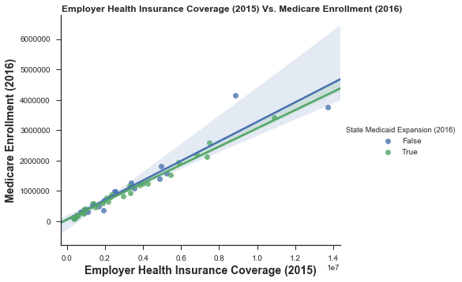


```python
sns.set(style="ticks")
sns_plot=sns.pairplot(merge_affordable_care_medicare, x_vars=["Medicaid Enrollment (2016)"], y_vars=["Medicare Enrollment (2016)"],
             hue="State Medicaid Expansion (2016)", size=5, aspect=1.2, kind="reg")
sns.despine()
sns_plot.fig.suptitle('Medicaid Enrollment (2016) vs. Medicare Enrollment (2016)',  fontweight='bold',fontsize=12)
plt.xlabel("Medicaid Enrollment (2016)",  fontweight='bold',fontsize=12)
plt.ylabel("Medicare Enrollment (2016)",  fontweight='bold',fontsize=12)

sns_plot.savefig("Medicaid Enrollment (2016) vs. Medicare Enrollment (2016).png")  
plt.show()
```


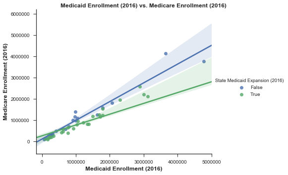


```python
sns_plot = sns.pairplot(merge_affordable_care_medicare, x_vars=["Avg_Spending_Per_Episode_State"], y_vars=["Medicare Enrollment (2016)"],
             hue="State Medicaid Expansion (2016)", size=5, aspect=1.2, kind="reg")
sns_plot.fig.suptitle('2015 Medicare Avg Spending Per Episode State vs. Medicare Enrollment (2016)', fontweight='bold',fontsize=12)
sns_plot.savefig("Avg_Spending_Per_Episode_State_vs._Medicare_Enrollment_(2016).png") 
plt.show()
```


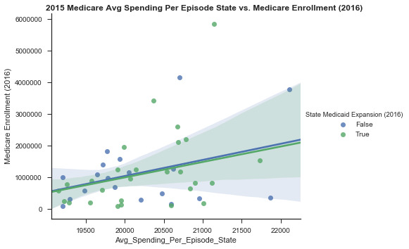


```python
sns_plot=sns.pairplot(merge_affordable_care_medicare, x_vars=["Avg_Spending_Per_Episode_State"], y_vars=["Marketplace Health Insurance Coverage (2016)"],
             hue="State Medicaid Expansion (2016)", size=5, aspect=1.2, kind="reg")
sns_plot.fig.suptitle('2015 Medicare Avg Spending Per Episode State vs. Marketplace Health Insurance Coverage (2016)', fontweight='bold',fontsize=12)
sns_plot.savefig("Avg_Spending_Per_Episode_State_vs._Marketplace Health Insurance Coverage (2016).png") 
plt.show()
```


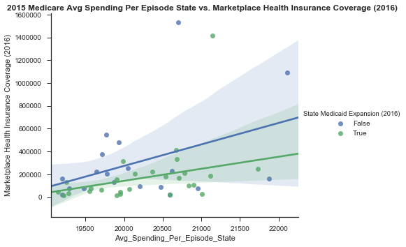


```python
sns_plot=sns.pairplot(merge_affordable_care_medicare, x_vars=["Avg_Spending_Per_Episode_State"], y_vars=["Employer Health Insurance Coverage (2015)"],
             hue="State Medicaid Expansion (2016)", size=5, aspect=1.2, kind="reg")
sns_plot.fig.suptitle('2015 Medicare Avg Spending Per Episode State vs. Employer Health Insurance Coverage (2015)', fontweight='bold',fontsize=12)
sns_plot.savefig("Avg_Spending_Per_Episode_State_vs._Employer Health Insurance Coverage (2015).png") 
plt.show()
```


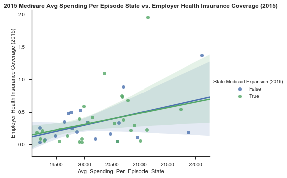


```python
sns_plot=sns.pairplot(merge_affordable_care_medicare, x_vars=["Avg_Spending_Per_Episode_State"], y_vars=["Medicaid Enrollment (2016)"],
             hue="State Medicaid Expansion (2016)", size=5, aspect=1.2, kind="reg")
sns_plot.fig.suptitle('2015 Medicare Avg Spending Per Episode State vs. Medicaid Enrollment (2016)', fontweight='bold',fontsize=12)
sns_plot.savefig("Avg_Spending_Per_Episode_State_vs._Medicaid Enrollment (2016).png") 
plt.show()
```


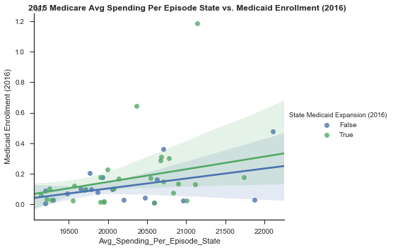


```python
sns_plot=sns.pairplot(merge_affordable_care_medicare, x_vars=["Marketplace Health Insurance Coverage (2016)"], y_vars=["Medicare Enrollment (2016)"],
               hue="State Medicaid Expansion (2016)",size=5, aspect=1.2, kind="reg")
sns_plot.fig.suptitle('Marketplace Health Insurance Coverage (2016) vs. Medicare Enrollment (2016)', fontweight='bold',fontsize=12)
sns_plot.savefig("Medicare Enrollment (2016) vs. Marketplace Health Insurance Coverage (2016).png") 
plt.show()
```


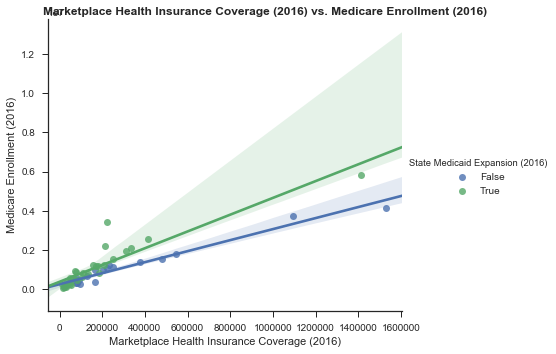


```python

sns_plot=sns.pairplot(merge_affordable_care_medicare, x_vars=["Marketplace Health Insurance Coverage (2016)"], y_vars=["Employer Health Insurance Coverage (2015)"],
               hue="State Medicaid Expansion (2016)",size=5, aspect=1.2, kind="reg")
sns_plot.fig.suptitle('Marketplace Health Insurance Coverage (2016) vs. Employer Health Insurance Coverage (2015)', fontweight='bold',fontsize=12)
sns_plot.savefig("Employer Health Insurance Coverage (2015) vs. Marketplace Health Insurance Coverage (2016).png") 
plt.show()
```


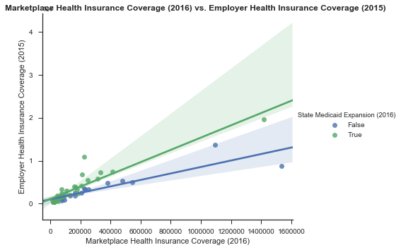


```python
sns_plot=sns.pairplot(merge_affordable_care_medicare, x_vars=["Marketplace Health Insurance Coverage (2016)"], y_vars=["Medicaid Enrollment (2016)"],
               hue="State Medicaid Expansion (2016)", size=5, aspect=1.2, kind="reg")
sns_plot.fig.suptitle('Marketplace Health Insurance Coverage (2016) vs. Medicaid Enrollment (2016)', fontweight='bold',fontsize=12)
sns_plot.savefig("Medicaid Enrollment (2016) vs. Marketplace Health Insurance Coverage (2016).png") 
plt.show()
```


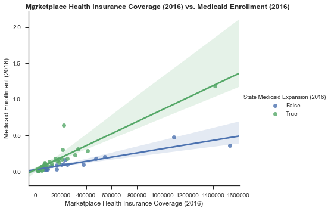


```python
death_causes = "NCHS_-_Potentially_Excess_Deaths_from_the_Five_Leading_Causes_of_Death.csv"

death_causes_df = pd.read_csv(death_causes)
death_causes_df
```


<div>
<style>
    .dataframe thead tr:only-child th {
        text-align: right;
    }

    .dataframe thead th {
        text-align: left;
    }

    .dataframe tbody tr th {
        vertical-align: top;
    }
</style>
<table border="1" class="dataframe">
  <thead>
    <tr style="text-align: right;">
      <th></th>
      <th>Year</th>
      <th>Cause of Death</th>
      <th>State</th>
      <th>State FIPS Code</th>
      <th>HHS Region</th>
      <th>Age Range</th>
      <th>Benchmark</th>
      <th>Locality</th>
      <th>Observed Deaths</th>
      <th>Population</th>
      <th>Expected Deaths</th>
      <th>Potentially Excess Deaths</th>
      <th>Percent Potentially Excess Deaths</th>
    </tr>
  </thead>
  <tbody>
    <tr>
      <th>0</th>
      <td>2005</td>
      <td>Cancer</td>
      <td>Alabama</td>
      <td>AL</td>
      <td>4</td>
      <td>0-49</td>
      <td>2005 Fixed</td>
      <td>All</td>
      <td>756.0</td>
      <td>3148377.0</td>
      <td>451.0</td>
      <td>305.0</td>
      <td>40.3%</td>
    </tr>
    <tr>
      <th>1</th>
      <td>2005</td>
      <td>Cancer</td>
      <td>Alabama</td>
      <td>AL</td>
      <td>4</td>
      <td>0-49</td>
      <td>2005 Fixed</td>
      <td>Metropolitan</td>
      <td>556.0</td>
      <td>2379871.0</td>
      <td>341.0</td>
      <td>217.0</td>
      <td>39%</td>
    </tr>
    <tr>
      <th>2</th>
      <td>2005</td>
      <td>Cancer</td>
      <td>Alabama</td>
      <td>AL</td>
      <td>4</td>
      <td>0-49</td>
      <td>2005 Fixed</td>
      <td>Nonmetropolitan</td>
      <td>200.0</td>
      <td>768506.0</td>
      <td>111.0</td>
      <td>89.0</td>
      <td>44.5%</td>
    </tr>
    <tr>
      <th>3</th>
      <td>2005</td>
      <td>Cancer</td>
      <td>Alabama</td>
      <td>AL</td>
      <td>4</td>
      <td>0-49</td>
      <td>2010 Fixed</td>
      <td>All</td>
      <td>756.0</td>
      <td>3148377.0</td>
      <td>421.0</td>
      <td>335.0</td>
      <td>44.3%</td>
    </tr>
    <tr>
      <th>4</th>
      <td>2005</td>
      <td>Cancer</td>
      <td>Alabama</td>
      <td>AL</td>
      <td>4</td>
      <td>0-49</td>
      <td>2010 Fixed</td>
      <td>Metropolitan</td>
      <td>556.0</td>
      <td>2379871.0</td>
      <td>318.0</td>
      <td>238.0</td>
      <td>42.8%</td>
    </tr>
    <tr>
      <th>5</th>
      <td>2005</td>
      <td>Cancer</td>
      <td>Alabama</td>
      <td>AL</td>
      <td>4</td>
      <td>0-49</td>
      <td>2010 Fixed</td>
      <td>Nonmetropolitan</td>
      <td>200.0</td>
      <td>768506.0</td>
      <td>103.0</td>
      <td>97.0</td>
      <td>48.5%</td>
    </tr>
    <tr>
      <th>6</th>
      <td>2005</td>
      <td>Cancer</td>
      <td>Alabama</td>
      <td>AL</td>
      <td>4</td>
      <td>0-49</td>
      <td>Floating</td>
      <td>All</td>
      <td>756.0</td>
      <td>3148377.0</td>
      <td>451.0</td>
      <td>305.0</td>
      <td>40.3%</td>
    </tr>
    <tr>
      <th>7</th>
      <td>2005</td>
      <td>Cancer</td>
      <td>Alabama</td>
      <td>AL</td>
      <td>4</td>
      <td>0-49</td>
      <td>Floating</td>
      <td>Metropolitan</td>
      <td>556.0</td>
      <td>2379871.0</td>
      <td>341.0</td>
      <td>217.0</td>
      <td>39%</td>
    </tr>
    <tr>
      <th>8</th>
      <td>2005</td>
      <td>Cancer</td>
      <td>Alabama</td>
      <td>AL</td>
      <td>4</td>
      <td>0-49</td>
      <td>Floating</td>
      <td>Nonmetropolitan</td>
      <td>200.0</td>
      <td>768506.0</td>
      <td>111.0</td>
      <td>89.0</td>
      <td>44.5%</td>
    </tr>
    <tr>
      <th>9</th>
      <td>2005</td>
      <td>Cancer</td>
      <td>Alabama</td>
      <td>AL</td>
      <td>4</td>
      <td>0-54</td>
      <td>2005 Fixed</td>
      <td>All</td>
      <td>1346.0</td>
      <td>3463216.0</td>
      <td>784.0</td>
      <td>562.0</td>
      <td>41.8%</td>
    </tr>
    <tr>
      <th>10</th>
      <td>2005</td>
      <td>Cancer</td>
      <td>Alabama</td>
      <td>AL</td>
      <td>4</td>
      <td>0-54</td>
      <td>2005 Fixed</td>
      <td>Metropolitan</td>
      <td>968.0</td>
      <td>2615416.0</td>
      <td>590.0</td>
      <td>379.0</td>
      <td>39.2%</td>
    </tr>
    <tr>
      <th>11</th>
      <td>2005</td>
      <td>Cancer</td>
      <td>Alabama</td>
      <td>AL</td>
      <td>4</td>
      <td>0-54</td>
      <td>2005 Fixed</td>
      <td>Nonmetropolitan</td>
      <td>378.0</td>
      <td>847800.0</td>
      <td>194.0</td>
      <td>184.0</td>
      <td>48.7%</td>
    </tr>
    <tr>
      <th>12</th>
      <td>2005</td>
      <td>Cancer</td>
      <td>Alabama</td>
      <td>AL</td>
      <td>4</td>
      <td>0-54</td>
      <td>2010 Fixed</td>
      <td>All</td>
      <td>1346.0</td>
      <td>3463216.0</td>
      <td>764.0</td>
      <td>582.0</td>
      <td>43.2%</td>
    </tr>
    <tr>
      <th>13</th>
      <td>2005</td>
      <td>Cancer</td>
      <td>Alabama</td>
      <td>AL</td>
      <td>4</td>
      <td>0-54</td>
      <td>2010 Fixed</td>
      <td>Metropolitan</td>
      <td>968.0</td>
      <td>2615416.0</td>
      <td>574.0</td>
      <td>394.0</td>
      <td>40.7%</td>
    </tr>
    <tr>
      <th>14</th>
      <td>2005</td>
      <td>Cancer</td>
      <td>Alabama</td>
      <td>AL</td>
      <td>4</td>
      <td>0-54</td>
      <td>2010 Fixed</td>
      <td>Nonmetropolitan</td>
      <td>378.0</td>
      <td>847800.0</td>
      <td>189.0</td>
      <td>189.0</td>
      <td>50%</td>
    </tr>
    <tr>
      <th>15</th>
      <td>2005</td>
      <td>Cancer</td>
      <td>Alabama</td>
      <td>AL</td>
      <td>4</td>
      <td>0-54</td>
      <td>Floating</td>
      <td>All</td>
      <td>1346.0</td>
      <td>3463216.0</td>
      <td>784.0</td>
      <td>562.0</td>
      <td>41.8%</td>
    </tr>
    <tr>
      <th>16</th>
      <td>2005</td>
      <td>Cancer</td>
      <td>Alabama</td>
      <td>AL</td>
      <td>4</td>
      <td>0-54</td>
      <td>Floating</td>
      <td>Metropolitan</td>
      <td>968.0</td>
      <td>2615416.0</td>
      <td>590.0</td>
      <td>379.0</td>
      <td>39.2%</td>
    </tr>
    <tr>
      <th>17</th>
      <td>2005</td>
      <td>Cancer</td>
      <td>Alabama</td>
      <td>AL</td>
      <td>4</td>
      <td>0-54</td>
      <td>Floating</td>
      <td>Nonmetropolitan</td>
      <td>378.0</td>
      <td>847800.0</td>
      <td>194.0</td>
      <td>184.0</td>
      <td>48.7%</td>
    </tr>
    <tr>
      <th>18</th>
      <td>2005</td>
      <td>Cancer</td>
      <td>Alabama</td>
      <td>AL</td>
      <td>4</td>
      <td>0-59</td>
      <td>2005 Fixed</td>
      <td>All</td>
      <td>2199.0</td>
      <td>3747300.0</td>
      <td>1330.0</td>
      <td>869.0</td>
      <td>39.5%</td>
    </tr>
    <tr>
      <th>19</th>
      <td>2005</td>
      <td>Cancer</td>
      <td>Alabama</td>
      <td>AL</td>
      <td>4</td>
      <td>0-59</td>
      <td>2005 Fixed</td>
      <td>Metropolitan</td>
      <td>1596.0</td>
      <td>2823908.0</td>
      <td>992.0</td>
      <td>606.0</td>
      <td>38%</td>
    </tr>
    <tr>
      <th>20</th>
      <td>2005</td>
      <td>Cancer</td>
      <td>Alabama</td>
      <td>AL</td>
      <td>4</td>
      <td>0-59</td>
      <td>2005 Fixed</td>
      <td>Nonmetropolitan</td>
      <td>603.0</td>
      <td>923392.0</td>
      <td>338.0</td>
      <td>265.0</td>
      <td>43.9%</td>
    </tr>
    <tr>
      <th>21</th>
      <td>2005</td>
      <td>Cancer</td>
      <td>Alabama</td>
      <td>AL</td>
      <td>4</td>
      <td>0-59</td>
      <td>2010 Fixed</td>
      <td>All</td>
      <td>2199.0</td>
      <td>3747300.0</td>
      <td>1264.0</td>
      <td>935.0</td>
      <td>42.5%</td>
    </tr>
    <tr>
      <th>22</th>
      <td>2005</td>
      <td>Cancer</td>
      <td>Alabama</td>
      <td>AL</td>
      <td>4</td>
      <td>0-59</td>
      <td>2010 Fixed</td>
      <td>Metropolitan</td>
      <td>1596.0</td>
      <td>2823908.0</td>
      <td>943.0</td>
      <td>653.0</td>
      <td>40.9%</td>
    </tr>
    <tr>
      <th>23</th>
      <td>2005</td>
      <td>Cancer</td>
      <td>Alabama</td>
      <td>AL</td>
      <td>4</td>
      <td>0-59</td>
      <td>2010 Fixed</td>
      <td>Nonmetropolitan</td>
      <td>603.0</td>
      <td>923392.0</td>
      <td>321.0</td>
      <td>282.0</td>
      <td>46.8%</td>
    </tr>
    <tr>
      <th>24</th>
      <td>2005</td>
      <td>Cancer</td>
      <td>Alabama</td>
      <td>AL</td>
      <td>4</td>
      <td>0-59</td>
      <td>Floating</td>
      <td>All</td>
      <td>2199.0</td>
      <td>3747300.0</td>
      <td>1330.0</td>
      <td>869.0</td>
      <td>39.5%</td>
    </tr>
    <tr>
      <th>25</th>
      <td>2005</td>
      <td>Cancer</td>
      <td>Alabama</td>
      <td>AL</td>
      <td>4</td>
      <td>0-59</td>
      <td>Floating</td>
      <td>Metropolitan</td>
      <td>1596.0</td>
      <td>2823908.0</td>
      <td>992.0</td>
      <td>606.0</td>
      <td>38%</td>
    </tr>
    <tr>
      <th>26</th>
      <td>2005</td>
      <td>Cancer</td>
      <td>Alabama</td>
      <td>AL</td>
      <td>4</td>
      <td>0-59</td>
      <td>Floating</td>
      <td>Nonmetropolitan</td>
      <td>603.0</td>
      <td>923392.0</td>
      <td>338.0</td>
      <td>265.0</td>
      <td>43.9%</td>
    </tr>
    <tr>
      <th>27</th>
      <td>2005</td>
      <td>Cancer</td>
      <td>Alabama</td>
      <td>AL</td>
      <td>4</td>
      <td>0-64</td>
      <td>2005 Fixed</td>
      <td>All</td>
      <td>3244.0</td>
      <td>3967703.0</td>
      <td>2067.0</td>
      <td>1177.0</td>
      <td>36.3%</td>
    </tr>
    <tr>
      <th>28</th>
      <td>2005</td>
      <td>Cancer</td>
      <td>Alabama</td>
      <td>AL</td>
      <td>4</td>
      <td>0-64</td>
      <td>2005 Fixed</td>
      <td>Metropolitan</td>
      <td>2325.0</td>
      <td>2982884.0</td>
      <td>1524.0</td>
      <td>801.0</td>
      <td>34.5%</td>
    </tr>
    <tr>
      <th>29</th>
      <td>2005</td>
      <td>Cancer</td>
      <td>Alabama</td>
      <td>AL</td>
      <td>4</td>
      <td>0-64</td>
      <td>2005 Fixed</td>
      <td>Nonmetropolitan</td>
      <td>919.0</td>
      <td>984819.0</td>
      <td>543.0</td>
      <td>376.0</td>
      <td>40.9%</td>
    </tr>
    <tr>
      <th>...</th>
      <td>...</td>
      <td>...</td>
      <td>...</td>
      <td>...</td>
      <td>...</td>
      <td>...</td>
      <td>...</td>
      <td>...</td>
      <td>...</td>
      <td>...</td>
      <td>...</td>
      <td>...</td>
      <td>...</td>
    </tr>
    <tr>
      <th>205890</th>
      <td>2015</td>
      <td>Unintentional Injury</td>
      <td>Wyoming</td>
      <td>WY</td>
      <td>8</td>
      <td>0-69</td>
      <td>Floating</td>
      <td>All</td>
      <td>304.0</td>
      <td>531891.0</td>
      <td>111.0</td>
      <td>193.0</td>
      <td>63.5%</td>
    </tr>
    <tr>
      <th>205891</th>
      <td>2015</td>
      <td>Unintentional Injury</td>
      <td>Wyoming</td>
      <td>WY</td>
      <td>8</td>
      <td>0-69</td>
      <td>Floating</td>
      <td>Metropolitan</td>
      <td>83.0</td>
      <td>163034.0</td>
      <td>34.0</td>
      <td>49.0</td>
      <td>59%</td>
    </tr>
    <tr>
      <th>205892</th>
      <td>2015</td>
      <td>Unintentional Injury</td>
      <td>Wyoming</td>
      <td>WY</td>
      <td>8</td>
      <td>0-69</td>
      <td>Floating</td>
      <td>Nonmetropolitan</td>
      <td>221.0</td>
      <td>368857.0</td>
      <td>77.0</td>
      <td>144.0</td>
      <td>65.2%</td>
    </tr>
    <tr>
      <th>205893</th>
      <td>2015</td>
      <td>Unintentional Injury</td>
      <td>Wyoming</td>
      <td>WY</td>
      <td>8</td>
      <td>0-74</td>
      <td>2005 Fixed</td>
      <td>All</td>
      <td>318.0</td>
      <td>552210.0</td>
      <td>96.0</td>
      <td>222.0</td>
      <td>69.8%</td>
    </tr>
    <tr>
      <th>205894</th>
      <td>2015</td>
      <td>Unintentional Injury</td>
      <td>Wyoming</td>
      <td>WY</td>
      <td>8</td>
      <td>0-74</td>
      <td>2005 Fixed</td>
      <td>Metropolitan</td>
      <td>86.0</td>
      <td>168713.0</td>
      <td>29.0</td>
      <td>57.0</td>
      <td>66.3%</td>
    </tr>
    <tr>
      <th>205895</th>
      <td>2015</td>
      <td>Unintentional Injury</td>
      <td>Wyoming</td>
      <td>WY</td>
      <td>8</td>
      <td>0-74</td>
      <td>2005 Fixed</td>
      <td>Nonmetropolitan</td>
      <td>232.0</td>
      <td>383497.0</td>
      <td>67.0</td>
      <td>165.0</td>
      <td>71.1%</td>
    </tr>
    <tr>
      <th>205896</th>
      <td>2015</td>
      <td>Unintentional Injury</td>
      <td>Wyoming</td>
      <td>WY</td>
      <td>8</td>
      <td>0-74</td>
      <td>2010 Fixed</td>
      <td>All</td>
      <td>318.0</td>
      <td>552210.0</td>
      <td>101.0</td>
      <td>217.0</td>
      <td>68.2%</td>
    </tr>
    <tr>
      <th>205897</th>
      <td>2015</td>
      <td>Unintentional Injury</td>
      <td>Wyoming</td>
      <td>WY</td>
      <td>8</td>
      <td>0-74</td>
      <td>2010 Fixed</td>
      <td>Metropolitan</td>
      <td>86.0</td>
      <td>168713.0</td>
      <td>31.0</td>
      <td>55.0</td>
      <td>64%</td>
    </tr>
    <tr>
      <th>205898</th>
      <td>2015</td>
      <td>Unintentional Injury</td>
      <td>Wyoming</td>
      <td>WY</td>
      <td>8</td>
      <td>0-74</td>
      <td>2010 Fixed</td>
      <td>Nonmetropolitan</td>
      <td>232.0</td>
      <td>383497.0</td>
      <td>70.0</td>
      <td>162.0</td>
      <td>69.8%</td>
    </tr>
    <tr>
      <th>205899</th>
      <td>2015</td>
      <td>Unintentional Injury</td>
      <td>Wyoming</td>
      <td>WY</td>
      <td>8</td>
      <td>0-74</td>
      <td>Floating</td>
      <td>All</td>
      <td>318.0</td>
      <td>552210.0</td>
      <td>120.0</td>
      <td>198.0</td>
      <td>62.3%</td>
    </tr>
    <tr>
      <th>205900</th>
      <td>2015</td>
      <td>Unintentional Injury</td>
      <td>Wyoming</td>
      <td>WY</td>
      <td>8</td>
      <td>0-74</td>
      <td>Floating</td>
      <td>Metropolitan</td>
      <td>86.0</td>
      <td>168713.0</td>
      <td>37.0</td>
      <td>49.0</td>
      <td>57%</td>
    </tr>
    <tr>
      <th>205901</th>
      <td>2015</td>
      <td>Unintentional Injury</td>
      <td>Wyoming</td>
      <td>WY</td>
      <td>8</td>
      <td>0-74</td>
      <td>Floating</td>
      <td>Nonmetropolitan</td>
      <td>232.0</td>
      <td>383497.0</td>
      <td>84.0</td>
      <td>148.0</td>
      <td>63.8%</td>
    </tr>
    <tr>
      <th>205902</th>
      <td>2015</td>
      <td>Unintentional Injury</td>
      <td>Wyoming</td>
      <td>WY</td>
      <td>8</td>
      <td>0-79</td>
      <td>2005 Fixed</td>
      <td>All</td>
      <td>336.0</td>
      <td>566120.0</td>
      <td>106.0</td>
      <td>230.0</td>
      <td>68.5%</td>
    </tr>
    <tr>
      <th>205903</th>
      <td>2015</td>
      <td>Unintentional Injury</td>
      <td>Wyoming</td>
      <td>WY</td>
      <td>8</td>
      <td>0-79</td>
      <td>2005 Fixed</td>
      <td>Metropolitan</td>
      <td>90.0</td>
      <td>172771.0</td>
      <td>32.0</td>
      <td>58.0</td>
      <td>64.4%</td>
    </tr>
    <tr>
      <th>205904</th>
      <td>2015</td>
      <td>Unintentional Injury</td>
      <td>Wyoming</td>
      <td>WY</td>
      <td>8</td>
      <td>0-79</td>
      <td>2005 Fixed</td>
      <td>Nonmetropolitan</td>
      <td>246.0</td>
      <td>393349.0</td>
      <td>74.0</td>
      <td>172.0</td>
      <td>69.9%</td>
    </tr>
    <tr>
      <th>205905</th>
      <td>2015</td>
      <td>Unintentional Injury</td>
      <td>Wyoming</td>
      <td>WY</td>
      <td>8</td>
      <td>0-79</td>
      <td>2010 Fixed</td>
      <td>All</td>
      <td>336.0</td>
      <td>566120.0</td>
      <td>111.0</td>
      <td>225.0</td>
      <td>67%</td>
    </tr>
    <tr>
      <th>205906</th>
      <td>2015</td>
      <td>Unintentional Injury</td>
      <td>Wyoming</td>
      <td>WY</td>
      <td>8</td>
      <td>0-79</td>
      <td>2010 Fixed</td>
      <td>Metropolitan</td>
      <td>90.0</td>
      <td>172771.0</td>
      <td>34.0</td>
      <td>56.0</td>
      <td>62.2%</td>
    </tr>
    <tr>
      <th>205907</th>
      <td>2015</td>
      <td>Unintentional Injury</td>
      <td>Wyoming</td>
      <td>WY</td>
      <td>8</td>
      <td>0-79</td>
      <td>2010 Fixed</td>
      <td>Nonmetropolitan</td>
      <td>246.0</td>
      <td>393349.0</td>
      <td>78.0</td>
      <td>168.0</td>
      <td>68.3%</td>
    </tr>
    <tr>
      <th>205908</th>
      <td>2015</td>
      <td>Unintentional Injury</td>
      <td>Wyoming</td>
      <td>WY</td>
      <td>8</td>
      <td>0-79</td>
      <td>Floating</td>
      <td>All</td>
      <td>336.0</td>
      <td>566120.0</td>
      <td>126.0</td>
      <td>210.0</td>
      <td>62.5%</td>
    </tr>
    <tr>
      <th>205909</th>
      <td>2015</td>
      <td>Unintentional Injury</td>
      <td>Wyoming</td>
      <td>WY</td>
      <td>8</td>
      <td>0-79</td>
      <td>Floating</td>
      <td>Metropolitan</td>
      <td>90.0</td>
      <td>172771.0</td>
      <td>38.0</td>
      <td>52.0</td>
      <td>57.8%</td>
    </tr>
    <tr>
      <th>205910</th>
      <td>2015</td>
      <td>Unintentional Injury</td>
      <td>Wyoming</td>
      <td>WY</td>
      <td>8</td>
      <td>0-79</td>
      <td>Floating</td>
      <td>Nonmetropolitan</td>
      <td>246.0</td>
      <td>393349.0</td>
      <td>88.0</td>
      <td>158.0</td>
      <td>64.2%</td>
    </tr>
    <tr>
      <th>205911</th>
      <td>2015</td>
      <td>Unintentional Injury</td>
      <td>Wyoming</td>
      <td>WY</td>
      <td>8</td>
      <td>0-84</td>
      <td>2005 Fixed</td>
      <td>All</td>
      <td>352.0</td>
      <td>575843.0</td>
      <td>113.0</td>
      <td>239.0</td>
      <td>67.9%</td>
    </tr>
    <tr>
      <th>205912</th>
      <td>2015</td>
      <td>Unintentional Injury</td>
      <td>Wyoming</td>
      <td>WY</td>
      <td>8</td>
      <td>0-84</td>
      <td>2005 Fixed</td>
      <td>Metropolitan</td>
      <td>93.0</td>
      <td>175787.0</td>
      <td>34.0</td>
      <td>59.0</td>
      <td>63.4%</td>
    </tr>
    <tr>
      <th>205913</th>
      <td>2015</td>
      <td>Unintentional Injury</td>
      <td>Wyoming</td>
      <td>WY</td>
      <td>8</td>
      <td>0-84</td>
      <td>2005 Fixed</td>
      <td>Nonmetropolitan</td>
      <td>259.0</td>
      <td>400056.0</td>
      <td>79.0</td>
      <td>180.0</td>
      <td>69.5%</td>
    </tr>
    <tr>
      <th>205914</th>
      <td>2015</td>
      <td>Unintentional Injury</td>
      <td>Wyoming</td>
      <td>WY</td>
      <td>8</td>
      <td>0-84</td>
      <td>2010 Fixed</td>
      <td>All</td>
      <td>352.0</td>
      <td>575843.0</td>
      <td>118.0</td>
      <td>234.0</td>
      <td>66.5%</td>
    </tr>
    <tr>
      <th>205915</th>
      <td>2015</td>
      <td>Unintentional Injury</td>
      <td>Wyoming</td>
      <td>WY</td>
      <td>8</td>
      <td>0-84</td>
      <td>2010 Fixed</td>
      <td>Metropolitan</td>
      <td>93.0</td>
      <td>175787.0</td>
      <td>36.0</td>
      <td>57.0</td>
      <td>61.3%</td>
    </tr>
    <tr>
      <th>205916</th>
      <td>2015</td>
      <td>Unintentional Injury</td>
      <td>Wyoming</td>
      <td>WY</td>
      <td>8</td>
      <td>0-84</td>
      <td>2010 Fixed</td>
      <td>Nonmetropolitan</td>
      <td>259.0</td>
      <td>400056.0</td>
      <td>82.0</td>
      <td>177.0</td>
      <td>68.3%</td>
    </tr>
    <tr>
      <th>205917</th>
      <td>2015</td>
      <td>Unintentional Injury</td>
      <td>Wyoming</td>
      <td>WY</td>
      <td>8</td>
      <td>0-84</td>
      <td>Floating</td>
      <td>All</td>
      <td>352.0</td>
      <td>575843.0</td>
      <td>137.0</td>
      <td>215.0</td>
      <td>61.1%</td>
    </tr>
    <tr>
      <th>205918</th>
      <td>2015</td>
      <td>Unintentional Injury</td>
      <td>Wyoming</td>
      <td>WY</td>
      <td>8</td>
      <td>0-84</td>
      <td>Floating</td>
      <td>Metropolitan</td>
      <td>93.0</td>
      <td>175787.0</td>
      <td>42.0</td>
      <td>51.0</td>
      <td>54.8%</td>
    </tr>
    <tr>
      <th>205919</th>
      <td>2015</td>
      <td>Unintentional Injury</td>
      <td>Wyoming</td>
      <td>WY</td>
      <td>8</td>
      <td>0-84</td>
      <td>Floating</td>
      <td>Nonmetropolitan</td>
      <td>259.0</td>
      <td>400056.0</td>
      <td>96.0</td>
      <td>163.0</td>
      <td>62.9%</td>
    </tr>
  </tbody>
</table>
<p>205920 rows × 13 columns</p>
</div>


```python
death_causes_df=death_causes_df.query('Year >= 2010')
#death_causes_df= death_causes_df.dropna(how='any')
death_causes_df = death_causes_df.loc[death_causes_df["Benchmark"] == "2010 Fixed", :]
death_causes_df = death_causes_df.loc[death_causes_df["Locality"] == "All", :]
death_causes_df = death_causes_df.reset_index()
death_causes_df.head()

```


<div>
<style>
    .dataframe thead tr:only-child th {
        text-align: right;
    }

    .dataframe thead th {
        text-align: left;
    }

    .dataframe tbody tr th {
        vertical-align: top;
    }
</style>
<table border="1" class="dataframe">
  <thead>
    <tr style="text-align: right;">
      <th></th>
      <th>index</th>
      <th>Year</th>
      <th>Cause of Death</th>
      <th>State</th>
      <th>State FIPS Code</th>
      <th>HHS Region</th>
      <th>Age Range</th>
      <th>Benchmark</th>
      <th>Locality</th>
      <th>Observed Deaths</th>
      <th>Population</th>
      <th>Expected Deaths</th>
      <th>Potentially Excess Deaths</th>
      <th>Percent Potentially Excess Deaths</th>
    </tr>
  </thead>
  <tbody>
    <tr>
      <th>0</th>
      <td>92578</td>
      <td>2010</td>
      <td>Cancer</td>
      <td>Florida</td>
      <td>FL</td>
      <td>4</td>
      <td>0-69</td>
      <td>2010 Fixed</td>
      <td>All</td>
      <td>16866.0</td>
      <td>16500941.0</td>
      <td>12592.0</td>
      <td>4274.0</td>
      <td>25.3%</td>
    </tr>
    <tr>
      <th>1</th>
      <td>93620</td>
      <td>2010</td>
      <td>Cancer</td>
      <td>Alabama</td>
      <td>AL</td>
      <td>4</td>
      <td>0-49</td>
      <td>2010 Fixed</td>
      <td>All</td>
      <td>632.0</td>
      <td>3186426.0</td>
      <td>412.0</td>
      <td>220.0</td>
      <td>34.8%</td>
    </tr>
    <tr>
      <th>2</th>
      <td>93629</td>
      <td>2010</td>
      <td>Cancer</td>
      <td>Alabama</td>
      <td>AL</td>
      <td>4</td>
      <td>0-54</td>
      <td>2010 Fixed</td>
      <td>All</td>
      <td>1291.0</td>
      <td>3533911.0</td>
      <td>790.0</td>
      <td>501.0</td>
      <td>38.8%</td>
    </tr>
    <tr>
      <th>3</th>
      <td>93638</td>
      <td>2010</td>
      <td>Cancer</td>
      <td>Alabama</td>
      <td>AL</td>
      <td>4</td>
      <td>0-59</td>
      <td>2010 Fixed</td>
      <td>All</td>
      <td>2195.0</td>
      <td>3845817.0</td>
      <td>1340.0</td>
      <td>855.0</td>
      <td>39%</td>
    </tr>
    <tr>
      <th>4</th>
      <td>93647</td>
      <td>2010</td>
      <td>Cancer</td>
      <td>Alabama</td>
      <td>AL</td>
      <td>4</td>
      <td>0-64</td>
      <td>2010 Fixed</td>
      <td>All</td>
      <td>3412.0</td>
      <td>4121944.0</td>
      <td>2151.0</td>
      <td>1261.0</td>
      <td>37%</td>
    </tr>
  </tbody>
</table>
</div>


```python

death_causes_df.drop('index', axis=1, inplace=True)
death_causes_df = death_causes_df.dropna(how='any')
death_causes_df.head()
```


<div>
<style>
    .dataframe thead tr:only-child th {
        text-align: right;
    }

    .dataframe thead th {
        text-align: left;
    }

    .dataframe tbody tr th {
        vertical-align: top;
    }
</style>
<table border="1" class="dataframe">
  <thead>
    <tr style="text-align: right;">
      <th></th>
      <th>Year</th>
      <th>Cause of Death</th>
      <th>State</th>
      <th>State FIPS Code</th>
      <th>HHS Region</th>
      <th>Age Range</th>
      <th>Benchmark</th>
      <th>Locality</th>
      <th>Observed Deaths</th>
      <th>Population</th>
      <th>Expected Deaths</th>
      <th>Potentially Excess Deaths</th>
      <th>Percent Potentially Excess Deaths</th>
    </tr>
  </thead>
  <tbody>
    <tr>
      <th>0</th>
      <td>2010</td>
      <td>Cancer</td>
      <td>Florida</td>
      <td>FL</td>
      <td>4</td>
      <td>0-69</td>
      <td>2010 Fixed</td>
      <td>All</td>
      <td>16866.0</td>
      <td>16500941.0</td>
      <td>12592.0</td>
      <td>4274.0</td>
      <td>25.3%</td>
    </tr>
    <tr>
      <th>1</th>
      <td>2010</td>
      <td>Cancer</td>
      <td>Alabama</td>
      <td>AL</td>
      <td>4</td>
      <td>0-49</td>
      <td>2010 Fixed</td>
      <td>All</td>
      <td>632.0</td>
      <td>3186426.0</td>
      <td>412.0</td>
      <td>220.0</td>
      <td>34.8%</td>
    </tr>
    <tr>
      <th>2</th>
      <td>2010</td>
      <td>Cancer</td>
      <td>Alabama</td>
      <td>AL</td>
      <td>4</td>
      <td>0-54</td>
      <td>2010 Fixed</td>
      <td>All</td>
      <td>1291.0</td>
      <td>3533911.0</td>
      <td>790.0</td>
      <td>501.0</td>
      <td>38.8%</td>
    </tr>
    <tr>
      <th>3</th>
      <td>2010</td>
      <td>Cancer</td>
      <td>Alabama</td>
      <td>AL</td>
      <td>4</td>
      <td>0-59</td>
      <td>2010 Fixed</td>
      <td>All</td>
      <td>2195.0</td>
      <td>3845817.0</td>
      <td>1340.0</td>
      <td>855.0</td>
      <td>39%</td>
    </tr>
    <tr>
      <th>4</th>
      <td>2010</td>
      <td>Cancer</td>
      <td>Alabama</td>
      <td>AL</td>
      <td>4</td>
      <td>0-64</td>
      <td>2010 Fixed</td>
      <td>All</td>
      <td>3412.0</td>
      <td>4121944.0</td>
      <td>2151.0</td>
      <td>1261.0</td>
      <td>37%</td>
    </tr>
  </tbody>
</table>
</div>


```python
death_causes_df["Percent Potentially Excess Deaths"] = death_causes_df["Percent Potentially Excess Deaths"] .replace('[%\,]', '', regex=True).astype(float)
death_causes_df
```


<div>
<style>
    .dataframe thead tr:only-child th {
        text-align: right;
    }

    .dataframe thead th {
        text-align: left;
    }

    .dataframe tbody tr th {
        vertical-align: top;
    }
</style>
<table border="1" class="dataframe">
  <thead>
    <tr style="text-align: right;">
      <th></th>
      <th>Year</th>
      <th>Cause of Death</th>
      <th>State</th>
      <th>State FIPS Code</th>
      <th>HHS Region</th>
      <th>Age Range</th>
      <th>Benchmark</th>
      <th>Locality</th>
      <th>Observed Deaths</th>
      <th>Population</th>
      <th>Expected Deaths</th>
      <th>Potentially Excess Deaths</th>
      <th>Percent Potentially Excess Deaths</th>
    </tr>
  </thead>
  <tbody>
    <tr>
      <th>0</th>
      <td>2010</td>
      <td>Cancer</td>
      <td>Florida</td>
      <td>FL</td>
      <td>4</td>
      <td>0-69</td>
      <td>2010 Fixed</td>
      <td>All</td>
      <td>16866.0</td>
      <td>16500941.0</td>
      <td>12592.0</td>
      <td>4274.0</td>
      <td>25.3</td>
    </tr>
    <tr>
      <th>1</th>
      <td>2010</td>
      <td>Cancer</td>
      <td>Alabama</td>
      <td>AL</td>
      <td>4</td>
      <td>0-49</td>
      <td>2010 Fixed</td>
      <td>All</td>
      <td>632.0</td>
      <td>3186426.0</td>
      <td>412.0</td>
      <td>220.0</td>
      <td>34.8</td>
    </tr>
    <tr>
      <th>2</th>
      <td>2010</td>
      <td>Cancer</td>
      <td>Alabama</td>
      <td>AL</td>
      <td>4</td>
      <td>0-54</td>
      <td>2010 Fixed</td>
      <td>All</td>
      <td>1291.0</td>
      <td>3533911.0</td>
      <td>790.0</td>
      <td>501.0</td>
      <td>38.8</td>
    </tr>
    <tr>
      <th>3</th>
      <td>2010</td>
      <td>Cancer</td>
      <td>Alabama</td>
      <td>AL</td>
      <td>4</td>
      <td>0-59</td>
      <td>2010 Fixed</td>
      <td>All</td>
      <td>2195.0</td>
      <td>3845817.0</td>
      <td>1340.0</td>
      <td>855.0</td>
      <td>39.0</td>
    </tr>
    <tr>
      <th>4</th>
      <td>2010</td>
      <td>Cancer</td>
      <td>Alabama</td>
      <td>AL</td>
      <td>4</td>
      <td>0-64</td>
      <td>2010 Fixed</td>
      <td>All</td>
      <td>3412.0</td>
      <td>4121944.0</td>
      <td>2151.0</td>
      <td>1261.0</td>
      <td>37.0</td>
    </tr>
    <tr>
      <th>5</th>
      <td>2010</td>
      <td>Cancer</td>
      <td>Alabama</td>
      <td>AL</td>
      <td>4</td>
      <td>0-69</td>
      <td>2010 Fixed</td>
      <td>All</td>
      <td>4743.0</td>
      <td>4331581.0</td>
      <td>3054.0</td>
      <td>1690.0</td>
      <td>35.6</td>
    </tr>
    <tr>
      <th>6</th>
      <td>2010</td>
      <td>Cancer</td>
      <td>Alabama</td>
      <td>AL</td>
      <td>4</td>
      <td>0-74</td>
      <td>2010 Fixed</td>
      <td>All</td>
      <td>6182.0</td>
      <td>4492445.0</td>
      <td>4109.0</td>
      <td>2073.0</td>
      <td>33.5</td>
    </tr>
    <tr>
      <th>7</th>
      <td>2010</td>
      <td>Cancer</td>
      <td>Alabama</td>
      <td>AL</td>
      <td>4</td>
      <td>0-79</td>
      <td>2010 Fixed</td>
      <td>All</td>
      <td>7595.0</td>
      <td>4615281.0</td>
      <td>5227.0</td>
      <td>2369.0</td>
      <td>31.2</td>
    </tr>
    <tr>
      <th>8</th>
      <td>2010</td>
      <td>Cancer</td>
      <td>Alabama</td>
      <td>AL</td>
      <td>4</td>
      <td>0-84</td>
      <td>2010 Fixed</td>
      <td>All</td>
      <td>8879.0</td>
      <td>4704052.0</td>
      <td>6279.0</td>
      <td>2600.0</td>
      <td>29.3</td>
    </tr>
    <tr>
      <th>9</th>
      <td>2010</td>
      <td>Cancer</td>
      <td>Alaska</td>
      <td>AK</td>
      <td>10</td>
      <td>0-49</td>
      <td>2010 Fixed</td>
      <td>All</td>
      <td>87.0</td>
      <td>513084.0</td>
      <td>64.0</td>
      <td>23.0</td>
      <td>26.4</td>
    </tr>
    <tr>
      <th>10</th>
      <td>2010</td>
      <td>Cancer</td>
      <td>Alaska</td>
      <td>AK</td>
      <td>10</td>
      <td>0-54</td>
      <td>2010 Fixed</td>
      <td>All</td>
      <td>142.0</td>
      <td>569384.0</td>
      <td>126.0</td>
      <td>16.0</td>
      <td>11.3</td>
    </tr>
    <tr>
      <th>11</th>
      <td>2010</td>
      <td>Cancer</td>
      <td>Alaska</td>
      <td>AK</td>
      <td>10</td>
      <td>0-59</td>
      <td>2010 Fixed</td>
      <td>All</td>
      <td>225.0</td>
      <td>619355.0</td>
      <td>214.0</td>
      <td>23.0</td>
      <td>10.2</td>
    </tr>
    <tr>
      <th>12</th>
      <td>2010</td>
      <td>Cancer</td>
      <td>Alaska</td>
      <td>AK</td>
      <td>10</td>
      <td>0-64</td>
      <td>2010 Fixed</td>
      <td>All</td>
      <td>347.0</td>
      <td>655293.0</td>
      <td>324.0</td>
      <td>23.0</td>
      <td>6.6</td>
    </tr>
    <tr>
      <th>13</th>
      <td>2010</td>
      <td>Cancer</td>
      <td>Alaska</td>
      <td>AK</td>
      <td>10</td>
      <td>0-69</td>
      <td>2010 Fixed</td>
      <td>All</td>
      <td>464.0</td>
      <td>677495.0</td>
      <td>419.0</td>
      <td>57.0</td>
      <td>12.3</td>
    </tr>
    <tr>
      <th>14</th>
      <td>2010</td>
      <td>Cancer</td>
      <td>Alaska</td>
      <td>AK</td>
      <td>10</td>
      <td>0-74</td>
      <td>2010 Fixed</td>
      <td>All</td>
      <td>580.0</td>
      <td>690643.0</td>
      <td>511.0</td>
      <td>69.0</td>
      <td>11.9</td>
    </tr>
    <tr>
      <th>15</th>
      <td>2010</td>
      <td>Cancer</td>
      <td>Alaska</td>
      <td>AK</td>
      <td>10</td>
      <td>0-79</td>
      <td>2010 Fixed</td>
      <td>All</td>
      <td>703.0</td>
      <td>699535.0</td>
      <td>588.0</td>
      <td>128.0</td>
      <td>18.2</td>
    </tr>
    <tr>
      <th>16</th>
      <td>2010</td>
      <td>Cancer</td>
      <td>Alaska</td>
      <td>AK</td>
      <td>10</td>
      <td>0-84</td>
      <td>2010 Fixed</td>
      <td>All</td>
      <td>798.0</td>
      <td>705520.0</td>
      <td>664.0</td>
      <td>134.0</td>
      <td>16.8</td>
    </tr>
    <tr>
      <th>17</th>
      <td>2010</td>
      <td>Cancer</td>
      <td>Arizona</td>
      <td>AZ</td>
      <td>9</td>
      <td>0-49</td>
      <td>2010 Fixed</td>
      <td>All</td>
      <td>603.0</td>
      <td>4368434.0</td>
      <td>536.0</td>
      <td>67.0</td>
      <td>11.1</td>
    </tr>
    <tr>
      <th>18</th>
      <td>2010</td>
      <td>Cancer</td>
      <td>Arizona</td>
      <td>AZ</td>
      <td>9</td>
      <td>0-54</td>
      <td>2010 Fixed</td>
      <td>All</td>
      <td>1136.0</td>
      <td>4783958.0</td>
      <td>989.0</td>
      <td>147.0</td>
      <td>12.9</td>
    </tr>
    <tr>
      <th>19</th>
      <td>2010</td>
      <td>Cancer</td>
      <td>Arizona</td>
      <td>AZ</td>
      <td>9</td>
      <td>0-59</td>
      <td>2010 Fixed</td>
      <td>All</td>
      <td>1938.0</td>
      <td>5159226.0</td>
      <td>1649.0</td>
      <td>289.0</td>
      <td>14.9</td>
    </tr>
    <tr>
      <th>20</th>
      <td>2010</td>
      <td>Cancer</td>
      <td>Arizona</td>
      <td>AZ</td>
      <td>9</td>
      <td>0-64</td>
      <td>2010 Fixed</td>
      <td>All</td>
      <td>3075.0</td>
      <td>5510186.0</td>
      <td>2669.0</td>
      <td>406.0</td>
      <td>13.2</td>
    </tr>
    <tr>
      <th>21</th>
      <td>2010</td>
      <td>Cancer</td>
      <td>Arizona</td>
      <td>AZ</td>
      <td>9</td>
      <td>0-69</td>
      <td>2010 Fixed</td>
      <td>All</td>
      <td>4467.0</td>
      <td>5793052.0</td>
      <td>3885.0</td>
      <td>582.0</td>
      <td>13.0</td>
    </tr>
    <tr>
      <th>22</th>
      <td>2010</td>
      <td>Cancer</td>
      <td>Arizona</td>
      <td>AZ</td>
      <td>9</td>
      <td>0-74</td>
      <td>2010 Fixed</td>
      <td>All</td>
      <td>5903.0</td>
      <td>6008078.0</td>
      <td>5300.0</td>
      <td>603.0</td>
      <td>10.2</td>
    </tr>
    <tr>
      <th>23</th>
      <td>2010</td>
      <td>Cancer</td>
      <td>Arizona</td>
      <td>AZ</td>
      <td>9</td>
      <td>0-79</td>
      <td>2010 Fixed</td>
      <td>All</td>
      <td>7460.0</td>
      <td>6170339.0</td>
      <td>6775.0</td>
      <td>685.0</td>
      <td>9.2</td>
    </tr>
    <tr>
      <th>24</th>
      <td>2010</td>
      <td>Cancer</td>
      <td>Arizona</td>
      <td>AZ</td>
      <td>9</td>
      <td>0-84</td>
      <td>2010 Fixed</td>
      <td>All</td>
      <td>8917.0</td>
      <td>6288617.0</td>
      <td>8177.0</td>
      <td>740.0</td>
      <td>8.3</td>
    </tr>
    <tr>
      <th>25</th>
      <td>2010</td>
      <td>Cancer</td>
      <td>Arkansas</td>
      <td>AR</td>
      <td>6</td>
      <td>0-49</td>
      <td>2010 Fixed</td>
      <td>All</td>
      <td>411.0</td>
      <td>1943224.0</td>
      <td>246.0</td>
      <td>165.0</td>
      <td>40.1</td>
    </tr>
    <tr>
      <th>26</th>
      <td>2010</td>
      <td>Cancer</td>
      <td>Arkansas</td>
      <td>AR</td>
      <td>6</td>
      <td>0-54</td>
      <td>2010 Fixed</td>
      <td>All</td>
      <td>802.0</td>
      <td>2144946.0</td>
      <td>467.0</td>
      <td>335.0</td>
      <td>41.8</td>
    </tr>
    <tr>
      <th>27</th>
      <td>2010</td>
      <td>Cancer</td>
      <td>Arkansas</td>
      <td>AR</td>
      <td>6</td>
      <td>0-59</td>
      <td>2010 Fixed</td>
      <td>All</td>
      <td>1351.0</td>
      <td>2328906.0</td>
      <td>788.0</td>
      <td>563.0</td>
      <td>41.7</td>
    </tr>
    <tr>
      <th>28</th>
      <td>2010</td>
      <td>Cancer</td>
      <td>Arkansas</td>
      <td>AR</td>
      <td>6</td>
      <td>0-64</td>
      <td>2010 Fixed</td>
      <td>All</td>
      <td>2040.0</td>
      <td>2495937.0</td>
      <td>1279.0</td>
      <td>761.0</td>
      <td>37.3</td>
    </tr>
    <tr>
      <th>29</th>
      <td>2010</td>
      <td>Cancer</td>
      <td>Arkansas</td>
      <td>AR</td>
      <td>6</td>
      <td>0-69</td>
      <td>2010 Fixed</td>
      <td>All</td>
      <td>2945.0</td>
      <td>2629304.0</td>
      <td>1848.0</td>
      <td>1097.0</td>
      <td>37.2</td>
    </tr>
    <tr>
      <th>...</th>
      <td>...</td>
      <td>...</td>
      <td>...</td>
      <td>...</td>
      <td>...</td>
      <td>...</td>
      <td>...</td>
      <td>...</td>
      <td>...</td>
      <td>...</td>
      <td>...</td>
      <td>...</td>
      <td>...</td>
    </tr>
    <tr>
      <th>12450</th>
      <td>2015</td>
      <td>Unintentional Injury</td>
      <td>Washington</td>
      <td>WA</td>
      <td>10</td>
      <td>0-59</td>
      <td>2010 Fixed</td>
      <td>All</td>
      <td>1664.0</td>
      <td>5691819.0</td>
      <td>995.0</td>
      <td>669.0</td>
      <td>40.2</td>
    </tr>
    <tr>
      <th>12451</th>
      <td>2015</td>
      <td>Unintentional Injury</td>
      <td>Washington</td>
      <td>WA</td>
      <td>10</td>
      <td>0-64</td>
      <td>2010 Fixed</td>
      <td>All</td>
      <td>1858.0</td>
      <td>6134305.0</td>
      <td>1072.0</td>
      <td>786.0</td>
      <td>42.3</td>
    </tr>
    <tr>
      <th>12452</th>
      <td>2015</td>
      <td>Unintentional Injury</td>
      <td>Washington</td>
      <td>WA</td>
      <td>10</td>
      <td>0-69</td>
      <td>2010 Fixed</td>
      <td>All</td>
      <td>2025.0</td>
      <td>6503239.0</td>
      <td>1192.0</td>
      <td>833.0</td>
      <td>41.1</td>
    </tr>
    <tr>
      <th>12453</th>
      <td>2015</td>
      <td>Unintentional Injury</td>
      <td>Washington</td>
      <td>WA</td>
      <td>10</td>
      <td>0-74</td>
      <td>2010 Fixed</td>
      <td>All</td>
      <td>2172.0</td>
      <td>6757609.0</td>
      <td>1256.0</td>
      <td>916.0</td>
      <td>42.2</td>
    </tr>
    <tr>
      <th>12454</th>
      <td>2015</td>
      <td>Unintentional Injury</td>
      <td>Washington</td>
      <td>WA</td>
      <td>10</td>
      <td>0-79</td>
      <td>2010 Fixed</td>
      <td>All</td>
      <td>2318.0</td>
      <td>6924515.0</td>
      <td>1381.0</td>
      <td>937.0</td>
      <td>40.4</td>
    </tr>
    <tr>
      <th>12455</th>
      <td>2015</td>
      <td>Unintentional Injury</td>
      <td>Washington</td>
      <td>WA</td>
      <td>10</td>
      <td>0-84</td>
      <td>2010 Fixed</td>
      <td>All</td>
      <td>2511.0</td>
      <td>7039367.0</td>
      <td>1460.0</td>
      <td>1051.0</td>
      <td>41.9</td>
    </tr>
    <tr>
      <th>12456</th>
      <td>2015</td>
      <td>Unintentional Injury</td>
      <td>West Virginia</td>
      <td>WV</td>
      <td>3</td>
      <td>0-49</td>
      <td>2010 Fixed</td>
      <td>All</td>
      <td>713.0</td>
      <td>1109770.0</td>
      <td>175.0</td>
      <td>538.0</td>
      <td>75.5</td>
    </tr>
    <tr>
      <th>12457</th>
      <td>2015</td>
      <td>Unintentional Injury</td>
      <td>West Virginia</td>
      <td>WV</td>
      <td>3</td>
      <td>0-54</td>
      <td>2010 Fixed</td>
      <td>All</td>
      <td>854.0</td>
      <td>1238918.0</td>
      <td>209.0</td>
      <td>645.0</td>
      <td>75.5</td>
    </tr>
    <tr>
      <th>12458</th>
      <td>2015</td>
      <td>Unintentional Injury</td>
      <td>West Virginia</td>
      <td>WV</td>
      <td>3</td>
      <td>0-59</td>
      <td>2010 Fixed</td>
      <td>All</td>
      <td>975.0</td>
      <td>1376299.0</td>
      <td>244.0</td>
      <td>731.0</td>
      <td>75.0</td>
    </tr>
    <tr>
      <th>12459</th>
      <td>2015</td>
      <td>Unintentional Injury</td>
      <td>West Virginia</td>
      <td>WV</td>
      <td>3</td>
      <td>0-64</td>
      <td>2010 Fixed</td>
      <td>All</td>
      <td>1061.0</td>
      <td>1507840.0</td>
      <td>268.0</td>
      <td>793.0</td>
      <td>74.7</td>
    </tr>
    <tr>
      <th>12460</th>
      <td>2015</td>
      <td>Unintentional Injury</td>
      <td>West Virginia</td>
      <td>WV</td>
      <td>3</td>
      <td>0-69</td>
      <td>2010 Fixed</td>
      <td>All</td>
      <td>1138.0</td>
      <td>1624151.0</td>
      <td>305.0</td>
      <td>833.0</td>
      <td>73.2</td>
    </tr>
    <tr>
      <th>12461</th>
      <td>2015</td>
      <td>Unintentional Injury</td>
      <td>West Virginia</td>
      <td>WV</td>
      <td>3</td>
      <td>0-74</td>
      <td>2010 Fixed</td>
      <td>All</td>
      <td>1194.0</td>
      <td>1705204.0</td>
      <td>326.0</td>
      <td>868.0</td>
      <td>72.7</td>
    </tr>
    <tr>
      <th>12462</th>
      <td>2015</td>
      <td>Unintentional Injury</td>
      <td>West Virginia</td>
      <td>WV</td>
      <td>3</td>
      <td>0-79</td>
      <td>2010 Fixed</td>
      <td>All</td>
      <td>1258.0</td>
      <td>1764445.0</td>
      <td>367.0</td>
      <td>891.0</td>
      <td>70.8</td>
    </tr>
    <tr>
      <th>12463</th>
      <td>2015</td>
      <td>Unintentional Injury</td>
      <td>West Virginia</td>
      <td>WV</td>
      <td>3</td>
      <td>0-84</td>
      <td>2010 Fixed</td>
      <td>All</td>
      <td>1334.0</td>
      <td>1804864.0</td>
      <td>398.0</td>
      <td>936.0</td>
      <td>70.2</td>
    </tr>
    <tr>
      <th>12464</th>
      <td>2015</td>
      <td>Unintentional Injury</td>
      <td>Wisconsin</td>
      <td>WI</td>
      <td>5</td>
      <td>0-49</td>
      <td>2010 Fixed</td>
      <td>All</td>
      <td>1018.0</td>
      <td>3648006.0</td>
      <td>566.0</td>
      <td>452.0</td>
      <td>44.4</td>
    </tr>
    <tr>
      <th>12465</th>
      <td>2015</td>
      <td>Unintentional Injury</td>
      <td>Wisconsin</td>
      <td>WI</td>
      <td>5</td>
      <td>0-54</td>
      <td>2010 Fixed</td>
      <td>All</td>
      <td>1223.0</td>
      <td>4074270.0</td>
      <td>678.0</td>
      <td>545.0</td>
      <td>44.6</td>
    </tr>
    <tr>
      <th>12466</th>
      <td>2015</td>
      <td>Unintentional Injury</td>
      <td>Wisconsin</td>
      <td>WI</td>
      <td>5</td>
      <td>0-59</td>
      <td>2010 Fixed</td>
      <td>All</td>
      <td>1433.0</td>
      <td>4498067.0</td>
      <td>786.0</td>
      <td>647.0</td>
      <td>45.2</td>
    </tr>
    <tr>
      <th>12467</th>
      <td>2015</td>
      <td>Unintentional Injury</td>
      <td>Wisconsin</td>
      <td>WI</td>
      <td>5</td>
      <td>0-64</td>
      <td>2010 Fixed</td>
      <td>All</td>
      <td>1589.0</td>
      <td>4869203.0</td>
      <td>852.0</td>
      <td>737.0</td>
      <td>46.4</td>
    </tr>
    <tr>
      <th>12468</th>
      <td>2015</td>
      <td>Unintentional Injury</td>
      <td>Wisconsin</td>
      <td>WI</td>
      <td>5</td>
      <td>0-69</td>
      <td>2010 Fixed</td>
      <td>All</td>
      <td>1718.0</td>
      <td>5167226.0</td>
      <td>948.0</td>
      <td>770.0</td>
      <td>44.8</td>
    </tr>
    <tr>
      <th>12469</th>
      <td>2015</td>
      <td>Unintentional Injury</td>
      <td>Wisconsin</td>
      <td>WI</td>
      <td>5</td>
      <td>0-74</td>
      <td>2010 Fixed</td>
      <td>All</td>
      <td>1855.0</td>
      <td>5376869.0</td>
      <td>1002.0</td>
      <td>853.0</td>
      <td>46.0</td>
    </tr>
    <tr>
      <th>12470</th>
      <td>2015</td>
      <td>Unintentional Injury</td>
      <td>Wisconsin</td>
      <td>WI</td>
      <td>5</td>
      <td>0-79</td>
      <td>2010 Fixed</td>
      <td>All</td>
      <td>2049.0</td>
      <td>5529128.0</td>
      <td>1111.0</td>
      <td>938.0</td>
      <td>45.8</td>
    </tr>
    <tr>
      <th>12471</th>
      <td>2015</td>
      <td>Unintentional Injury</td>
      <td>Wisconsin</td>
      <td>WI</td>
      <td>5</td>
      <td>0-84</td>
      <td>2010 Fixed</td>
      <td>All</td>
      <td>2316.0</td>
      <td>5642080.0</td>
      <td>1194.0</td>
      <td>1122.0</td>
      <td>48.4</td>
    </tr>
    <tr>
      <th>12472</th>
      <td>2015</td>
      <td>Unintentional Injury</td>
      <td>Wyoming</td>
      <td>WY</td>
      <td>8</td>
      <td>0-49</td>
      <td>2010 Fixed</td>
      <td>All</td>
      <td>186.0</td>
      <td>381699.0</td>
      <td>58.0</td>
      <td>128.0</td>
      <td>68.8</td>
    </tr>
    <tr>
      <th>12473</th>
      <td>2015</td>
      <td>Unintentional Injury</td>
      <td>Wyoming</td>
      <td>WY</td>
      <td>8</td>
      <td>0-54</td>
      <td>2010 Fixed</td>
      <td>All</td>
      <td>213.0</td>
      <td>420120.0</td>
      <td>68.0</td>
      <td>145.0</td>
      <td>68.1</td>
    </tr>
    <tr>
      <th>12474</th>
      <td>2015</td>
      <td>Unintentional Injury</td>
      <td>Wyoming</td>
      <td>WY</td>
      <td>8</td>
      <td>0-59</td>
      <td>2010 Fixed</td>
      <td>All</td>
      <td>250.0</td>
      <td>462746.0</td>
      <td>79.0</td>
      <td>171.0</td>
      <td>68.4</td>
    </tr>
    <tr>
      <th>12475</th>
      <td>2015</td>
      <td>Unintentional Injury</td>
      <td>Wyoming</td>
      <td>WY</td>
      <td>8</td>
      <td>0-64</td>
      <td>2010 Fixed</td>
      <td>All</td>
      <td>282.0</td>
      <td>501408.0</td>
      <td>86.0</td>
      <td>196.0</td>
      <td>69.5</td>
    </tr>
    <tr>
      <th>12476</th>
      <td>2015</td>
      <td>Unintentional Injury</td>
      <td>Wyoming</td>
      <td>WY</td>
      <td>8</td>
      <td>0-69</td>
      <td>2010 Fixed</td>
      <td>All</td>
      <td>304.0</td>
      <td>531891.0</td>
      <td>96.0</td>
      <td>208.0</td>
      <td>68.4</td>
    </tr>
    <tr>
      <th>12477</th>
      <td>2015</td>
      <td>Unintentional Injury</td>
      <td>Wyoming</td>
      <td>WY</td>
      <td>8</td>
      <td>0-74</td>
      <td>2010 Fixed</td>
      <td>All</td>
      <td>318.0</td>
      <td>552210.0</td>
      <td>101.0</td>
      <td>217.0</td>
      <td>68.2</td>
    </tr>
    <tr>
      <th>12478</th>
      <td>2015</td>
      <td>Unintentional Injury</td>
      <td>Wyoming</td>
      <td>WY</td>
      <td>8</td>
      <td>0-79</td>
      <td>2010 Fixed</td>
      <td>All</td>
      <td>336.0</td>
      <td>566120.0</td>
      <td>111.0</td>
      <td>225.0</td>
      <td>67.0</td>
    </tr>
    <tr>
      <th>12479</th>
      <td>2015</td>
      <td>Unintentional Injury</td>
      <td>Wyoming</td>
      <td>WY</td>
      <td>8</td>
      <td>0-84</td>
      <td>2010 Fixed</td>
      <td>All</td>
      <td>352.0</td>
      <td>575843.0</td>
      <td>118.0</td>
      <td>234.0</td>
      <td>66.5</td>
    </tr>
  </tbody>
</table>
<p>12372 rows × 13 columns</p>
</div>


```python
grouped_death_causes_df= death_causes_df. groupby(['State FIPS Code', 'Year', 'Cause of Death'])
print(grouped_death_causes_df)

# In order to be visualized, a data function must be used...
grouped_death_causes_df=grouped_death_causes_df.mean()
grouped_death_causes_df
```

    <pandas.core.groupby.DataFrameGroupBy object at 0x000001F40E201438>
    


<div>
<style>
    .dataframe thead tr:only-child th {
        text-align: right;
    }

    .dataframe thead th {
        text-align: left;
    }

    .dataframe tbody tr th {
        vertical-align: top;
    }
</style>
<table border="1" class="dataframe">
  <thead>
    <tr style="text-align: right;">
      <th></th>
      <th></th>
      <th></th>
      <th>HHS Region</th>
      <th>Observed Deaths</th>
      <th>Population</th>
      <th>Expected Deaths</th>
      <th>Potentially Excess Deaths</th>
      <th>Percent Potentially Excess Deaths</th>
    </tr>
    <tr>
      <th>State FIPS Code</th>
      <th>Year</th>
      <th>Cause of Death</th>
      <th></th>
      <th></th>
      <th></th>
      <th></th>
      <th></th>
      <th></th>
    </tr>
  </thead>
  <tbody>
    <tr>
      <th rowspan="30" valign="top">0</th>
      <th rowspan="5" valign="top">2010</th>
      <th>Cancer</th>
      <td>0</td>
      <td>231247.375000</td>
      <td>2.667117e+08</td>
      <td>180338.875000</td>
      <td>51056.625000</td>
      <td>23.175000</td>
    </tr>
    <tr>
      <th>Chronic Lower Respiratory Disease</th>
      <td>0</td>
      <td>37473.750000</td>
      <td>2.667117e+08</td>
      <td>22184.125000</td>
      <td>15348.750000</td>
      <td>41.375000</td>
    </tr>
    <tr>
      <th>Heart Disease</th>
      <td>0</td>
      <td>161289.250000</td>
      <td>2.667117e+08</td>
      <td>105009.250000</td>
      <td>56581.250000</td>
      <td>36.512500</td>
    </tr>
    <tr>
      <th>Stroke</th>
      <td>0</td>
      <td>29790.375000</td>
      <td>2.667117e+08</td>
      <td>19334.125000</td>
      <td>10500.625000</td>
      <td>37.900000</td>
    </tr>
    <tr>
      <th>Unintentional Injury</th>
      <td>0</td>
      <td>80648.375000</td>
      <td>2.667117e+08</td>
      <td>48166.625000</td>
      <td>32641.375000</td>
      <td>40.600000</td>
    </tr>
    <tr>
      <th rowspan="5" valign="top">2011</th>
      <th>Cancer</th>
      <td>0</td>
      <td>231848.875000</td>
      <td>2.682468e+08</td>
      <td>184737.750000</td>
      <td>47333.625000</td>
      <td>21.537500</td>
    </tr>
    <tr>
      <th>Chronic Lower Respiratory Disease</th>
      <td>0</td>
      <td>38653.000000</td>
      <td>2.682468e+08</td>
      <td>22781.000000</td>
      <td>15914.000000</td>
      <td>42.112500</td>
    </tr>
    <tr>
      <th>Heart Disease</th>
      <td>0</td>
      <td>161566.250000</td>
      <td>2.682468e+08</td>
      <td>107273.875000</td>
      <td>54570.500000</td>
      <td>35.462500</td>
    </tr>
    <tr>
      <th>Stroke</th>
      <td>0</td>
      <td>29684.000000</td>
      <td>2.682468e+08</td>
      <td>19769.875000</td>
      <td>10006.625000</td>
      <td>36.200000</td>
    </tr>
    <tr>
      <th>Unintentional Injury</th>
      <td>0</td>
      <td>84092.750000</td>
      <td>2.682468e+08</td>
      <td>48569.000000</td>
      <td>35666.500000</td>
      <td>42.562500</td>
    </tr>
    <tr>
      <th rowspan="5" valign="top">2012</th>
      <th>Cancer</th>
      <td>0</td>
      <td>233962.625000</td>
      <td>2.694100e+08</td>
      <td>188781.875000</td>
      <td>45438.250000</td>
      <td>20.662500</td>
    </tr>
    <tr>
      <th>Chronic Lower Respiratory Disease</th>
      <td>0</td>
      <td>39000.875000</td>
      <td>2.694100e+08</td>
      <td>23410.125000</td>
      <td>15681.750000</td>
      <td>41.450000</td>
    </tr>
    <tr>
      <th>Heart Disease</th>
      <td>0</td>
      <td>162700.750000</td>
      <td>2.694100e+08</td>
      <td>109397.000000</td>
      <td>53610.875000</td>
      <td>34.637500</td>
    </tr>
    <tr>
      <th>Stroke</th>
      <td>0</td>
      <td>29562.625000</td>
      <td>2.694100e+08</td>
      <td>20210.125000</td>
      <td>9509.375000</td>
      <td>35.112500</td>
    </tr>
    <tr>
      <th>Unintentional Injury</th>
      <td>0</td>
      <td>84121.250000</td>
      <td>2.694100e+08</td>
      <td>48885.875000</td>
      <td>35330.125000</td>
      <td>42.112500</td>
    </tr>
    <tr>
      <th rowspan="5" valign="top">2013</th>
      <th>Cancer</th>
      <td>0</td>
      <td>233778.625000</td>
      <td>2.704334e+08</td>
      <td>192744.625000</td>
      <td>41467.000000</td>
      <td>19.062500</td>
    </tr>
    <tr>
      <th>Chronic Lower Respiratory Disease</th>
      <td>0</td>
      <td>40702.750000</td>
      <td>2.704334e+08</td>
      <td>24048.125000</td>
      <td>16742.375000</td>
      <td>42.637500</td>
    </tr>
    <tr>
      <th>Heart Disease</th>
      <td>0</td>
      <td>165855.625000</td>
      <td>2.704334e+08</td>
      <td>111535.500000</td>
      <td>54675.125000</td>
      <td>34.712500</td>
    </tr>
    <tr>
      <th>Stroke</th>
      <td>0</td>
      <td>29707.125000</td>
      <td>2.704334e+08</td>
      <td>20664.000000</td>
      <td>9283.500000</td>
      <td>33.887500</td>
    </tr>
    <tr>
      <th>Unintentional Injury</th>
      <td>0</td>
      <td>85466.875000</td>
      <td>2.704334e+08</td>
      <td>49168.250000</td>
      <td>36391.125000</td>
      <td>42.687500</td>
    </tr>
    <tr>
      <th rowspan="5" valign="top">2014</th>
      <th>Cancer</th>
      <td>0</td>
      <td>235616.750000</td>
      <td>2.719680e+08</td>
      <td>196956.875000</td>
      <td>39427.125000</td>
      <td>18.012500</td>
    </tr>
    <tr>
      <th>Chronic Lower Respiratory Disease</th>
      <td>0</td>
      <td>40710.375000</td>
      <td>2.719680e+08</td>
      <td>24710.375000</td>
      <td>16120.500000</td>
      <td>41.637500</td>
    </tr>
    <tr>
      <th>Heart Disease</th>
      <td>0</td>
      <td>168279.875000</td>
      <td>2.719680e+08</td>
      <td>113825.875000</td>
      <td>54901.125000</td>
      <td>34.575000</td>
    </tr>
    <tr>
      <th>Stroke</th>
      <td>0</td>
      <td>30495.125000</td>
      <td>2.719680e+08</td>
      <td>21144.000000</td>
      <td>9551.375000</td>
      <td>34.112500</td>
    </tr>
    <tr>
      <th>Unintentional Injury</th>
      <td>0</td>
      <td>88645.125000</td>
      <td>2.719680e+08</td>
      <td>49555.125000</td>
      <td>39219.125000</td>
      <td>44.337500</td>
    </tr>
    <tr>
      <th rowspan="5" valign="top">2015</th>
      <th>Cancer</th>
      <td>0</td>
      <td>236161.875000</td>
      <td>2.733587e+08</td>
      <td>201058.500000</td>
      <td>36169.000000</td>
      <td>16.475000</td>
    </tr>
    <tr>
      <th>Chronic Lower Respiratory Disease</th>
      <td>0</td>
      <td>42508.250000</td>
      <td>2.733587e+08</td>
      <td>25351.125000</td>
      <td>17260.625000</td>
      <td>41.875000</td>
    </tr>
    <tr>
      <th>Heart Disease</th>
      <td>0</td>
      <td>172597.000000</td>
      <td>2.733587e+08</td>
      <td>116050.500000</td>
      <td>57045.625000</td>
      <td>34.937500</td>
    </tr>
    <tr>
      <th>Stroke</th>
      <td>0</td>
      <td>31492.125000</td>
      <td>2.733587e+08</td>
      <td>21606.000000</td>
      <td>10076.000000</td>
      <td>34.587500</td>
    </tr>
    <tr>
      <th>Unintentional Injury</th>
      <td>0</td>
      <td>96290.625000</td>
      <td>2.733587e+08</td>
      <td>49906.250000</td>
      <td>46463.375000</td>
      <td>48.387500</td>
    </tr>
    <tr>
      <th>...</th>
      <th>...</th>
      <th>...</th>
      <td>...</td>
      <td>...</td>
      <td>...</td>
      <td>...</td>
      <td>...</td>
      <td>...</td>
    </tr>
    <tr>
      <th rowspan="30" valign="top">WY</th>
      <th rowspan="5" valign="top">2010</th>
      <th>Cancer</th>
      <td>8</td>
      <td>418.750000</td>
      <td>4.875850e+05</td>
      <td>336.000000</td>
      <td>83.250000</td>
      <td>21.175000</td>
    </tr>
    <tr>
      <th>Chronic Lower Respiratory Disease</th>
      <td>8</td>
      <td>105.142857</td>
      <td>5.035374e+05</td>
      <td>46.285714</td>
      <td>58.857143</td>
      <td>56.571429</td>
    </tr>
    <tr>
      <th>Heart Disease</th>
      <td>8</td>
      <td>293.375000</td>
      <td>4.875850e+05</td>
      <td>193.875000</td>
      <td>99.500000</td>
      <td>37.362500</td>
    </tr>
    <tr>
      <th>Stroke</th>
      <td>8</td>
      <td>46.000000</td>
      <td>5.035374e+05</td>
      <td>39.857143</td>
      <td>6.571429</td>
      <td>11.985714</td>
    </tr>
    <tr>
      <th>Unintentional Injury</th>
      <td>8</td>
      <td>249.750000</td>
      <td>4.875850e+05</td>
      <td>87.875000</td>
      <td>161.875000</td>
      <td>64.812500</td>
    </tr>
    <tr>
      <th rowspan="5" valign="top">2011</th>
      <th>Cancer</th>
      <td>8</td>
      <td>375.625000</td>
      <td>4.895041e+05</td>
      <td>344.250000</td>
      <td>34.500000</td>
      <td>10.337500</td>
    </tr>
    <tr>
      <th>Chronic Lower Respiratory Disease</th>
      <td>8</td>
      <td>108.666667</td>
      <td>5.203773e+05</td>
      <td>54.833333</td>
      <td>55.833333</td>
      <td>45.116667</td>
    </tr>
    <tr>
      <th>Heart Disease</th>
      <td>8</td>
      <td>294.125000</td>
      <td>4.895041e+05</td>
      <td>197.625000</td>
      <td>96.500000</td>
      <td>36.450000</td>
    </tr>
    <tr>
      <th>Stroke</th>
      <td>8</td>
      <td>56.500000</td>
      <td>5.203773e+05</td>
      <td>46.166667</td>
      <td>13.666667</td>
      <td>23.833333</td>
    </tr>
    <tr>
      <th>Unintentional Injury</th>
      <td>8</td>
      <td>222.875000</td>
      <td>4.895041e+05</td>
      <td>88.375000</td>
      <td>134.500000</td>
      <td>60.675000</td>
    </tr>
    <tr>
      <th rowspan="5" valign="top">2012</th>
      <th>Cancer</th>
      <td>8</td>
      <td>384.125000</td>
      <td>4.952818e+05</td>
      <td>352.375000</td>
      <td>35.250000</td>
      <td>9.012500</td>
    </tr>
    <tr>
      <th>Chronic Lower Respiratory Disease</th>
      <td>8</td>
      <td>119.500000</td>
      <td>5.269157e+05</td>
      <td>56.333333</td>
      <td>63.666667</td>
      <td>51.600000</td>
    </tr>
    <tr>
      <th>Heart Disease</th>
      <td>8</td>
      <td>293.750000</td>
      <td>4.952818e+05</td>
      <td>202.375000</td>
      <td>91.375000</td>
      <td>30.175000</td>
    </tr>
    <tr>
      <th>Stroke</th>
      <td>8</td>
      <td>46.500000</td>
      <td>5.269157e+05</td>
      <td>47.333333</td>
      <td>2.000000</td>
      <td>3.400000</td>
    </tr>
    <tr>
      <th>Unintentional Injury</th>
      <td>8</td>
      <td>226.125000</td>
      <td>4.952818e+05</td>
      <td>89.500000</td>
      <td>136.625000</td>
      <td>60.712500</td>
    </tr>
    <tr>
      <th rowspan="5" valign="top">2013</th>
      <th>Cancer</th>
      <td>8</td>
      <td>366.500000</td>
      <td>4.990795e+05</td>
      <td>359.250000</td>
      <td>17.000000</td>
      <td>5.075000</td>
    </tr>
    <tr>
      <th>Chronic Lower Respiratory Disease</th>
      <td>8</td>
      <td>119.428571</td>
      <td>5.158641e+05</td>
      <td>50.428571</td>
      <td>69.000000</td>
      <td>57.842857</td>
    </tr>
    <tr>
      <th>Heart Disease</th>
      <td>8</td>
      <td>281.625000</td>
      <td>4.990795e+05</td>
      <td>205.875000</td>
      <td>75.750000</td>
      <td>30.075000</td>
    </tr>
    <tr>
      <th>Stroke</th>
      <td>8</td>
      <td>52.857143</td>
      <td>5.158641e+05</td>
      <td>42.857143</td>
      <td>11.428571</td>
      <td>19.371429</td>
    </tr>
    <tr>
      <th>Unintentional Injury</th>
      <td>8</td>
      <td>240.125000</td>
      <td>4.990795e+05</td>
      <td>89.875000</td>
      <td>150.250000</td>
      <td>62.800000</td>
    </tr>
    <tr>
      <th rowspan="5" valign="top">2014</th>
      <th>Cancer</th>
      <td>8</td>
      <td>374.125000</td>
      <td>4.988318e+05</td>
      <td>363.750000</td>
      <td>18.500000</td>
      <td>4.050000</td>
    </tr>
    <tr>
      <th>Chronic Lower Respiratory Disease</th>
      <td>8</td>
      <td>102.571429</td>
      <td>5.156450e+05</td>
      <td>51.428571</td>
      <td>51.142857</td>
      <td>45.814286</td>
    </tr>
    <tr>
      <th>Heart Disease</th>
      <td>8</td>
      <td>322.125000</td>
      <td>4.988318e+05</td>
      <td>208.250000</td>
      <td>114.375000</td>
      <td>39.837500</td>
    </tr>
    <tr>
      <th>Stroke</th>
      <td>8</td>
      <td>49.000000</td>
      <td>5.156450e+05</td>
      <td>43.571429</td>
      <td>8.142857</td>
      <td>22.614286</td>
    </tr>
    <tr>
      <th>Unintentional Injury</th>
      <td>8</td>
      <td>266.500000</td>
      <td>4.988318e+05</td>
      <td>89.875000</td>
      <td>176.625000</td>
      <td>66.425000</td>
    </tr>
    <tr>
      <th rowspan="5" valign="top">2015</th>
      <th>Cancer</th>
      <td>8</td>
      <td>362.500000</td>
      <td>4.990046e+05</td>
      <td>369.125000</td>
      <td>2.750000</td>
      <td>1.000000</td>
    </tr>
    <tr>
      <th>Chronic Lower Respiratory Disease</th>
      <td>8</td>
      <td>106.250000</td>
      <td>4.990046e+05</td>
      <td>46.250000</td>
      <td>60.000000</td>
      <td>61.062500</td>
    </tr>
    <tr>
      <th>Heart Disease</th>
      <td>8</td>
      <td>313.000000</td>
      <td>4.990046e+05</td>
      <td>211.125000</td>
      <td>102.875000</td>
      <td>35.200000</td>
    </tr>
    <tr>
      <th>Stroke</th>
      <td>8</td>
      <td>50.250000</td>
      <td>4.990046e+05</td>
      <td>39.375000</td>
      <td>11.375000</td>
      <td>30.787500</td>
    </tr>
    <tr>
      <th>Unintentional Injury</th>
      <td>8</td>
      <td>280.125000</td>
      <td>4.990046e+05</td>
      <td>89.625000</td>
      <td>190.500000</td>
      <td>68.112500</td>
    </tr>
  </tbody>
</table>
<p>1560 rows × 6 columns</p>
</div>


```python
grouped_death_causes_df = grouped_death_causes_df.reset_index()
grouped_death_causes_df.head()

```


<div>
<style>
    .dataframe thead tr:only-child th {
        text-align: right;
    }

    .dataframe thead th {
        text-align: left;
    }

    .dataframe tbody tr th {
        vertical-align: top;
    }
</style>
<table border="1" class="dataframe">
  <thead>
    <tr style="text-align: right;">
      <th></th>
      <th>State FIPS Code</th>
      <th>Year</th>
      <th>Cause of Death</th>
      <th>HHS Region</th>
      <th>Observed Deaths</th>
      <th>Population</th>
      <th>Expected Deaths</th>
      <th>Potentially Excess Deaths</th>
      <th>Percent Potentially Excess Deaths</th>
    </tr>
  </thead>
  <tbody>
    <tr>
      <th>0</th>
      <td>0</td>
      <td>2010</td>
      <td>Cancer</td>
      <td>0</td>
      <td>231247.375</td>
      <td>266711674.0</td>
      <td>180338.875</td>
      <td>51056.625</td>
      <td>23.1750</td>
    </tr>
    <tr>
      <th>1</th>
      <td>0</td>
      <td>2010</td>
      <td>Chronic Lower Respiratory Disease</td>
      <td>0</td>
      <td>37473.750</td>
      <td>266711674.0</td>
      <td>22184.125</td>
      <td>15348.750</td>
      <td>41.3750</td>
    </tr>
    <tr>
      <th>2</th>
      <td>0</td>
      <td>2010</td>
      <td>Heart Disease</td>
      <td>0</td>
      <td>161289.250</td>
      <td>266711674.0</td>
      <td>105009.250</td>
      <td>56581.250</td>
      <td>36.5125</td>
    </tr>
    <tr>
      <th>3</th>
      <td>0</td>
      <td>2010</td>
      <td>Stroke</td>
      <td>0</td>
      <td>29790.375</td>
      <td>266711674.0</td>
      <td>19334.125</td>
      <td>10500.625</td>
      <td>37.9000</td>
    </tr>
    <tr>
      <th>4</th>
      <td>0</td>
      <td>2010</td>
      <td>Unintentional Injury</td>
      <td>0</td>
      <td>80648.375</td>
      <td>266711674.0</td>
      <td>48166.625</td>
      <td>32641.375</td>
      <td>40.6000</td>
    </tr>
  </tbody>
</table>
</div>


```python
grouped_USA_death_causes_df=grouped_death_causes_df.loc[grouped_death_causes_df["State FIPS Code"] == "0", :]
grouped_USA_death_causes_df.head()
```


<div>
<style>
    .dataframe thead tr:only-child th {
        text-align: right;
    }

    .dataframe thead th {
        text-align: left;
    }

    .dataframe tbody tr th {
        vertical-align: top;
    }
</style>
<table border="1" class="dataframe">
  <thead>
    <tr style="text-align: right;">
      <th></th>
      <th>State FIPS Code</th>
      <th>Year</th>
      <th>Cause of Death</th>
      <th>HHS Region</th>
      <th>Observed Deaths</th>
      <th>Population</th>
      <th>Expected Deaths</th>
      <th>Potentially Excess Deaths</th>
      <th>Percent Potentially Excess Deaths</th>
    </tr>
  </thead>
  <tbody>
    <tr>
      <th>0</th>
      <td>0</td>
      <td>2010</td>
      <td>Cancer</td>
      <td>0</td>
      <td>231247.375</td>
      <td>266711674.0</td>
      <td>180338.875</td>
      <td>51056.625</td>
      <td>23.1750</td>
    </tr>
    <tr>
      <th>1</th>
      <td>0</td>
      <td>2010</td>
      <td>Chronic Lower Respiratory Disease</td>
      <td>0</td>
      <td>37473.750</td>
      <td>266711674.0</td>
      <td>22184.125</td>
      <td>15348.750</td>
      <td>41.3750</td>
    </tr>
    <tr>
      <th>2</th>
      <td>0</td>
      <td>2010</td>
      <td>Heart Disease</td>
      <td>0</td>
      <td>161289.250</td>
      <td>266711674.0</td>
      <td>105009.250</td>
      <td>56581.250</td>
      <td>36.5125</td>
    </tr>
    <tr>
      <th>3</th>
      <td>0</td>
      <td>2010</td>
      <td>Stroke</td>
      <td>0</td>
      <td>29790.375</td>
      <td>266711674.0</td>
      <td>19334.125</td>
      <td>10500.625</td>
      <td>37.9000</td>
    </tr>
    <tr>
      <th>4</th>
      <td>0</td>
      <td>2010</td>
      <td>Unintentional Injury</td>
      <td>0</td>
      <td>80648.375</td>
      <td>266711674.0</td>
      <td>48166.625</td>
      <td>32641.375</td>
      <td>40.6000</td>
    </tr>
  </tbody>
</table>
</div>


```python
sns.set(style="whitegrid")
g = sns.factorplot(x="Cause of Death", y="Percent Potentially Excess Deaths", hue="Year", data=grouped_USA_death_causes_df,
                   size=12, kind="bar", palette="muted")
g.despine(left=True)
g.set_ylabels("USA Percent Potentially Excess Deaths",  fontweight='bold',fontsize=14)
g.set_xlabels("Cause of Death",  fontweight='bold',fontsize=14)
plt.title("USA Percent Potentially Excess Deaths vs. Cause of Death (2010-2015)", fontweight='bold',fontsize=16)
plt.savefig("USA Percent Potentially Excess Deaths caused by five leading disease (2010-2015)")    
plt.show()
```


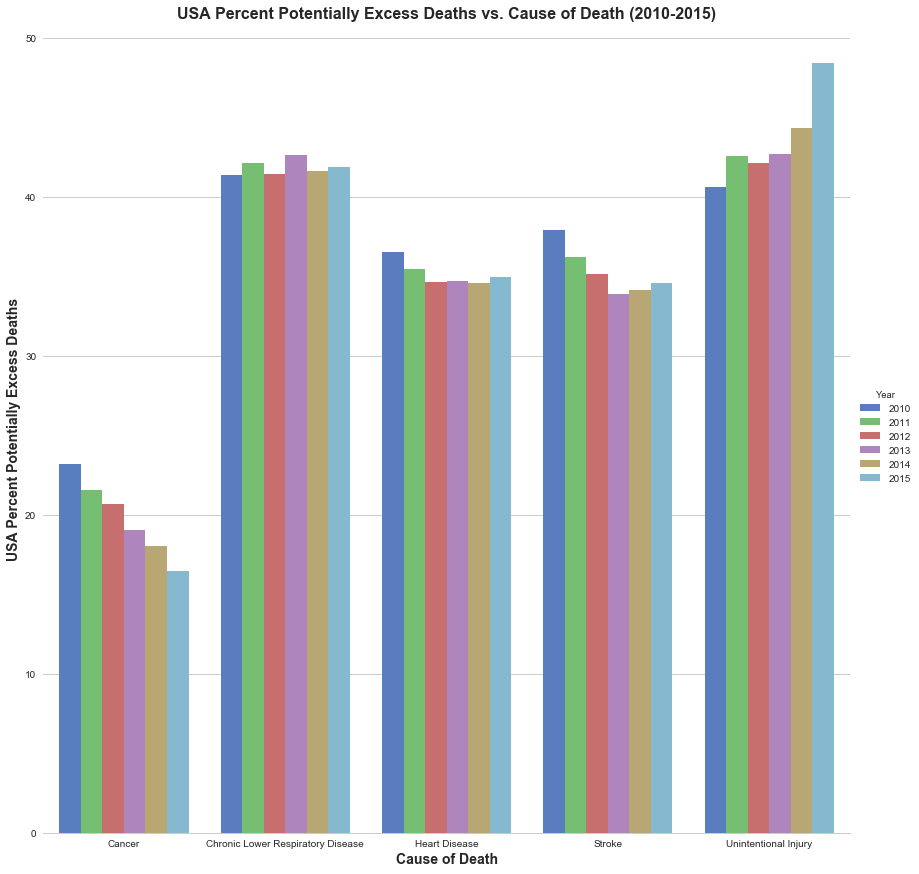


```python
grouped_state_death_causes_df=grouped_death_causes_df.loc[grouped_death_causes_df["State FIPS Code"] != "0", :]
grouped_state_death_causes_df.head()
```


<div>
<style>
    .dataframe thead tr:only-child th {
        text-align: right;
    }

    .dataframe thead th {
        text-align: left;
    }

    .dataframe tbody tr th {
        vertical-align: top;
    }
</style>
<table border="1" class="dataframe">
  <thead>
    <tr style="text-align: right;">
      <th></th>
      <th>State FIPS Code</th>
      <th>Year</th>
      <th>Cause of Death</th>
      <th>HHS Region</th>
      <th>Observed Deaths</th>
      <th>Population</th>
      <th>Expected Deaths</th>
      <th>Potentially Excess Deaths</th>
      <th>Percent Potentially Excess Deaths</th>
    </tr>
  </thead>
  <tbody>
    <tr>
      <th>30</th>
      <td>AK</td>
      <td>2010</td>
      <td>Cancer</td>
      <td>10</td>
      <td>418.250000</td>
      <td>641288.625000</td>
      <td>363.750000</td>
      <td>59.125</td>
      <td>14.212500</td>
    </tr>
    <tr>
      <th>31</th>
      <td>AK</td>
      <td>2010</td>
      <td>Chronic Lower Respiratory Disease</td>
      <td>10</td>
      <td>64.285714</td>
      <td>659603.571429</td>
      <td>45.571429</td>
      <td>20.000</td>
      <td>22.785714</td>
    </tr>
    <tr>
      <th>32</th>
      <td>AK</td>
      <td>2010</td>
      <td>Heart Disease</td>
      <td>10</td>
      <td>312.375000</td>
      <td>641288.625000</td>
      <td>207.375000</td>
      <td>105.875</td>
      <td>37.625000</td>
    </tr>
    <tr>
      <th>33</th>
      <td>AK</td>
      <td>2010</td>
      <td>Stroke</td>
      <td>10</td>
      <td>54.000000</td>
      <td>641288.625000</td>
      <td>36.500000</td>
      <td>17.500</td>
      <td>32.962500</td>
    </tr>
    <tr>
      <th>34</th>
      <td>AK</td>
      <td>2010</td>
      <td>Unintentional Injury</td>
      <td>10</td>
      <td>289.625000</td>
      <td>641288.625000</td>
      <td>112.500000</td>
      <td>177.125</td>
      <td>61.150000</td>
    </tr>
  </tbody>
</table>
</div>


```python

state_cancer_death=grouped_state_death_causes_df.loc[grouped_state_death_causes_df["Cause of Death"] == "Cancer", :]
state_cancer_death.head()
```


<div>
<style>
    .dataframe thead tr:only-child th {
        text-align: right;
    }

    .dataframe thead th {
        text-align: left;
    }

    .dataframe tbody tr th {
        vertical-align: top;
    }
</style>
<table border="1" class="dataframe">
  <thead>
    <tr style="text-align: right;">
      <th></th>
      <th>State FIPS Code</th>
      <th>Year</th>
      <th>Cause of Death</th>
      <th>HHS Region</th>
      <th>Observed Deaths</th>
      <th>Population</th>
      <th>Expected Deaths</th>
      <th>Potentially Excess Deaths</th>
      <th>Percent Potentially Excess Deaths</th>
    </tr>
  </thead>
  <tbody>
    <tr>
      <th>30</th>
      <td>AK</td>
      <td>2010</td>
      <td>Cancer</td>
      <td>10</td>
      <td>418.250</td>
      <td>641288.625</td>
      <td>363.750</td>
      <td>59.125</td>
      <td>14.2125</td>
    </tr>
    <tr>
      <th>35</th>
      <td>AK</td>
      <td>2011</td>
      <td>Cancer</td>
      <td>10</td>
      <td>446.750</td>
      <td>649941.375</td>
      <td>377.500</td>
      <td>71.000</td>
      <td>15.9125</td>
    </tr>
    <tr>
      <th>40</th>
      <td>AK</td>
      <td>2012</td>
      <td>Cancer</td>
      <td>10</td>
      <td>435.875</td>
      <td>655534.125</td>
      <td>387.125</td>
      <td>48.750</td>
      <td>9.8375</td>
    </tr>
    <tr>
      <th>45</th>
      <td>AK</td>
      <td>2013</td>
      <td>Cancer</td>
      <td>10</td>
      <td>492.875</td>
      <td>657146.000</td>
      <td>390.250</td>
      <td>103.125</td>
      <td>20.2000</td>
    </tr>
    <tr>
      <th>50</th>
      <td>AK</td>
      <td>2014</td>
      <td>Cancer</td>
      <td>10</td>
      <td>459.875</td>
      <td>656759.625</td>
      <td>395.375</td>
      <td>69.625</td>
      <td>15.7125</td>
    </tr>
  </tbody>
</table>
</div>


```python
state_cancer_death_2010= state_cancer_death.query('Year == 2010')
state_cancer_death_2010=state_cancer_death_2010[['State FIPS Code', 'Percent Potentially Excess Deaths']]
state_cancer_death_2010=state_cancer_death_2010.rename(columns={"Percent Potentially Excess Deaths":"2010 cancer caused Percent Potentially Excess Deaths"})
state_cancer_death_2010.head()

```


<div>
<style>
    .dataframe thead tr:only-child th {
        text-align: right;
    }

    .dataframe thead th {
        text-align: left;
    }

    .dataframe tbody tr th {
        vertical-align: top;
    }
</style>
<table border="1" class="dataframe">
  <thead>
    <tr style="text-align: right;">
      <th></th>
      <th>State FIPS Code</th>
      <th>2010 cancer caused Percent Potentially Excess Deaths</th>
    </tr>
  </thead>
  <tbody>
    <tr>
      <th>30</th>
      <td>AK</td>
      <td>14.2125</td>
    </tr>
    <tr>
      <th>60</th>
      <td>AL</td>
      <td>34.9000</td>
    </tr>
    <tr>
      <th>90</th>
      <td>AR</td>
      <td>36.8125</td>
    </tr>
    <tr>
      <th>120</th>
      <td>AZ</td>
      <td>11.6000</td>
    </tr>
    <tr>
      <th>150</th>
      <td>CA</td>
      <td>11.2375</td>
    </tr>
  </tbody>
</table>
</div>


```python
state_cancer_death_2015= state_cancer_death.query('Year == 2015')
state_cancer_death_2015=state_cancer_death_2015[['State FIPS Code', 'Percent Potentially Excess Deaths']]
state_cancer_death_2015=state_cancer_death_2015.rename(columns={"Percent Potentially Excess Deaths":"2015 cancer caused Percent Potentially Excess Deaths"})
state_cancer_death_2015.head()
```


<div>
<style>
    .dataframe thead tr:only-child th {
        text-align: right;
    }

    .dataframe thead th {
        text-align: left;
    }

    .dataframe tbody tr th {
        vertical-align: top;
    }
</style>
<table border="1" class="dataframe">
  <thead>
    <tr style="text-align: right;">
      <th></th>
      <th>State FIPS Code</th>
      <th>2015 cancer caused Percent Potentially Excess Deaths</th>
    </tr>
  </thead>
  <tbody>
    <tr>
      <th>55</th>
      <td>AK</td>
      <td>13.1750</td>
    </tr>
    <tr>
      <th>85</th>
      <td>AL</td>
      <td>29.9625</td>
    </tr>
    <tr>
      <th>115</th>
      <td>AR</td>
      <td>33.8250</td>
    </tr>
    <tr>
      <th>145</th>
      <td>AZ</td>
      <td>7.3375</td>
    </tr>
    <tr>
      <th>175</th>
      <td>CA</td>
      <td>3.8750</td>
    </tr>
  </tbody>
</table>
</div>


```python
merge_state_cancer_death = pd.merge(state_cancer_death_2010, state_cancer_death_2015, on="State FIPS Code")
merge_state_cancer_death = merge_state_cancer_death.rename(columns={"State FIPS Code":"State Abbreviation"})
merge_state_cancer_death.head()
```


<div>
<style>
    .dataframe thead tr:only-child th {
        text-align: right;
    }

    .dataframe thead th {
        text-align: left;
    }

    .dataframe tbody tr th {
        vertical-align: top;
    }
</style>
<table border="1" class="dataframe">
  <thead>
    <tr style="text-align: right;">
      <th></th>
      <th>State Abbreviation</th>
      <th>2010 cancer caused Percent Potentially Excess Deaths</th>
      <th>2015 cancer caused Percent Potentially Excess Deaths</th>
    </tr>
  </thead>
  <tbody>
    <tr>
      <th>0</th>
      <td>AK</td>
      <td>14.2125</td>
      <td>13.1750</td>
    </tr>
    <tr>
      <th>1</th>
      <td>AL</td>
      <td>34.9000</td>
      <td>29.9625</td>
    </tr>
    <tr>
      <th>2</th>
      <td>AR</td>
      <td>36.8125</td>
      <td>33.8250</td>
    </tr>
    <tr>
      <th>3</th>
      <td>AZ</td>
      <td>11.6000</td>
      <td>7.3375</td>
    </tr>
    <tr>
      <th>4</th>
      <td>CA</td>
      <td>11.2375</td>
      <td>3.8750</td>
    </tr>
  </tbody>
</table>
</div>


```python
merge_state_cancer_death["Cancer Caused Percent Potentially Excess Deaths Change(2010-2015)"]= merge_state_cancer_death["2015 cancer caused Percent Potentially Excess Deaths"]-merge_state_cancer_death["2010 cancer caused Percent Potentially Excess Deaths"]
merge_state_cancer_death.head()
```


<div>
<style>
    .dataframe thead tr:only-child th {
        text-align: right;
    }

    .dataframe thead th {
        text-align: left;
    }

    .dataframe tbody tr th {
        vertical-align: top;
    }
</style>
<table border="1" class="dataframe">
  <thead>
    <tr style="text-align: right;">
      <th></th>
      <th>State Abbreviation</th>
      <th>2010 cancer caused Percent Potentially Excess Deaths</th>
      <th>2015 cancer caused Percent Potentially Excess Deaths</th>
      <th>Cancer Caused Percent Potentially Excess Deaths Change(2010-2015)</th>
    </tr>
  </thead>
  <tbody>
    <tr>
      <th>0</th>
      <td>AK</td>
      <td>14.2125</td>
      <td>13.1750</td>
      <td>-1.0375</td>
    </tr>
    <tr>
      <th>1</th>
      <td>AL</td>
      <td>34.9000</td>
      <td>29.9625</td>
      <td>-4.9375</td>
    </tr>
    <tr>
      <th>2</th>
      <td>AR</td>
      <td>36.8125</td>
      <td>33.8250</td>
      <td>-2.9875</td>
    </tr>
    <tr>
      <th>3</th>
      <td>AZ</td>
      <td>11.6000</td>
      <td>7.3375</td>
      <td>-4.2625</td>
    </tr>
    <tr>
      <th>4</th>
      <td>CA</td>
      <td>11.2375</td>
      <td>3.8750</td>
      <td>-7.3625</td>
    </tr>
  </tbody>
</table>
</div>


```python
 merge_state_cancer_death.count()
```


    State Abbreviation                                                   51
    2010 cancer caused Percent Potentially Excess Deaths                 51
    2015 cancer caused Percent Potentially Excess Deaths                 51
    Cancer Caused Percent Potentially Excess Deaths Change(2010-2015)    51
    dtype: int64


```python
merge_all = pd.merge(merge_affordable_care_medicare,  merge_state_cancer_death, how='left', on="State Abbreviation")
merge_all.head()
```


<div>
<style>
    .dataframe thead tr:only-child th {
        text-align: right;
    }

    .dataframe thead th {
        text-align: left;
    }

    .dataframe tbody tr th {
        vertical-align: top;
    }
</style>
<table border="1" class="dataframe">
  <thead>
    <tr style="text-align: right;">
      <th></th>
      <th>State</th>
      <th>State Abbreviation</th>
      <th>Uninsured Rate (2010)</th>
      <th>Uninsured Rate (2015)</th>
      <th>Uninsured Rate Change (2010-2015)</th>
      <th>Medicare Enrollment (2016)</th>
      <th>Employer Health Insurance Coverage (2015)</th>
      <th>Marketplace Health Insurance Coverage (2016)</th>
      <th>Average Monthly Tax Credit (2016)</th>
      <th>Medicaid Enrollment (2016)</th>
      <th>State Medicaid Expansion (2016)</th>
      <th>Avg_Spending_Per_Episode_State</th>
      <th>2010 cancer caused Percent Potentially Excess Deaths</th>
      <th>2015 cancer caused Percent Potentially Excess Deaths</th>
      <th>Cancer Caused Percent Potentially Excess Deaths Change(2010-2015)</th>
    </tr>
  </thead>
  <tbody>
    <tr>
      <th>0</th>
      <td>Alabama</td>
      <td>AL</td>
      <td>14.6</td>
      <td>10.1</td>
      <td>-4.5</td>
      <td>989855</td>
      <td>2545000</td>
      <td>165534</td>
      <td>310.0</td>
      <td>910775</td>
      <td>False</td>
      <td>19201.0</td>
      <td>34.9000</td>
      <td>29.9625</td>
      <td>-4.9375</td>
    </tr>
    <tr>
      <th>1</th>
      <td>Alaska</td>
      <td>AK</td>
      <td>19.9</td>
      <td>14.9</td>
      <td>-5.0</td>
      <td>88966</td>
      <td>390000</td>
      <td>17995</td>
      <td>750.0</td>
      <td>166625</td>
      <td>True</td>
      <td>19907.0</td>
      <td>14.2125</td>
      <td>13.1750</td>
      <td>-1.0375</td>
    </tr>
    <tr>
      <th>2</th>
      <td>Arizona</td>
      <td>AZ</td>
      <td>16.9</td>
      <td>10.8</td>
      <td>-6.1</td>
      <td>1175624</td>
      <td>3288000</td>
      <td>179445</td>
      <td>230.0</td>
      <td>1716198</td>
      <td>True</td>
      <td>20542.0</td>
      <td>11.6000</td>
      <td>7.3375</td>
      <td>-4.2625</td>
    </tr>
    <tr>
      <th>3</th>
      <td>Arkansas</td>
      <td>AR</td>
      <td>17.5</td>
      <td>9.5</td>
      <td>-8.0</td>
      <td>606146</td>
      <td>1365000</td>
      <td>63357</td>
      <td>306.0</td>
      <td>920194</td>
      <td>True</td>
      <td>19705.0</td>
      <td>36.8125</td>
      <td>33.8250</td>
      <td>-2.9875</td>
    </tr>
    <tr>
      <th>4</th>
      <td>California</td>
      <td>CA</td>
      <td>18.5</td>
      <td>8.6</td>
      <td>-9.9</td>
      <td>5829777</td>
      <td>19552000</td>
      <td>1415428</td>
      <td>309.0</td>
      <td>11843081</td>
      <td>True</td>
      <td>21141.0</td>
      <td>11.2375</td>
      <td>3.8750</td>
      <td>-7.3625</td>
    </tr>
  </tbody>
</table>
</div>


```python
#merge_all["Uninsured Rate Change (2010-2015)"] = merge_all["Uninsured Rate Change (2010-2015)"].abs()
#merge_all.head()
```


```python
sns_plot = sns.pairplot(merge_all, x_vars=["Uninsured Rate Change (2010-2015)"], y_vars=["Cancer Caused Percent Potentially Excess Deaths Change(2010-2015)"],
             hue="State Medicaid Expansion (2016)",size=5, aspect=1.2, kind="reg")
sns_plot.fig.suptitle('Cancer Caused Percent Potentially Excess Deaths Change(2010-2015) vs. Uninsured Rate Change(2010-2015) ',fontweight='bold',fontsize=12)
sns_plot.savefig("Cancer_Caused_Percent_Potentially_Excess_Deaths_Change_vs._Uninsured_Rate_Change.png") 
plt.show()
```


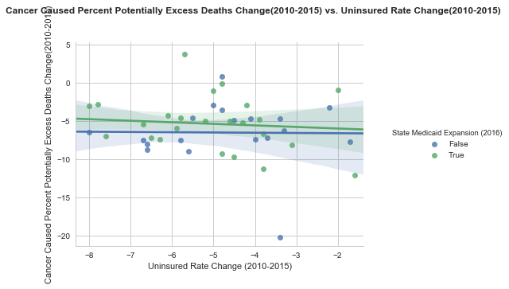


```python
sns_plot = sns.pairplot(merge_all, x_vars=["Uninsured Rate (2015)"], y_vars=["2015 cancer caused Percent Potentially Excess Deaths"],
             size=5, aspect=1.2, kind="reg")
sns_plot.fig.suptitle('2015 Cancer Caused Percent Potentially Excess Deaths vs. 2015 Uninsured Rate',fontweight='bold',fontsize=12)
sns_plot.savefig("2015_Cancer_Caused_Percent_Potentially_Excess_Deaths_vs._Uninsured_Rate_2015.png") 
plt.show()
```


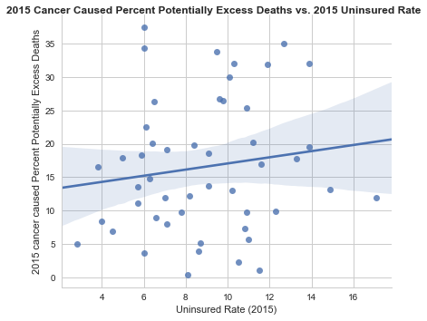


```python
sns_plot= sns.pairplot(merge_all, x_vars=["Uninsured Rate (2010)"], y_vars=["2010 cancer caused Percent Potentially Excess Deaths"],
             size=5, aspect=1.2, kind="reg")
sns_plot.fig.suptitle('2010 Cancer Caused Percent Potentially Excess Deaths vs. 2010 Uninsured Rate',fontweight='bold',fontsize=12)
sns_plot.savefig("2010_Cancer_Caused_Percent_Potentially_Excess_Deaths_vs._Uninsured_Rate-2010.png") 
plt.show()
```


```python
sns_plot= sns.pairplot(merge_all, x_vars=["Employer Health Insurance Coverage (2015)"], y_vars=["2015 cancer caused Percent Potentially Excess Deaths"],
             size=5, aspect=1.2, kind="reg")
sns_plot.fig.suptitle('2015 Cancer Caused Percent Potentially Excess Deaths vs. Employer Health Insurance Coverage (2015)',fontweight='bold',fontsize=12)
sns_plot.savefig("2015_Cancer_Caused_Percent_Potentially_Excess_Deaths_vs._Employer Health Insurance Coverage (2015).png") 
plt.show()
```


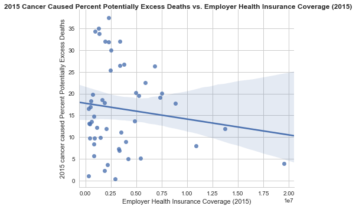


```python
sns_plot= sns.pairplot(merge_all, x_vars=["Avg_Spending_Per_Episode_State"], y_vars=["2015 cancer caused Percent Potentially Excess Deaths"],
             size=5, aspect=1.2, kind="reg")
sns_plot.fig.suptitle('2015 Cancer Caused Percent Potentially Excess Deaths vs. Avg_Spending_Per_Episode_State(2015)',fontweight='bold',fontsize=12)
sns_plot.savefig("2015_Cancer_Caused_Percent_Potentially_Excess_Deaths_vs._Avg_Spending_Per_Episode_State (2015).png") 
plt.show()
```


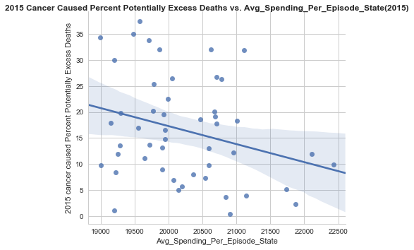


```python
state_stroke_death=grouped_state_death_causes_df.loc[grouped_state_death_causes_df["Cause of Death"] == "Stroke", :]
state_stroke_death.head()
```


<div>
<style>
    .dataframe thead tr:only-child th {
        text-align: right;
    }

    .dataframe thead th {
        text-align: left;
    }

    .dataframe tbody tr th {
        vertical-align: top;
    }
</style>
<table border="1" class="dataframe">
  <thead>
    <tr style="text-align: right;">
      <th></th>
      <th>State FIPS Code</th>
      <th>Year</th>
      <th>Cause of Death</th>
      <th>HHS Region</th>
      <th>Observed Deaths</th>
      <th>Population</th>
      <th>Expected Deaths</th>
      <th>Potentially Excess Deaths</th>
      <th>Percent Potentially Excess Deaths</th>
    </tr>
  </thead>
  <tbody>
    <tr>
      <th>33</th>
      <td>AK</td>
      <td>2010</td>
      <td>Stroke</td>
      <td>10</td>
      <td>54.000000</td>
      <td>641288.625000</td>
      <td>36.500000</td>
      <td>17.500000</td>
      <td>32.962500</td>
    </tr>
    <tr>
      <th>38</th>
      <td>AK</td>
      <td>2011</td>
      <td>Stroke</td>
      <td>10</td>
      <td>57.857143</td>
      <td>668964.571429</td>
      <td>42.285714</td>
      <td>15.571429</td>
      <td>24.414286</td>
    </tr>
    <tr>
      <th>43</th>
      <td>AK</td>
      <td>2012</td>
      <td>Stroke</td>
      <td>10</td>
      <td>56.125000</td>
      <td>655534.125000</td>
      <td>39.250000</td>
      <td>17.000000</td>
      <td>33.200000</td>
    </tr>
    <tr>
      <th>48</th>
      <td>AK</td>
      <td>2013</td>
      <td>Stroke</td>
      <td>10</td>
      <td>55.875000</td>
      <td>657146.000000</td>
      <td>39.875000</td>
      <td>16.000000</td>
      <td>28.062500</td>
    </tr>
    <tr>
      <th>53</th>
      <td>AK</td>
      <td>2014</td>
      <td>Stroke</td>
      <td>10</td>
      <td>51.125000</td>
      <td>656759.625000</td>
      <td>40.500000</td>
      <td>11.000000</td>
      <td>23.425000</td>
    </tr>
  </tbody>
</table>
</div>


```python
state_stroke_death_2010= state_stroke_death.query('Year == 2010')
state_stroke_death_2010=state_stroke_death_2010[['State FIPS Code', 'Percent Potentially Excess Deaths']]
state_stroke_death_2010=state_stroke_death_2010.rename(columns={"Percent Potentially Excess Deaths":"2010 stroke caused Percent Potentially Excess Deaths"})
state_stroke_death_2010.head()
```


<div>
<style>
    .dataframe thead tr:only-child th {
        text-align: right;
    }

    .dataframe thead th {
        text-align: left;
    }

    .dataframe tbody tr th {
        vertical-align: top;
    }
</style>
<table border="1" class="dataframe">
  <thead>
    <tr style="text-align: right;">
      <th></th>
      <th>State FIPS Code</th>
      <th>2010 stroke caused Percent Potentially Excess Deaths</th>
    </tr>
  </thead>
  <tbody>
    <tr>
      <th>33</th>
      <td>AK</td>
      <td>32.9625</td>
    </tr>
    <tr>
      <th>63</th>
      <td>AL</td>
      <td>61.3500</td>
    </tr>
    <tr>
      <th>93</th>
      <td>AR</td>
      <td>54.1000</td>
    </tr>
    <tr>
      <th>123</th>
      <td>AZ</td>
      <td>13.9500</td>
    </tr>
    <tr>
      <th>153</th>
      <td>CA</td>
      <td>33.9125</td>
    </tr>
  </tbody>
</table>
</div>


```python
state_stroke_death_2015= state_stroke_death.query('Year == 2015')
state_stroke_death_2015=state_stroke_death_2015[['State FIPS Code', 'Percent Potentially Excess Deaths']]
state_stroke_death_2015=state_stroke_death_2015.rename(columns={"Percent Potentially Excess Deaths":"2015 stroke caused Percent Potentially Excess Deaths"})
state_stroke_death_2015.head()
```


<div>
<style>
    .dataframe thead tr:only-child th {
        text-align: right;
    }

    .dataframe thead th {
        text-align: left;
    }

    .dataframe tbody tr th {
        vertical-align: top;
    }
</style>
<table border="1" class="dataframe">
  <thead>
    <tr style="text-align: right;">
      <th></th>
      <th>State FIPS Code</th>
      <th>2015 stroke caused Percent Potentially Excess Deaths</th>
    </tr>
  </thead>
  <tbody>
    <tr>
      <th>58</th>
      <td>AK</td>
      <td>38.0625</td>
    </tr>
    <tr>
      <th>88</th>
      <td>AL</td>
      <td>61.2250</td>
    </tr>
    <tr>
      <th>118</th>
      <td>AR</td>
      <td>56.5375</td>
    </tr>
    <tr>
      <th>148</th>
      <td>AZ</td>
      <td>19.5750</td>
    </tr>
    <tr>
      <th>178</th>
      <td>CA</td>
      <td>26.7250</td>
    </tr>
  </tbody>
</table>
</div>


```python
merge_state_stroke_death = pd.merge(state_stroke_death_2010, state_stroke_death_2015, on="State FIPS Code")
merge_state_stroke_death = merge_state_stroke_death.rename(columns={"State FIPS Code":"State Abbreviation"})
merge_state_stroke_death.head()
```


<div>
<style>
    .dataframe thead tr:only-child th {
        text-align: right;
    }

    .dataframe thead th {
        text-align: left;
    }

    .dataframe tbody tr th {
        vertical-align: top;
    }
</style>
<table border="1" class="dataframe">
  <thead>
    <tr style="text-align: right;">
      <th></th>
      <th>State Abbreviation</th>
      <th>2010 stroke caused Percent Potentially Excess Deaths</th>
      <th>2015 stroke caused Percent Potentially Excess Deaths</th>
    </tr>
  </thead>
  <tbody>
    <tr>
      <th>0</th>
      <td>AK</td>
      <td>32.9625</td>
      <td>38.0625</td>
    </tr>
    <tr>
      <th>1</th>
      <td>AL</td>
      <td>61.3500</td>
      <td>61.2250</td>
    </tr>
    <tr>
      <th>2</th>
      <td>AR</td>
      <td>54.1000</td>
      <td>56.5375</td>
    </tr>
    <tr>
      <th>3</th>
      <td>AZ</td>
      <td>13.9500</td>
      <td>19.5750</td>
    </tr>
    <tr>
      <th>4</th>
      <td>CA</td>
      <td>33.9125</td>
      <td>26.7250</td>
    </tr>
  </tbody>
</table>
</div>


```python
merge_state_stroke_death["Stroke Caused Percent Potentially Excess Deaths Change(2010-2015)"]= merge_state_stroke_death["2015 stroke caused Percent Potentially Excess Deaths"]-merge_state_stroke_death["2010 stroke caused Percent Potentially Excess Deaths"]
merge_state_stroke_death.head()
```


<div>
<style>
    .dataframe thead tr:only-child th {
        text-align: right;
    }

    .dataframe thead th {
        text-align: left;
    }

    .dataframe tbody tr th {
        vertical-align: top;
    }
</style>
<table border="1" class="dataframe">
  <thead>
    <tr style="text-align: right;">
      <th></th>
      <th>State Abbreviation</th>
      <th>2010 stroke caused Percent Potentially Excess Deaths</th>
      <th>2015 stroke caused Percent Potentially Excess Deaths</th>
      <th>Stroke Caused Percent Potentially Excess Deaths Change(2010-2015)</th>
    </tr>
  </thead>
  <tbody>
    <tr>
      <th>0</th>
      <td>AK</td>
      <td>32.9625</td>
      <td>38.0625</td>
      <td>5.1000</td>
    </tr>
    <tr>
      <th>1</th>
      <td>AL</td>
      <td>61.3500</td>
      <td>61.2250</td>
      <td>-0.1250</td>
    </tr>
    <tr>
      <th>2</th>
      <td>AR</td>
      <td>54.1000</td>
      <td>56.5375</td>
      <td>2.4375</td>
    </tr>
    <tr>
      <th>3</th>
      <td>AZ</td>
      <td>13.9500</td>
      <td>19.5750</td>
      <td>5.6250</td>
    </tr>
    <tr>
      <th>4</th>
      <td>CA</td>
      <td>33.9125</td>
      <td>26.7250</td>
      <td>-7.1875</td>
    </tr>
  </tbody>
</table>
</div>


```python
merge_all_stroke = pd.merge(merge_all,  merge_state_stroke_death, how='left', on="State Abbreviation")
merge_all_stroke.head()
```


<div>
<style>
    .dataframe thead tr:only-child th {
        text-align: right;
    }

    .dataframe thead th {
        text-align: left;
    }

    .dataframe tbody tr th {
        vertical-align: top;
    }
</style>
<table border="1" class="dataframe">
  <thead>
    <tr style="text-align: right;">
      <th></th>
      <th>State</th>
      <th>State Abbreviation</th>
      <th>Uninsured Rate (2010)</th>
      <th>Uninsured Rate (2015)</th>
      <th>Uninsured Rate Change (2010-2015)</th>
      <th>Medicare Enrollment (2016)</th>
      <th>Employer Health Insurance Coverage (2015)</th>
      <th>Marketplace Health Insurance Coverage (2016)</th>
      <th>Average Monthly Tax Credit (2016)</th>
      <th>Medicaid Enrollment (2016)</th>
      <th>State Medicaid Expansion (2016)</th>
      <th>Avg_Spending_Per_Episode_State</th>
      <th>2010 cancer caused Percent Potentially Excess Deaths</th>
      <th>2015 cancer caused Percent Potentially Excess Deaths</th>
      <th>Cancer Caused Percent Potentially Excess Deaths Change(2010-2015)</th>
      <th>2010 stroke caused Percent Potentially Excess Deaths</th>
      <th>2015 stroke caused Percent Potentially Excess Deaths</th>
      <th>Stroke Caused Percent Potentially Excess Deaths Change(2010-2015)</th>
    </tr>
  </thead>
  <tbody>
    <tr>
      <th>0</th>
      <td>Alabama</td>
      <td>AL</td>
      <td>14.6</td>
      <td>10.1</td>
      <td>-4.5</td>
      <td>989855</td>
      <td>2545000</td>
      <td>165534</td>
      <td>310.0</td>
      <td>910775</td>
      <td>False</td>
      <td>19201.0</td>
      <td>34.9000</td>
      <td>29.9625</td>
      <td>-4.9375</td>
      <td>61.3500</td>
      <td>61.2250</td>
      <td>-0.1250</td>
    </tr>
    <tr>
      <th>1</th>
      <td>Alaska</td>
      <td>AK</td>
      <td>19.9</td>
      <td>14.9</td>
      <td>-5.0</td>
      <td>88966</td>
      <td>390000</td>
      <td>17995</td>
      <td>750.0</td>
      <td>166625</td>
      <td>True</td>
      <td>19907.0</td>
      <td>14.2125</td>
      <td>13.1750</td>
      <td>-1.0375</td>
      <td>32.9625</td>
      <td>38.0625</td>
      <td>5.1000</td>
    </tr>
    <tr>
      <th>2</th>
      <td>Arizona</td>
      <td>AZ</td>
      <td>16.9</td>
      <td>10.8</td>
      <td>-6.1</td>
      <td>1175624</td>
      <td>3288000</td>
      <td>179445</td>
      <td>230.0</td>
      <td>1716198</td>
      <td>True</td>
      <td>20542.0</td>
      <td>11.6000</td>
      <td>7.3375</td>
      <td>-4.2625</td>
      <td>13.9500</td>
      <td>19.5750</td>
      <td>5.6250</td>
    </tr>
    <tr>
      <th>3</th>
      <td>Arkansas</td>
      <td>AR</td>
      <td>17.5</td>
      <td>9.5</td>
      <td>-8.0</td>
      <td>606146</td>
      <td>1365000</td>
      <td>63357</td>
      <td>306.0</td>
      <td>920194</td>
      <td>True</td>
      <td>19705.0</td>
      <td>36.8125</td>
      <td>33.8250</td>
      <td>-2.9875</td>
      <td>54.1000</td>
      <td>56.5375</td>
      <td>2.4375</td>
    </tr>
    <tr>
      <th>4</th>
      <td>California</td>
      <td>CA</td>
      <td>18.5</td>
      <td>8.6</td>
      <td>-9.9</td>
      <td>5829777</td>
      <td>19552000</td>
      <td>1415428</td>
      <td>309.0</td>
      <td>11843081</td>
      <td>True</td>
      <td>21141.0</td>
      <td>11.2375</td>
      <td>3.8750</td>
      <td>-7.3625</td>
      <td>33.9125</td>
      <td>26.7250</td>
      <td>-7.1875</td>
    </tr>
  </tbody>
</table>
</div>


```python
sns_plot=sns.pairplot(merge_all_stroke, x_vars=["Uninsured Rate Change (2010-2015)"], y_vars=["Stroke Caused Percent Potentially Excess Deaths Change(2010-2015)"],
             hue="State Medicaid Expansion (2016)",size=5, aspect=1.2, kind="reg")
sns_plot.fig.suptitle('Strok Caused Percent Potentially Excess Deaths Change(2010-2015) vs. Uninsured Rate Change(2010-2015)',fontweight='bold',fontsize=12)
sns_plot.savefig("Stroke_Caused_Percent_Potentially_Excess_Deaths_Change_vs._Uninsured_Rate_Change.png") 
plt.show()
```


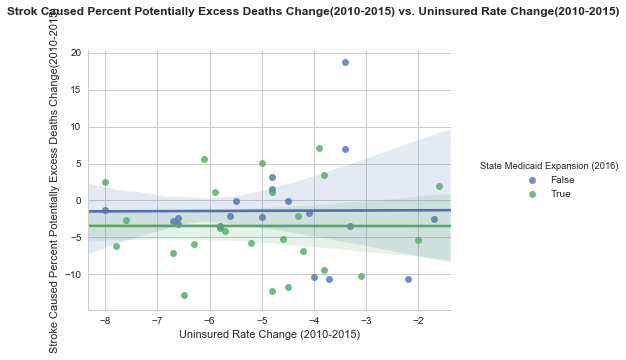


```python
sns_plot=sns.pairplot(merge_all_stroke, x_vars=["Uninsured Rate (2015)"], y_vars=["2015 stroke caused Percent Potentially Excess Deaths"],
             size=5, aspect=1.2, kind="reg")
sns_plot.fig.suptitle('2015 Stroke Caused Percent Potentially Excess Deaths vs. Uninsured Rate 2015',fontweight='bold',fontsize=12)
sns_plot.savefig("2015_Stroke_Caused_Percent_Potentially_Excess_Deaths_vs._Uninsured_Rate_2015.png") 
plt.show()
```


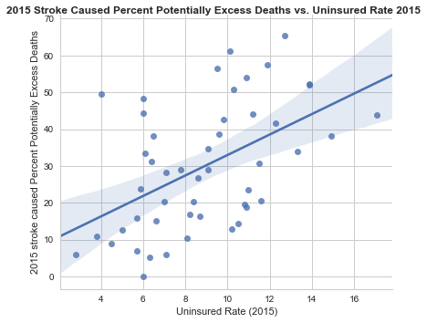


```python
sns_plot=sns.pairplot(merge_all_stroke, x_vars=["Uninsured Rate (2010)"], y_vars=["2010 stroke caused Percent Potentially Excess Deaths"],
             size=5, aspect=1.2, kind="reg")
sns_plot.fig.suptitle('2010 Stroke Caused Percent Potentially Excess Deaths vs. Uninsured Rate 2010',fontweight='bold',fontsize=12)
sns_plot.savefig("2010_Stroke_Caused_Percent_Potentially_Excess_Deaths_vs._Uninsured_Rate_2010.png") 
plt.show()
```


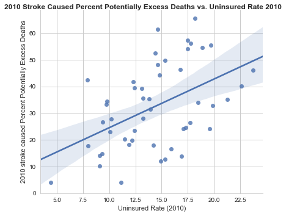


```python
sns_plot=sns.pairplot(merge_all_stroke, x_vars=["Employer Health Insurance Coverage (2015)"], y_vars=["2015 stroke caused Percent Potentially Excess Deaths"],
             size=5, aspect=1.2, kind="reg")
sns_plot.fig.suptitle('2015 Stroke Caused Percent Potentially Excess Deaths vs. Employer Health Insurance Coverage (2015)',fontweight='bold',fontsize=12)
sns_plot.savefig("2015_Stroke_Caused_Percent_Potentially_Excess_Deaths_vs._Employer Health Insurance Coverage (2015).png") 
plt.show()
```


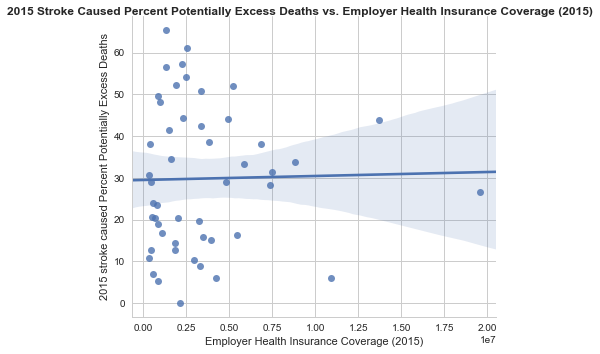


```python
sns_plot=sns.pairplot(merge_all_stroke, x_vars=["Avg_Spending_Per_Episode_State"], y_vars=["2015 stroke caused Percent Potentially Excess Deaths"],
             size=5, aspect=1.2, kind="reg")
sns_plot.fig.suptitle('2015 Stroke Caused Percent Potentially Excess Deaths vs. 2015 Avg_Spending_Per_Episode_State',fontweight='bold',fontsize=12)
sns_plot.savefig("2015_Stroke_Caused_Percent_Potentially_Excess_Deaths_vs._Avg_Spending_Per_Episode_State 2015.png") 
plt.show()
```


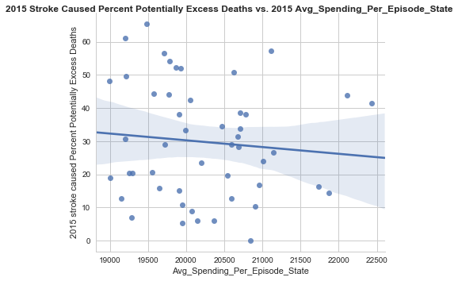


```python
state_Unintentional_Injury_death=grouped_state_death_causes_df.loc[grouped_state_death_causes_df["Cause of Death"] == "Unintentional Injury", :]
state_Unintentional_Injury_death.head()
```


<div>
<style>
    .dataframe thead tr:only-child th {
        text-align: right;
    }

    .dataframe thead th {
        text-align: left;
    }

    .dataframe tbody tr th {
        vertical-align: top;
    }
</style>
<table border="1" class="dataframe">
  <thead>
    <tr style="text-align: right;">
      <th></th>
      <th>State FIPS Code</th>
      <th>Year</th>
      <th>Cause of Death</th>
      <th>HHS Region</th>
      <th>Observed Deaths</th>
      <th>Population</th>
      <th>Expected Deaths</th>
      <th>Potentially Excess Deaths</th>
      <th>Percent Potentially Excess Deaths</th>
    </tr>
  </thead>
  <tbody>
    <tr>
      <th>34</th>
      <td>AK</td>
      <td>2010</td>
      <td>Unintentional Injury</td>
      <td>10</td>
      <td>289.625</td>
      <td>641288.625</td>
      <td>112.500</td>
      <td>177.125</td>
      <td>61.1500</td>
    </tr>
    <tr>
      <th>39</th>
      <td>AK</td>
      <td>2011</td>
      <td>Unintentional Injury</td>
      <td>10</td>
      <td>318.250</td>
      <td>649941.375</td>
      <td>114.125</td>
      <td>204.125</td>
      <td>64.2625</td>
    </tr>
    <tr>
      <th>44</th>
      <td>AK</td>
      <td>2012</td>
      <td>Unintentional Injury</td>
      <td>10</td>
      <td>298.250</td>
      <td>655534.125</td>
      <td>115.500</td>
      <td>182.750</td>
      <td>61.4000</td>
    </tr>
    <tr>
      <th>49</th>
      <td>AK</td>
      <td>2013</td>
      <td>Unintentional Injury</td>
      <td>10</td>
      <td>291.500</td>
      <td>657146.000</td>
      <td>115.375</td>
      <td>176.125</td>
      <td>60.6000</td>
    </tr>
    <tr>
      <th>54</th>
      <td>AK</td>
      <td>2014</td>
      <td>Unintentional Injury</td>
      <td>10</td>
      <td>300.125</td>
      <td>656759.625</td>
      <td>115.750</td>
      <td>184.375</td>
      <td>61.3875</td>
    </tr>
  </tbody>
</table>
</div>


```python
state_Injury_death_2010 = state_Unintentional_Injury_death.query('Year == 2010')
state_Injury_death_2010 = state_Injury_death_2010[['State FIPS Code', 'Percent Potentially Excess Deaths']]
state_Injury_death_2010 = state_Injury_death_2010.rename(columns={"Percent Potentially Excess Deaths":"2010 Injury caused Percent Potentially Excess Deaths"})
state_Injury_death_2010.head()

```


<div>
<style>
    .dataframe thead tr:only-child th {
        text-align: right;
    }

    .dataframe thead th {
        text-align: left;
    }

    .dataframe tbody tr th {
        vertical-align: top;
    }
</style>
<table border="1" class="dataframe">
  <thead>
    <tr style="text-align: right;">
      <th></th>
      <th>State FIPS Code</th>
      <th>2010 Injury caused Percent Potentially Excess Deaths</th>
    </tr>
  </thead>
  <tbody>
    <tr>
      <th>34</th>
      <td>AK</td>
      <td>61.1500</td>
    </tr>
    <tr>
      <th>64</th>
      <td>AL</td>
      <td>58.0250</td>
    </tr>
    <tr>
      <th>94</th>
      <td>AR</td>
      <td>57.2500</td>
    </tr>
    <tr>
      <th>124</th>
      <td>AZ</td>
      <td>50.5875</td>
    </tr>
    <tr>
      <th>154</th>
      <td>CA</td>
      <td>20.0375</td>
    </tr>
  </tbody>
</table>
</div>


```python
state_Injury_death_2015 = state_Unintentional_Injury_death.query('Year == 2015')
state_Injury_death_2015 = state_Injury_death_2015[['State FIPS Code', 'Percent Potentially Excess Deaths']]
state_Injury_death_2015 = state_Injury_death_2015.rename(columns={"Percent Potentially Excess Deaths":"2015 Injury caused Percent Potentially Excess Deaths"})
state_Injury_death_2015.head()
```


<div>
<style>
    .dataframe thead tr:only-child th {
        text-align: right;
    }

    .dataframe thead th {
        text-align: left;
    }

    .dataframe tbody tr th {
        vertical-align: top;
    }
</style>
<table border="1" class="dataframe">
  <thead>
    <tr style="text-align: right;">
      <th></th>
      <th>State FIPS Code</th>
      <th>2015 Injury caused Percent Potentially Excess Deaths</th>
    </tr>
  </thead>
  <tbody>
    <tr>
      <th>59</th>
      <td>AK</td>
      <td>60.9750</td>
    </tr>
    <tr>
      <th>89</th>
      <td>AL</td>
      <td>59.5125</td>
    </tr>
    <tr>
      <th>119</th>
      <td>AR</td>
      <td>56.6000</td>
    </tr>
    <tr>
      <th>149</th>
      <td>AZ</td>
      <td>53.3750</td>
    </tr>
    <tr>
      <th>179</th>
      <td>CA</td>
      <td>28.5500</td>
    </tr>
  </tbody>
</table>
</div>


```python
merge_state_Injury_death = pd.merge(state_Injury_death_2010, state_Injury_death_2015, on="State FIPS Code")
merge_state_Injury_death = merge_state_Injury_death.rename(columns={"State FIPS Code":"State Abbreviation"})
merge_state_Injury_death.head()
```


<div>
<style>
    .dataframe thead tr:only-child th {
        text-align: right;
    }

    .dataframe thead th {
        text-align: left;
    }

    .dataframe tbody tr th {
        vertical-align: top;
    }
</style>
<table border="1" class="dataframe">
  <thead>
    <tr style="text-align: right;">
      <th></th>
      <th>State Abbreviation</th>
      <th>2010 Injury caused Percent Potentially Excess Deaths</th>
      <th>2015 Injury caused Percent Potentially Excess Deaths</th>
    </tr>
  </thead>
  <tbody>
    <tr>
      <th>0</th>
      <td>AK</td>
      <td>61.1500</td>
      <td>60.9750</td>
    </tr>
    <tr>
      <th>1</th>
      <td>AL</td>
      <td>58.0250</td>
      <td>59.5125</td>
    </tr>
    <tr>
      <th>2</th>
      <td>AR</td>
      <td>57.2500</td>
      <td>56.6000</td>
    </tr>
    <tr>
      <th>3</th>
      <td>AZ</td>
      <td>50.5875</td>
      <td>53.3750</td>
    </tr>
    <tr>
      <th>4</th>
      <td>CA</td>
      <td>20.0375</td>
      <td>28.5500</td>
    </tr>
  </tbody>
</table>
</div>


```python
merge_state_Injury_death["Injury Caused Percent Potentially Excess Deaths Change(2010-2015)"]= merge_state_Injury_death["2015 Injury caused Percent Potentially Excess Deaths"]-merge_state_Injury_death["2010 Injury caused Percent Potentially Excess Deaths"]
merge_state_Injury_death.head()
```


<div>
<style>
    .dataframe thead tr:only-child th {
        text-align: right;
    }

    .dataframe thead th {
        text-align: left;
    }

    .dataframe tbody tr th {
        vertical-align: top;
    }
</style>
<table border="1" class="dataframe">
  <thead>
    <tr style="text-align: right;">
      <th></th>
      <th>State Abbreviation</th>
      <th>2010 Injury caused Percent Potentially Excess Deaths</th>
      <th>2015 Injury caused Percent Potentially Excess Deaths</th>
      <th>Injury Caused Percent Potentially Excess Deaths Change(2010-2015)</th>
    </tr>
  </thead>
  <tbody>
    <tr>
      <th>0</th>
      <td>AK</td>
      <td>61.1500</td>
      <td>60.9750</td>
      <td>-0.1750</td>
    </tr>
    <tr>
      <th>1</th>
      <td>AL</td>
      <td>58.0250</td>
      <td>59.5125</td>
      <td>1.4875</td>
    </tr>
    <tr>
      <th>2</th>
      <td>AR</td>
      <td>57.2500</td>
      <td>56.6000</td>
      <td>-0.6500</td>
    </tr>
    <tr>
      <th>3</th>
      <td>AZ</td>
      <td>50.5875</td>
      <td>53.3750</td>
      <td>2.7875</td>
    </tr>
    <tr>
      <th>4</th>
      <td>CA</td>
      <td>20.0375</td>
      <td>28.5500</td>
      <td>8.5125</td>
    </tr>
  </tbody>
</table>
</div>


```python
merge_all_injury = pd.merge(merge_all_stroke,  merge_state_Injury_death, how='left', on="State Abbreviation")
merge_all_injury.head()
```


<div>
<style>
    .dataframe thead tr:only-child th {
        text-align: right;
    }

    .dataframe thead th {
        text-align: left;
    }

    .dataframe tbody tr th {
        vertical-align: top;
    }
</style>
<table border="1" class="dataframe">
  <thead>
    <tr style="text-align: right;">
      <th></th>
      <th>State</th>
      <th>State Abbreviation</th>
      <th>Uninsured Rate (2010)</th>
      <th>Uninsured Rate (2015)</th>
      <th>Uninsured Rate Change (2010-2015)</th>
      <th>Medicare Enrollment (2016)</th>
      <th>Employer Health Insurance Coverage (2015)</th>
      <th>Marketplace Health Insurance Coverage (2016)</th>
      <th>Average Monthly Tax Credit (2016)</th>
      <th>Medicaid Enrollment (2016)</th>
      <th>...</th>
      <th>Avg_Spending_Per_Episode_State</th>
      <th>2010 cancer caused Percent Potentially Excess Deaths</th>
      <th>2015 cancer caused Percent Potentially Excess Deaths</th>
      <th>Cancer Caused Percent Potentially Excess Deaths Change(2010-2015)</th>
      <th>2010 stroke caused Percent Potentially Excess Deaths</th>
      <th>2015 stroke caused Percent Potentially Excess Deaths</th>
      <th>Stroke Caused Percent Potentially Excess Deaths Change(2010-2015)</th>
      <th>2010 Injury caused Percent Potentially Excess Deaths</th>
      <th>2015 Injury caused Percent Potentially Excess Deaths</th>
      <th>Injury Caused Percent Potentially Excess Deaths Change(2010-2015)</th>
    </tr>
  </thead>
  <tbody>
    <tr>
      <th>0</th>
      <td>Alabama</td>
      <td>AL</td>
      <td>14.6</td>
      <td>10.1</td>
      <td>-4.5</td>
      <td>989855</td>
      <td>2545000</td>
      <td>165534</td>
      <td>310.0</td>
      <td>910775</td>
      <td>...</td>
      <td>19201.0</td>
      <td>34.9000</td>
      <td>29.9625</td>
      <td>-4.9375</td>
      <td>61.3500</td>
      <td>61.2250</td>
      <td>-0.1250</td>
      <td>58.0250</td>
      <td>59.5125</td>
      <td>1.4875</td>
    </tr>
    <tr>
      <th>1</th>
      <td>Alaska</td>
      <td>AK</td>
      <td>19.9</td>
      <td>14.9</td>
      <td>-5.0</td>
      <td>88966</td>
      <td>390000</td>
      <td>17995</td>
      <td>750.0</td>
      <td>166625</td>
      <td>...</td>
      <td>19907.0</td>
      <td>14.2125</td>
      <td>13.1750</td>
      <td>-1.0375</td>
      <td>32.9625</td>
      <td>38.0625</td>
      <td>5.1000</td>
      <td>61.1500</td>
      <td>60.9750</td>
      <td>-0.1750</td>
    </tr>
    <tr>
      <th>2</th>
      <td>Arizona</td>
      <td>AZ</td>
      <td>16.9</td>
      <td>10.8</td>
      <td>-6.1</td>
      <td>1175624</td>
      <td>3288000</td>
      <td>179445</td>
      <td>230.0</td>
      <td>1716198</td>
      <td>...</td>
      <td>20542.0</td>
      <td>11.6000</td>
      <td>7.3375</td>
      <td>-4.2625</td>
      <td>13.9500</td>
      <td>19.5750</td>
      <td>5.6250</td>
      <td>50.5875</td>
      <td>53.3750</td>
      <td>2.7875</td>
    </tr>
    <tr>
      <th>3</th>
      <td>Arkansas</td>
      <td>AR</td>
      <td>17.5</td>
      <td>9.5</td>
      <td>-8.0</td>
      <td>606146</td>
      <td>1365000</td>
      <td>63357</td>
      <td>306.0</td>
      <td>920194</td>
      <td>...</td>
      <td>19705.0</td>
      <td>36.8125</td>
      <td>33.8250</td>
      <td>-2.9875</td>
      <td>54.1000</td>
      <td>56.5375</td>
      <td>2.4375</td>
      <td>57.2500</td>
      <td>56.6000</td>
      <td>-0.6500</td>
    </tr>
    <tr>
      <th>4</th>
      <td>California</td>
      <td>CA</td>
      <td>18.5</td>
      <td>8.6</td>
      <td>-9.9</td>
      <td>5829777</td>
      <td>19552000</td>
      <td>1415428</td>
      <td>309.0</td>
      <td>11843081</td>
      <td>...</td>
      <td>21141.0</td>
      <td>11.2375</td>
      <td>3.8750</td>
      <td>-7.3625</td>
      <td>33.9125</td>
      <td>26.7250</td>
      <td>-7.1875</td>
      <td>20.0375</td>
      <td>28.5500</td>
      <td>8.5125</td>
    </tr>
  </tbody>
</table>
<p>5 rows × 21 columns</p>
</div>


```python
sns_plot=sns.pairplot(merge_all_injury, x_vars=["Uninsured Rate Change (2010-2015)"], y_vars=["Injury Caused Percent Potentially Excess Deaths Change(2010-2015)"],
             hue="State Medicaid Expansion (2016)",size=5, aspect=1.2, kind="reg")
sns_plot.fig.suptitle('Injury Caused Percent Potentially Excess Deaths Change(2010-2015) vs. Uninsured Rate Change(2010-2015)',fontweight='bold',fontsize=12)
sns_plot.savefig("Injury_Caused_Percent_Potentially_Excess_Deaths_Change_vs._Uninsured_Rate_Change.png") 
plt.show()
```


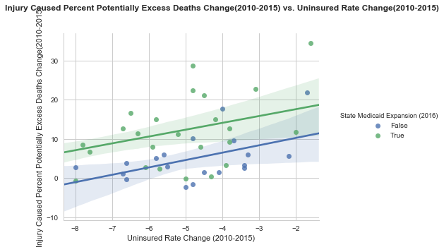


```python
sns_plot=sns.pairplot(merge_all_injury, x_vars=["Uninsured Rate (2015)"], y_vars=["2015 Injury caused Percent Potentially Excess Deaths"],
             size=5, aspect=1.2, kind="reg")
sns_plot.fig.suptitle('2015 Injury Caused Percent Potentially Excess Deaths vs. 2015 Uninsured_Rate',fontweight='bold',fontsize=12)
sns_plot.savefig("2015_Injury_Caused_Percent_Potentially_Excess_Deaths_vs._2015_Uninsured_Rate.png") 
plt.show()
```


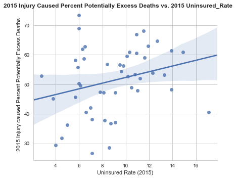


```python
sns_plot=sns.pairplot(merge_all_injury, x_vars=["Uninsured Rate (2010)"], y_vars=["2010 Injury caused Percent Potentially Excess Deaths"],
             size=5, aspect=1.2, kind="reg")
sns_plot.fig.suptitle('2010 Injury Caused Percent Potentially Excess_Deaths vs. Uninsured Rate 2010',fontweight='bold',fontsize=12)
sns_plot.savefig("2010_Injury_Caused_Percent_Potentially_Excess_Deaths_vs._Uninsured_Rate_2010.png") 
plt.show()
```


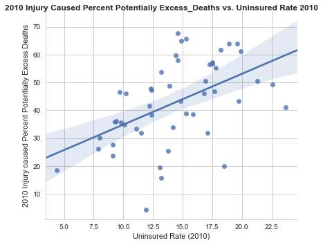


```python
sns_plot=sns.pairplot(merge_all_injury, x_vars=["Employer Health Insurance Coverage (2015)"], y_vars=["2015 Injury caused Percent Potentially Excess Deaths"],
             size=5, aspect=1.2, kind="reg")
sns_plot.fig.suptitle('2015 Injury Caused Percent Potentially Excess_Deaths vs. Employer Health Insurance Coverage (2015)',fontweight='bold',fontsize=12)
sns_plot.savefig("2015_Injury_Caused_Percent_Potentially_Excess_Deaths vs.Employer Health Insurance Coverage (2015).png") 
plt.show()
```


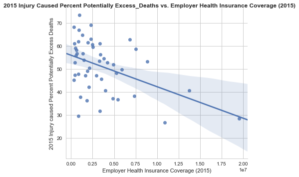


```python
sns_plot=sns.pairplot(merge_all_injury, x_vars=["Avg_Spending_Per_Episode_State"], y_vars=["2015 Injury caused Percent Potentially Excess Deaths"],
             size=5, aspect=1.2, kind="reg")
sns_plot.fig.suptitle('2015 Injury Caused Percent Potentially Excess_Deaths vs. Avg Spending Per Episode State(2015)',fontweight='bold',fontsize=12)
sns_plot.savefig("2015_Injury_Caused_Percent_Potentially_Excess_Deaths vs.Avg Spending Per Episode State(2015).png") 
plt.show()
```


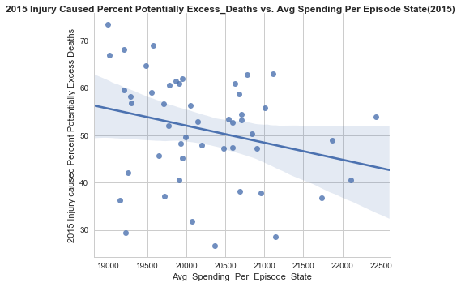


```python
df = affordable_care_statename
for col in df.columns:
    df[col] = df[col].astype(str)

scl = [[0.0, 'rgb(84,39,143)'],[0.2, 'rgb(117,107,177)'],[0.4, 'rgb(158,154,200)'],\
            [0.6, 'rgb(188,189,220)'],[0.8, 'rgb(218,218,235)'],[1.0, 'rgb(242,240,247)']]

df['text'] = df['State']  + '<br>' +\
    'Coverage Increase: '+df['Health Insurance Coverage Change (2010-2015)']+'<br>'+\
    'Medicaid Expansion: '+df['State Medicaid Expansion (2016)']+'<br>'+\
    'Avg. Tax Credit: ' + df['Average Monthly Tax Credit (2016)']+'<br>'+\
    'Medicaid Enrollment Change (2013-2016): '+df['Medicaid Enrollment Change (2013-2016)']

data = [ dict(
        type='choropleth',
        colorscale = scl,
        autocolorscale = False,
        locations = df['Abbreviation'],
        z = df['Uninsured Rate Change (2010-2015)'].astype(float),
        locationmode = 'USA-states',
        text = df['text'],
        marker = dict(
            line = dict (
                color = 'rgb(255,255,255)',
                width = 2
            ) ),
        colorbar = dict(
            title = "Percent of State Population")
        ) ]

layout = dict(
        title = 'Uninsure Rate Changes Between 2010 - 2015(%)<br>(Hover for breakdown)',
        geo = dict(
            scope='usa',
            projection=dict( type='albers usa' ),
            showlakes = True,
            lakecolor = 'rgb(255, 255, 255)'),
             )
    
fig = dict( data=data, layout=layout )
py.iplot( fig, filename='d3-cloropleth-map' )
```


<iframe id="igraph" scrolling="no" style="border:none;" seamless="seamless" src="https://plot.ly/~KDC323/2.embed" height="525px" width="100%"></iframe>


